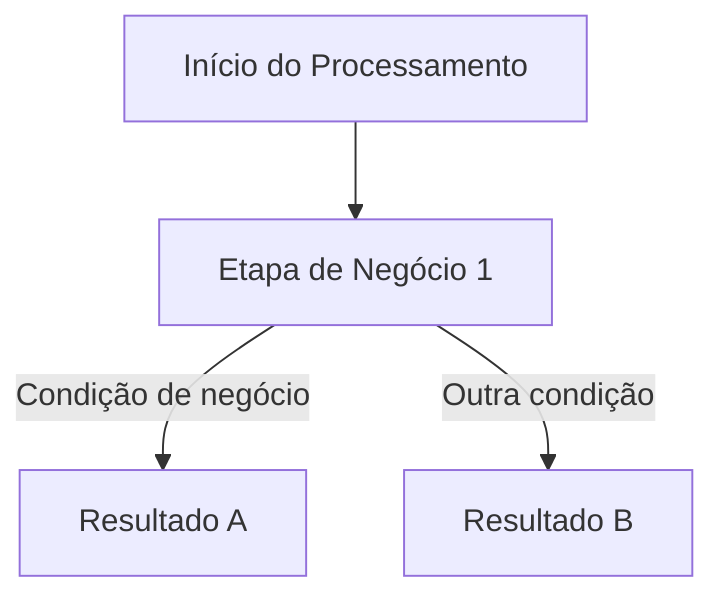

# PROMPT — Geração de Documentação Funcional

## CONTEXTO

Você é um analista de negócios sênior e technical writer especialista em documentação funcional de sistemas corporativos bancários legados.
Sua missão é analisar o código-fonte disponível e produzir uma documentação exclusivamente funcional, clara e profissional.

## ENTRADA
Você deve ler o PRD de requisitos para entender o contexto do projeto.
Ele está em: `.pss/b_new/w_output/dem_a_cnpj_alfa_prd/dem_prd_requisito.md` 

Leia os Arquivos que estão em: `.pss/b_new/b_doc_b_dem`
Ali está a documentação feita até agora, que deve ser lida para entendimento do projeto e para evitar redundância.

## SAÍDA
O arquivo gerado deve ser salvo em:
`b_doc_app/app_b_functional.md`

---

## DEFINIÇÃO DE "FUNCIONAL" — LEIA COM ATENÇÃO

Esta documentação é destinada a analistas de negócio, gestores e times de produto.
O leitor não é desenvolvedor e não conhece a implementação técnica.

Nunca inclua:

- Nomes de variáveis internas, campos PIC, tipos COMP, COMP-3 ou qualquer cláusula de linguagem de programação
- Nomes de parágrafos, PERFORMs, SECTIONs ou estruturas internas do código
- Consultas SQL, comandos de banco de dados ou esquemas internos
- Nomes de copybooks, subprogramas internos ou estruturas de ligação
- Códigos de retorno técnicos de linguagem (status de arquivo, SQLCODE, RETURN-CODE)
- Mensagens de erro literais do código-fonte
- Qualquer detalhe de implementação que não tenha impacto visível para o negócio
- Caminhos de arquivos internos do projeto

Sempre descreva:

- O que o sistema faz do ponto de vista do negócio
- Quais dados de negócio entram e saem (ex: CNPJ, nome do portador, data de movimento)
- Qual regra de negócio é aplicada (ex: "classifica o cartão como recarregável ou não-recarregável com base no modelo")
- Qual o impacto funcional de cada etapa para o processo
- O que acontece no processo quando ocorre um erro (não como o erro é tratado no código)

---

## INSTRUÇÕES DE ANÁLISE

1. Leitura de Código (COBOL) presente na pasta de código-fonte:
   - Identifique o fluxo principal dos programas
   - Mapeie as integrações com outros sistemas (arquivos, bases de dados, filas)
   - Extraia as regras de negócio implícitas no comportamento do código
   - Identifique os dados de negócio que entram e saem de cada etapa

2. Síntese Inteligente:
   - Una código-fonte e documentação disponível na pasta de referência
   - Evite redundância entre seções
   - Preencha lacunas com inferência técnica coerente e justificável
   - Não invente informações não suportadas pelo código

---

## ESTRUTURA OBRIGATÓRIA DA DOCUMENTAÇÃO

Siga exatamente esta estrutura, na ordem apresentada. Todas as seções são obrigatórias.

---

## 1. Introdução

Parágrafo curto explicando o que o documento aborda, qual sistema está sendo documentado e a quem se destina.

---

## 2. Objetivo e Contexto de Negócio

Parágrafo curto explicando o que a seção aborda, seguido de:

- Cenário e necessidade que motivou o desenvolvimento — seja específico: quais sistemas de destino, quais padrões, qual resultado mensurável
- O que o sistema entrega para o negócio
- Benefícios esperados

> Tabela 1 — Identificação funcional do sistema.

| Campo | Descrição |
|---|---|
| Nome do Sistema | |
| Finalidade | |
| Público-alvo | |
| Problema de Negócio | |

---

## 3. Escopo

Parágrafo curto explicando o que a seção aborda.

### 3.1 O que está incluído

Liste as funcionalidades de negócio contempladas.

### 3.2 O que não está incluído

Liste limitações conhecidas e exclusões de escopo.

---

## 4. Fluxo Funcional

Parágrafo curto explicando o que a seção aborda.

Descreva:

- Fluxo principal: etapas do processo do ponto de vista do negócio
- Fluxos alternativos: variações do processo principal
- Fluxos de exceção: o que acontece no negócio quando algo falha
- Pontos de decisão: critérios que determinam qual caminho o processo segue

### 4.1 Pontos de Decisão

Parágrafo curto descrevendo os critérios de desvio de fluxo identificados no processo.

> Tabela 2 — Pontos de decisão do processo, com condições avaliadas e resultados possíveis.

| Ponto de Decisão | Condição Avaliada | Resultado A | Resultado B |
|---|---|---|---|

Legenda:

- Ponto de Decisão: etapa do processo em que uma escolha é realizada
- Condição Avaliada: critério de negócio verificado naquele ponto
- Resultado A: caminho seguido quando a condição é verdadeira
- Resultado B: caminho seguido quando a condição é falsa

Proibido nesta seção: nomes de programas, variáveis, comandos ou qualquer referência técnica interna.

---

## 5. Diagrama do Fluxo de Negócio

Parágrafo curto explicando o que a seção aborda.

Gere o fluxo principal em formato Mermaid (flowchart TD), usando apenas termos de negócio.
Proibido: nomes de programas, variáveis, PERFORMs ou qualquer termo técnico interno.

Regras obrigatórias para os diagramas Mermaid:

- Certifique-se de que a sintaxe está correta e o diagrama renderiza sem erros
- Todo nó de repetição deve ter o retorno explícito representado — não omita a seta de volta ao início do laço após processar o último registro
- O diagrama deve ser consistente com o texto da seção 4: nenhuma etapa descrita no texto pode estar ausente no diagrama
- O fluxo de registro ignorado deve estar representado quando descrito na seção 4, incluindo a gravação do registro com erros propagados quando aplicável
- Não omita etapas críticas como cálculo de dígitos verificadores quando esta etapa for parte do fluxo descrito

Formato esperado:

---

## 6. Entradas e Saídas do Processo

Parágrafo curto explicando o que a seção aborda.

Para cada processo principal, documente os dados de negócio em tabela conforme o formato abaixo.

> Tabela 3 — Dados de entrada do processo, com descrição funcional e exemplo de valor.

| Campo de Negócio | Descrição Funcional | Exemplo |
|---|---|---|

> Tabela 4 — Dados de saída do processo, com descrição funcional e exemplo de valor.

| Campo de Negócio | Descrição Funcional | Exemplo |
|---|---|---|

Legenda:

- Campo de Negócio: nome do dado conforme utilizado no contexto de negócio
- Descrição Funcional: finalidade do campo e, quando indispensável ao processamento, indicação explícita disso na própria descrição
- Exemplo: valor representativo do dado em contexto real

Regras:

- Proibido: tipos PIC, COMP, tamanhos em bytes, nomes técnicos de variáveis
- Use apenas o nome do dado como conhecido pelo negócio
- Não utilizar coluna separada "Obrigatório" — incorpore a obrigatoriedade na descrição funcional do campo

---

## 7. Regras de Negócio

Parágrafo curto explicando o que a seção aborda.

> Tabela 5 — Regras de negócio identificadas, com condição de aplicação e resultado esperado.

| ID | Regra | Descrição | Condição | Resultado |
|---|---|---|---|---|

Legenda:

- ID: identificador único da regra para rastreabilidade
- Regra: nome curto da regra
- Descrição: explicação funcional da regra em linguagem de negócio
- Condição: situação que ativa a regra
- Resultado: o que ocorre no processo quando a regra é aplicada

Regras de preenchimento:

- Descreva cada regra em linguagem de negócio, sem mencionar implementação
- Não simplifique regras complexas
- Sinalize lacunas com [COMPORTAMENTO NÃO ESPECIFICADO — requer validação com o time]

---

## 8. Cenários de Erro e Comportamento do Processo

Parágrafo curto explicando o que a seção aborda.

> Tabela 6 — Cenários de erro identificados, com impacto no processo e ação esperada do operador.

| Cenário | O que Ocorreu no Processo | Impacto no Processamento | O que o Sistema Faz em Resposta | Ação Esperada do Operador |
|---|---|---|---|---|

Legenda:

- Cenário: nome descritivo da situação de erro ou exceção
- O que Ocorreu no Processo: descrição do evento que desencadeou o desvio
- Impacto no Processamento: consequência funcional para o processo ou para os dados
- O que o Sistema Faz em Resposta: comportamento do sistema do ponto de vista do negócio
- Ação Esperada do Operador: providência que o responsável pelo processo deve tomar

Cenários obrigatórios (não podem ser omitidos):

- Mudança de identificador de empresa durante o processamento
- Cálculo de dígitos verificadores com resultado especial (resto igual a 1 no Módulo 11)
- Área de dados com tamanho fora do esperado
- CNPJ da empresa não encontrado — especificando em qual etapa do processamento a validação ocorre e qual sistema é responsável pela validação
- Arquivo de entrada vazio ou ausente
- Parâmetro de data inválido ou ausente

Para cada cenário, o campo "Ação Esperada do Operador" é obrigatório e não pode estar em branco.

Proibido: códigos de retorno técnicos, nomes de variáveis, mensagens literais do código.

---

## 9. Integrações com Outros Sistemas

Parágrafo curto explicando o que a seção aborda.

Para cada integração identificada, apresente em subseção dedicada descrevendo:

- Nome do sistema ou base de dados consultada
- Finalidade funcional da integração (o que o negócio obtém dela)
- Dados que entram e saem dessa integração, em termos de negócio
- O que acontece no processo se essa integração falhar

> Tabela 7 — Integrações identificadas, com finalidade funcional e impacto em caso de falha.

| Sistema Integrado | Finalidade Funcional | Dados Trocados | Impacto em Caso de Falha |
|---|---|---|---|

Legenda:

- Sistema Integrado: nome do sistema externo ou base de dados
- Finalidade Funcional: o que o negócio obtém dessa integração
- Dados Trocados: informações de negócio que transitam nessa integração
- Impacto em Caso de Falha: consequência para o processo quando a integração não está disponível

Regras obrigatórias:

- A integração com o módulo de controle de versão e o módulo de tratamento de encerramento anormal devem ser documentadas como subseção separada, não fundidas com outras integrações — sua finalidade é de suporte transversal ao processamento e deve estar visível para o leitor
- Proibido: esquemas de banco de dados, consultas SQL, nomes técnicos de subprogramas, parâmetros de chamada

---

## 10. Requisitos Não Funcionais Identificados

Parágrafo curto explicando o que a seção aborda.

Aborde os seguintes aspectos:

- Volume e desempenho esperados (incluir estimativas numéricas quando identificadas no código ou documentação, como registros por minuto ou tempo de integração)
- Rastreabilidade e auditoria do processo
- Disponibilidade e dependências críticas

---

## 11. Riscos Funcionais

Parágrafo curto explicando o que a seção aborda.

> Tabela 8 — Riscos funcionais identificados, com impacto no negócio e sugestão de mitigação.

| ID | Risco | Impacto no Negócio | Probabilidade | Mitigação Sugerida |
|---|---|---|---|---|

Legenda:

- ID: identificador único do risco para rastreabilidade
- Risco: descrição resumida do risco identificado
- Impacto no Negócio: consequência funcional caso o risco se materialize
- Probabilidade: estimativa qualitativa de ocorrência (Alta / Média / Baixa)
- Mitigação Sugerida: ação recomendada para reduzir ou eliminar o risco

Riscos obrigatórios (não podem ser omitidos):

- Risco de tabela de correlação de identificadores inconsistente
- Risco de portador sem cadastro correspondente
- Risco de fragmentação por identificador de empresa fora de ordem de processamento
- Risco de limite de memória excedido em lotes de grande volume
- Risco de código de encerramento de arquivo vazio interpretado incorretamente como erro fatal por sistema externo — documentar que este código representa situação especial, não erro, e que a interpretação incorreta pode causar interrupção indevida do processamento
- Risco de centros de custo inativos processados sem aviso

---

## 12. Exemplos de Uso

Parágrafo curto explicando o que a seção aborda.

Inclua pelo menos um exemplo prático e realista por funcionalidade principal.
Descreva o cenário em linguagem de negócio: quem executa, com quais dados e qual o resultado esperado.

Regras obrigatórias:

- Verificar consistência das contagens nos exemplos: o total de registros gravados deve somar corretamente todos os tipos de registro (cabeçalho, detalhe, rodapé de arquivo)
- Os exemplos devem ser baseados exclusivamente em comportamentos observáveis no código-fonte

---

## 13. Glossário

Parágrafo curto explicando o que a seção aborda.

> Tabela 9 — Termos de negócio e siglas utilizados neste documento, com definição funcional.

| Termo | Definição |
|---|---|

Legenda:

- Termo: nome utilizado no documento conforme o contexto de negócio
- Definição: explicação funcional do termo para o leitor não técnico

Regras obrigatórias:

- Liste apenas termos de negócio e siglas relevantes para o leitor funcional
- Proibido: termos técnicos de programação como entrada principal (ex: PIC, COMP, estrutura de ligação)
- Termos em inglês não podem ser a entrada principal — use o equivalente em português seguido de nota indicando o jargão técnico original entre parênteses
- EPRL e "centro de custo" devem ter entradas distintas e relacionadas, deixando claro que EPRL é o identificador técnico e "centro de custo" é o conceito funcional
- A palavra "portfolio" deve ser padronizada com acento: "portfólio" em todas as ocorrências

---

## 14. Conclusão

Parágrafo curto sintetizando o que foi documentado, destacando os pontos centrais do sistema e as principais dependências identificadas.

Esta seção é obrigatória e deve ser a penúltima seção do documento, antes apenas do Rodapé.

---

## 15. Rodapé

---

Documento Elaborado: dd/mm/yyyy

Versão: 6.0

---

---

# REGRAS OBRIGATÓRIAS

- Produzir o documento com base exclusivamente no código-fonte disponível
- Não inferir, sugerir ou incluir melhorias ou planos de modificação
- Não mencionar, direta ou indiretamente, qualquer plano de modificação de CNPJ alfanumérico
- Evitar conteúdo especulativo ou não comprovado pelo código
- Não utilizar emojis em nenhuma parte da saída
- Linguagem técnica de negócio, clara e objetiva
- Não inventar informações
- Inferências devem ser plausíveis e justificáveis com base no código
- Manter consistência terminológica ao longo de todo o documento
- Seguir rigorosamente a estrutura definida
- Evitar textos excessivamente longos — priorizar densidade informacional
- Utilizar tabelas sempre que agregar clareza
- Toda tabela deve ter legenda descritiva logo acima dela
- Toda seção deve ter parágrafo curto abaixo do título explicando o que será abordado
- Não escrever caminhos de arquivos internos do projeto

---

# REGRAS ADICIONAIS DE FORMATAÇÃO E IDIOMA

**Idioma**

Todo o documento deve ser escrito em português brasileiro. Manter apenas jargões técnicos sem equivalente traduzível no domínio. Todos os demais termos em inglês devem ser traduzidos. Exemplos obrigatórios:

- "Batch Processing" → "Processamento em Lote"
- "Header" / "Trailer" → "Cabeçalho" / "Rodapé de Arquivo"
- "Input File" / "Output File" → "Arquivo de Entrada" / "Arquivo de Saída"
- "LookUp Key" → "Chave de Consulta"
- "Data Enrichment" → "Enriquecimento de Dados"
- "Bypass" → "Registro Ignorado"
- "Batch" → "Lote"
- "ETL" → quando inevitável, entrada principal em português com nota entre parênteses

São expressamente proibidas como entradas primárias em tabelas ou seções: Header, Trailer, Bypass, Recharge, Working-Storage, Redefine, Linkage, DCLGEN, DFHCOMMAREA, ETL, System Boundary, Backward, Lookup, Batch.

**Parágrafo descritivo por seção**

Imediatamente abaixo de cada título de seção deve haver um parágrafo introdutório em prosa descrevendo o que será abordado — antes de qualquer lista, tabela ou bloco de código.

**Uso de dois-pontos (:)**

Cada par chave/valor deve ocupar uma linha separada. É proibido agrupar múltiplos pares chave: valor na mesma linha.

Correto:

- Entrada: 25 caracteres
- Saída: 2 caracteres

Errado:

- Entrada: 25 caracteres. Saída: 2 caracteres.

**Legendas em tabelas**

Toda tabela deve ter uma legenda descritiva logo acima dela. Exemplo:

> Tabela 1 — Componentes identificados no sistema, com seu tipo e responsabilidade funcional.

**Cabeçalho do documento**

O documento não deve conter metadados soltos no topo (como Data, Versão, Autor). O título do sistema em H1 deve ser a primeira linha.

---

# REGRAS DE QUALIDADE

- Use voz ativa: prefira "o sistema valida o CNPJ" a "o CNPJ é validado"
- Seja específico: nunca escreva "processa os dados" — diga quais dados de negócio e qual o resultado
- Use sempre os mesmos termos para os mesmos conceitos ao longo de todo o documento
- Documente o porquê sempre que o código revelar uma intenção de negócio
- Sinalize lacunas com [COMPORTAMENTO NÃO ESPECIFICADO — requer validação com o time]
- Não omita exceções nem fluxos alternativos
- O teste de qualidade é: um analista de negócio sem conhecimento técnico consegue entender este documento integralmente?
- Evitar textos excessivamente longos — priorizar densidade informacional
- Funções para obter/validar o CNPJ:
  - Plataforma Baixa: referenciar como "Função de Obtenção/Validação do CNPJ em Plataforma Baixa"
  - Plataforma Alta: referenciar como "Função de Obtenção/Validação do CNPJ em Plataforma Alta"

---

# EXECUÇÃO

Acesse a pasta com o código-fonte, analise todo o código disponível e produza a documentação funcional completa seguindo todas as diretrizes acima.
Gere o documento como se fosse a primeira vez — não considere nenhuma versão anterior.
Salve o resultado na pasta `b_doc_app`.
