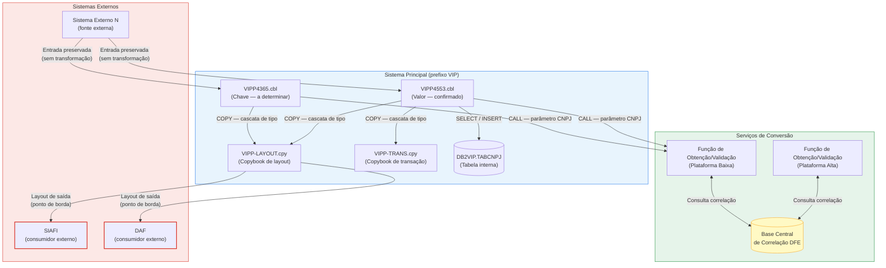

# LEVANTAMENTO DE IMPACTO — CNPJ ALFANUMÉRICO

## Descrição

Este PRD orienta a geração da documentação de impacto da adequação do CNPJ numérico para CNPJ alfanumérico. O objetivo deste documento é guiar a análise, preservar rastreabilidade com o PRD de requisito e evitar excesso de formalismo, duplicidade e prescrição indevida de implementação.

A documentação gerada a partir deste PRD deve:

- identificar onde o CNPJ é tratado;
- classificar cada ocorrência como **Chave**, **Valor**, **Ambos** ou **Indefinido**;
- mapear impactos em programas, copybooks, DB2, interfaces, arquivos, subprogramas e sistemas;
- explicitar pontos de borda, dependências de conversão e riscos de quebra contratual;
- quantificar impactos em armazenamento, tipagem e visibilidade de variáveis;
- manter rastreabilidade com os requisitos funcionais e técnicos do projeto.

---

## Como usar

Use este conteúdo como instrução base para o agente que irá produzir a documentação de impacto. O PRD de requisito é a referência funcional e técnica principal; este PRD de impacto deve traduzir essa base em roteiro analítico, tabelas de saída e critérios de evidência.

Formato: Markdown
Idioma: Português (Brasil)

Documento de requisito base: `.pss/b_new/w_output/dem_a_cnpj_alfa_prd/dem_prd_requisito.md`

Leia as outras documentações para entender os impactos que o sistema terá, e use este PRD para orientar a análise de impacto, garantindo que o documento gerado seja alinhado ao requisito e útil para a equipe técnica, caminho dos documentos: `.pss/b_new/b_doc_b_dem`

---

## Instruções Gerais de Qualidade Documental

- **Idioma**: redigir em português (Brasil). Termos técnicos consagrados podem permanecer em inglês.
- **Abertura de seção**: cada seção do documento gerado deve começar com um parágrafo curto explicando o que ela cobre.
- **Conclusão**: cada seção principal deve terminar com uma conclusão breve.
- **Tabelas**: toda tabela deve ter, logo após ela, uma legenda explicando as colunas. Toda tabela deve ser densa em insights — não deixar células vagas onde evidência pode ser antecipada.
- **Resumo Executivo**: não gerar seção de resumo executivo.
- **Diagramas**: usar exclusivamente **Mermaid** quando houver diagrama.

---

## Definições

Chave: É uma chave (primária ou estrangeira) do CNPJ, e não do conteúdo do CNPJ, onde o campo de chave estrangeira em um artefato de transação, ou campo de chave primária em um artefato de consulta, etc. (ex: 78465270000165, 00000000000001). A \*\*Chave de CNPJ\*\* é um identificador técnico interno e não deve ser tratada como documento oficial de negócio.

Valor: É o conteúdo do CNPJ, ou seja, o campo é manipulado como valor de negócio, onde o campo é utilizado em regras de negócio, cálculos, validações, tela (GUI) etc. (ex: 78465270000165, 6QNJ8VY2JIC341). O \*\*Valor de CNPJ\*\* é o identificador oficial utilizado pelo negócio e por interfaces externas.

Módulos: Refere-se a qualquer artefato de código, incluindo programas COBOL e copybooks (artefatos .CPY) que são utilizados pelos programas COBOL. (ex: RF, DAF, VIP, HLP, etc.)

Módulo Principal: É o nome dado a um módulo que pertence ao mesmo sistema dos programas principais. Módulos principais podem ou não ser alterados a depender do plano de execução e execução propriamente dita, mas pertencem ao mesmo time/sistema. A identificação de módulos principais é feita dinamicamente com base no prefixo do nome do artefato. (ex: se os programas principais são VIPP4365 e VIPP4553, então qualquer artefato com prefixo VIP é considerado principal, mesmo que não requeira alteração).

Módulo Secundário: A definição do módulo secundário é tão importante que há uma definição prática e consolidada para ele, que deve ser seguida rigorosamente. O módulo secundário é o nome dado a um módulo que pertence a um sistema diferente dos programas principais. Módulos secundários podem ou não ser alterados a depender do plano de execução e execução propriamente dita, pois pertencem a outros times/sistemas. A identificação de módulos secundários é feita dinamicamente com base no prefixo do nome do artefato. (ex: se os programas principais são VIPP4365 e VIPP4553, então artefatos com prefixo DAF ou HLP são considerados secundários).

Artefato: Artefato é qualquer unidade técnica versionável que compõe, suporta ou influencia a execução do sistema. Isso inclui programas (ex: .cbl), copybooks (.cpy), JCLs, artefatos de dados, layouts, tabelas e demais elementos estruturais. Um artefato pode representar lógica de negócio, estrutura de dados ou configuração operacional, sendo tratado como elemento rastreável, analisável e passível de impacto dentro do ecossistema.

Programas: Refere-se ao código COBOL em si, ou seja, aos artefatos .CBL, .CPY, entre outros. Esses artefatos são os artefatos que contêm a lógica de negócio e que serão modificados (patch). No cliente, seus nomes seguem o padrão de um prefixo de 3 letras maiúsculas seguido de um número, por exemplo: VIPP4365.cbl, DAF1234.cbl, HLP5678.cbl.

Correlação 1:1: Relação obrigatória e inequívoca entre uma \*\*Chave de CNPJ\*\* e um \*\*Valor de CNPJ\*\*, preservando rastreabilidade, integridade relacional, auditabilidade e determinismo da conversão.

CGC: Denominação anterior do CNPJ (Cadastro Geral de Contribuintes), equivalente ao CNPJ para todos os efeitos desta demanda. Campos nomeados como CGC devem ser tratados com as mesmas regras aplicáveis ao CNPJ.

PF: Pessoa Física, ou seja, indivíduo, pessoa natural. Campos relacionados a PF não estão no escopo desta demanda, mas podem ser utilizados para comparação e inferência quando necessário.

PJ: Pessoa Jurídica, ou seja, empresa, organização. Campos relacionados a PJ estão no escopo desta demanda, pois o CNPJ é o identificador oficial de pessoas jurídicas.

Fonte Externa: Origem de dados pertencente a um sistema externo ao escopo desta modificação, como tabelas DB2 de outros domínios (ex: DB2MCI.CLIENTE), artefatos legados de terceiros ou integrações de entrada. Dados provenientes de fontes externas não estão no escopo de modificação desta demanda e não devem ser alterados.

Campo Indefinido: Campo CNPJ ou CGC cuja natureza semântica (Chave ou Valor) não pode ser determinada com segurança a partir dos artefatos de discovery e diagnostic — ou seja, onde a taxa de inferência for fraca. Nesses casos, o campo deve ser classificado como Indefinido e não deve ser alterado.

Serviço Central de Conversão: Serviço oficial responsável por converter \*\*Chave de CNPJ\*\* em \*\*Valor de CNPJ\*\* e \*\*Valor de CNPJ\*\* em \*\*Chave de CNPJ\*\*. É proibida a geração local ou distribuída dessa correlação fora do sistema central autorizado.

Base Central de Correlação (DFE): Estrutura central responsável por manter a relação 1:1 entre \*\*Chave de CNPJ\*\* e \*\*Valor de CNPJ\*\*, bem como metadados de controle e auditoria.

Cache: Camadas auxiliares de desempenho utilizadas para reduzir acessos à base central de correlação, podendo incluir mecanismos equivalentes a Redis, VSAM, processamento batch ou estruturas legadas compatíveis com o ambiente.

Claro — abaixo está a **seção de definição** já com o **merge** das suas definições, preservando o conceito original que eu havia estruturado, mas incorporando explicitamente os pontos de **sistema diferente**, **outro time/domínio**, **identificação dinâmica por prefixo** e o fato de que a possibilidade de alteração depende do **plano de execução** e da **execução da demanda**.

---

### Definição Técnica de Origem de Dados

**Origem de Dados** é a caracterização técnica que determina **de qual sistema, módulo, processo, arquivo, tabela ou contrato o dado se origina**, bem como **qual domínio funcional detém a responsabilidade de produção, manutenção, controle e governança sobre seu conteúdo**.

Em ambiente **mainframe**, a origem de dados não deve ser inferida apenas pela presença física do campo em um programa COBOL, copybook, layout, FD, registro, área de comunicação, tabela DB2, arquivo VSAM, arquivo sequencial, mensagem ou estrutura intermediária. A presença do campo em tais artefatos pode representar apenas **declaração**, **transporte**, **repasse**, **espelhamento**, **persistência transitória** ou **consumo operacional**, sem caracterizar, por si só, a verdadeira origem do dado.

A determinação da origem deve considerar, de forma combinada:

- o **sistema produtor** do dado;
- o **módulo responsável** pela geração ou manutenção do conteúdo;
- a **estrutura de origem** que atua como fonte de verdade;
- o **domínio funcional** que possui governança sobre o valor;
- o **contexto operacional** em que o dado é recebido, transformado, propagado, persistido ou consumido.

No contexto mainframe, a origem de dados pode estar associada, por exemplo, a:

- programa COBOL produtor;
- transação on-line;
- fluxo batch;
- etapa de JCL;
- arquivo de entrada;
- arquivo de saída;
- arquivo VSAM;
- tabela DB2;
- copybook corporativo;
- COMMAREA ou outra área de comunicação;
- mensagem recebida de integração;
- contrato de interface entre sistemas;
- estrutura proveniente de módulo secundário externo.

A análise da origem deve observar, no mínimo, três dimensões técnicas:

#### Origem Lógica
Refere-se ao sistema, domínio ou processo que **efetivamente cria ou controla o significado funcional do dado**.

#### Origem Física
Refere-se ao artefato em que o dado está materializado em determinado ponto do fluxo, como tabela DB2, arquivo, layout, copybook, registro ou área de comunicação.

#### Origem Operacional
Refere-se ao ponto do processamento em que o dado é introduzido, recebido, propagado ou consumido no fluxo técnico, como uma transação on-line, um step batch, uma leitura de arquivo, uma consulta DB2 ou uma interface entre módulos.

A origem de dados deve ser classificada com base principalmente na **origem lógica**, utilizando a origem física e a origem operacional como elementos de apoio à inferência técnica.

Um dado deve ser tratado como de **origem interna** quando sua produção, manutenção, controle e governança pertencem ao próprio sistema em intervenção e ao escopo funcional da demanda.

Um dado deve ser tratado como de **origem externa** quando:

- é produzido, mantido ou controlado por sistema, módulo, domínio ou processo externo ao escopo da demanda; ou
- é apenas declarado, propagado ou manipulado por artefato pertencente a módulo secundário externo, sem que o sistema em intervenção detenha governança sobre o conteúdo.

Em ambiente mainframe, é obrigatório distinguir entre:

- **artefato que transporta o dado**; e
- **artefato que é a verdadeira origem do dado**.

Assim, copybooks, layouts, FDs, registros, áreas de comunicação, arquivos intermediários, estruturas de staging e programas utilitários **não devem ser tratados automaticamente como origem**, salvo quando forem também o ponto efetivo de produção e governança do conteúdo.

A definição de origem de dados é essencial para determinar a conduta técnica permitida sobre o campo, pois estabelece se o sistema em intervenção possui autoridade para:

- transformar;
- converter;
- validar;
- normalizar;
- reclassificar;
- enriquecer;
- persistir;
- ou apenas transportar e preservar o dado.

Portanto, em ambiente mainframe, **Origem de Dados** é o atributo técnico que identifica a procedência lógica, física e operacional de um dado no ecossistema de processamento, permitindo distinguir se o conteúdo pertence ao domínio do sistema em intervenção ou se deve ser tratado como informação externa, preservada conforme seu contrato de origem.

---

### Definição de Módulo Secundário (Externo)**

**Módulo Secundário (Externo)** é todo artefato técnico que **pertence a sistema, domínio funcional, contexto operacional ou responsabilidade de time diferente** em relação aos programas principais da demanda, ainda que mantenha relação funcional, estrutural, operacional ou contratual com o fluxo analisado.

No contexto desta documentação, o termo **externo** não significa necessariamente fora da aplicação em sentido físico, fora do repositório ou fora da plataforma mainframe. Significa, tecnicamente, que o artefato está **fora do núcleo principal da implementação**, pertencendo a **outro módulo lógico**, **outro agrupamento funcional** ou **outro contexto sistêmico**, podendo inclusive estar sob responsabilidade de **outro time**.

Um módulo secundário é, portanto, um artefato que **não compõe o conjunto principal de programas da demanda**, mas que pode participar do processamento por meio de chamadas, integrações, compartilhamento de estruturas, consumo de arquivos, uso de copybooks, trocas de dados ou dependências de execução.

#### **Identificação Dinâmica**

A identificação de um módulo secundário deve ser feita de forma **dinâmica**, com base na análise técnica do artefato e, em especial, na **convenção de nomenclatura e no prefixo do nome do artefato**.

Essa identificação não deve ser tratada como cadastro fixo ou lista estática pré-definida. A LLM deve inferir a classificação comparando o prefixo do artefato analisado com o prefixo dos programas principais da demanda.

Exemplo:

* se os programas principais da demanda forem **VIPP4365** e **VIPP4553**, então o prefixo principal do escopo é **VIP**;
* nesse cenário, artefatos com prefixos como **DAF** ou **HLP** devem ser tratados, em regra, como **módulos secundários**, por pertencerem a outro módulo, outro sistema ou outro domínio em relação ao núcleo principal.

Assim, artefatos com prefixo **DAF** ou **HLP** são secundários em relação a programas **VIP**, salvo quando a documentação da demanda dispuser explicitamente em sentido diverso.

#### **Relação com os Programas Principais**

Os programas principais são os artefatos diretamente vinculados ao escopo central da implementação. Já o módulo secundário externo é o artefato que, embora tecnicamente relacionado ao fluxo, **não representa o ponto principal da alteração solicitada**.

Ele pode:

* ser chamado pelo programa principal;
* chamar o programa principal;
* compartilhar copybooks, layouts ou áreas de comunicação;
* trocar dados com o fluxo principal;
* manipular campos correlatos ao CNPJ;
* participar de validações, integrações, consultas, persistência, formatação, enriquecimento ou apoio operacional.

Ainda assim, sua participação no fluxo **não o transforma automaticamente em módulo principal**.

#### **Pertencimento a Outro Sistema, Time ou Domínio**

Um dos critérios centrais para caracterização do módulo secundário é o seu pertencimento a **outro sistema**, **outro domínio funcional** ou **outro contexto de manutenção**, frequentemente sob responsabilidade de **outro time**.

Por essa razão, módulos secundários exigem tratamento mais controlado sob a ótica de governança, pois uma alteração nesses artefatos pode extrapolar o escopo original da demanda e produzir impacto em fluxos paralelos, contratos técnicos compartilhados ou responsabilidades sistêmicas de terceiros.

#### **Possibilidade de Alteração**

Módulos secundários **não podem ser alterados**, esta impossibilidade **não decorre automaticamente de sua participação no fluxo**, e também não da existência de manipulação de CNPJ, nem da relevância técnica do artefato.

A autorização para alteração depende de forma cumulativa de:

* previsão no **plano de execução**;
* autorização no **escopo formal da demanda**;
* direcionamento explícito na **execução propriamente dita**;
* compatibilidade com a governança de alteração entre módulos, sistemas e times.

Na ausência desses elementos, o módulo secundário deve ser tratado como **artefato analisável e registrável**, mas **não elegível para modificação**.

#### **Características Técnicas Comuns**

Um módulo secundário externo normalmente apresenta uma ou mais das seguintes características:

* pertence a prefixo diferente do prefixo dos programas principais;
* pertence a outro sistema, outro time ou outro domínio funcional;
* atua como suporte, integração, utilitário, consulta, persistência ou serviço compartilhado;
* não concentra a regra principal da demanda;
* participa do fluxo apenas como dependência técnica ou funcional;
* pode manipular CNPJ, mas sem ser o núcleo da implementação;
* está fora da lista principal de artefatos-alvo da alteração.

#### **Relação com a Manipulação de CNPJ**

A presença de CNPJ em um módulo secundário não altera, por si só, sua classificação.

Um módulo secundário pode:

* receber CNPJ como entrada;
* retornar CNPJ como saída;
* transportar CNPJ em registros;
* compartilhar estruturas com campos de CNPJ;
* usar CNPJ como **Chave**;
* usar CNPJ como **Valor**.

Mesmo nesses casos, a classificação como módulo secundário permanece válida se o artefato continuar pertencendo a **outro sistema/domínio/time** e não estiver enquadrado como programa principal da demanda.

#### **Exemplos Típicos**

Exemplos comuns de módulos secundários externos incluem:

* **DAF**
* **HLP**
* rotinas utilitárias
* programas de apoio
* artefatos de integração
* módulos de consulta compartilhados
* componentes pertencentes a outros agrupamentos funcionais

Exemplo prático:

* Programas principais: **VIPP4365**, **VIPP4553**
* Prefixo principal inferido: **VIP**
* Artefatos com prefixos **DAF** e **HLP**: classificados como **módulos secundários**
* Motivo: pertencem a outro módulo/sistema/domínio em relação ao núcleo principal

#### **Definição Consolidada**

Em termos consolidados, **Módulo Secundário (Externo)** é o nome dado ao artefato que:

* pertence a sistema, time ou domínio diferente dos programas principais;
* é identificado dinamicamente, principalmente pelo prefixo do nome do artefato e pela análise contextual;
* pode manter relação técnica com o fluxo principal;
* pode ou não ser alterado, dependendo do plano de execução e da autorização formal da demanda;
* não deve ser tratado automaticamente como parte do escopo principal apenas por participar do processamento.

## Cenários de Classificação de Uso do CNPJ (Chave x Valor)

O termo **“Cenário”** refere-se ao papel funcional e técnico desempenhado pelo CNPJ dentro do programa ou fluxo de processamento, permitindo classificar o uso do dado em **Chave** ou **Valor**.

A classificação deve ser realizada com base na **análise contextual do uso do campo no código-fonte** e na sua função dentro da arquitetura de dados, considerando:

- O comportamento funcional do campo no processamento;
- Sua participação em operações técnicas (indexação, relacionamento, filtros);
- Sua semântica de negócio (exibição, comunicação, interface).

---

## Critérios de Classificação

### CNPJ como Chave (Identificador Técnico)

- Utilizado como identificador interno para relacionamentos ou acesso a dados;
- Participa de JOINs, MATCHs, índices, buscas, validações de integridade ou relacionamentos entre registros;
- Pode estar associado a constraints, ponteiros lógicos, chaves primárias/estrangeiras ou estruturas de lookup;
- Não representa o dado de negócio em si, mas sim um **identificador interno** usado para navegação e correlação de dados.

---

### CNPJ como Valor (Dado de Negócio)

- Representa o CNPJ como informação de negócio, utilizado para exibição, relatórios, integração externa ou regras de negócio;
- É tratado como conteúdo informacional e não como referência estrutural para acesso a dados;
- Pode ser exibido, enviado a outros sistemas ou validado segundo regras de negócio.

---

## Classificação Acumulativa

A classificação **não é excludente**.

Um mesmo campo pode atuar simultaneamente como **Chave** e como **Valor**, desde que haja evidências claras no código de que o campo cumpre ambos os papéis no fluxo de processamento.

Essa avaliação deve considerar:

- O contexto específico de uso no programa;
- O papel funcional desempenhado em cada trecho do código;
- A intenção semântica e técnica do campo no processamento.

---

### Regra Mandatória de Explicitação de Consumo Subsequente

Sempre que a LLM identificar que um campo de CNPJ está inserido em **contexto de saída**, especialmente em estruturas de **detalhe**, **áreas de comunicação**, **buffers de output**, **arquivos de remessa/retorno**, **arquivos de saída**, **estrutura de saída**, **segmentos de transmissão**, **interfaces entre programas** ou qualquer outro artefato de **propagação de dado de negócio**, **não é suficiente** classificá-lo apenas como **Valor de Negócio**.

Nesses casos, a LLM **deve obrigatoriamente** explicitar, de forma técnica e rastreável, **quais são os consumidores subsequentes do campo** após a saída do programa, da rotina, do módulo ou do artefato analisado.

A análise **deve deixar claro**:

- **quem consome o dado posteriormente**, de forma nominal e técnica;
- **qual artefato subsequente recebe o campo**;
- **qual é a finalidade do consumo**;
- **se o campo é apenas transportado ou efetivamente utilizado em lógica de negócio**;
- **quais impactos decorrem da mudança do CNPJ numérico para alfanumérico nesse encadeamento subsequente**.

A LLM deve identificar, sempre que possível, os consumidores subsequentes dentro da cadeia de processamento, tais como:

- programas COBOL chamadores ou chamados;
- steps seguintes de JOB/JCL;
- transações CICS;
- rotinas batch;
- arquivos físicos ou lógicos;
- copybooks compartilhados;
- tabelas DB2;
- mensagens MQ;
- APIs;
- sistemas satélites;
- módulos de integração;
- rotinas de impressão, extrato, relatório, auditoria, conciliação ou retorno.

Além de identificar os consumidores subsequentes, a LLM **deve explicitar a natureza do consumo**, informando se o campo é:

- exibido;
- transmitido;
- persistido;
- validado;
- transformado;
- replicado;
- conciliado;
- utilizado em regra de negócio;
- utilizado em interface externa;
- ou apenas propagado como carga útil.

A conclusão **não deve ser genérica**. A LLM **não deve afirmar apenas** que se trata de “output”, “transmissão de dados de negócio” ou “valor de negócio”. Ela **deve detalhar o encadeamento técnico subsequente**, deixando explícito:

- a **origem** do campo;
- o **destino** do campo;
- o **artefato intermediário**, se houver;
- o **contrato técnico** em que ele trafega;
- e o **impacto potencial da alteração de formato** ao longo dessa cadeia.

A LLM deve utilizar como evidências técnicas, sempre que disponíveis:

- nome do campo;
- nome do registro;
- nome do layout;
- sufixos semânticos como `-DET`, `-OUT`, `-SAI`, `-RET`;
- instruções `MOVE`;
- gravação em arquivo;
- passagem por parâmetro;
- montagem de mensagem;
- envio para outro programa;
- uso em tela, relatório ou interface.

Em ambiente **mainframe**, a presença do CNPJ em estrutura de **saída/detalhe** deve ser tratada como forte indicativo de que o dado participa de uma **cadeia de consumo downstream**. Portanto, a análise da LLM **deve ser explícita, nominativa, técnica e rastreável**, demonstrando não apenas que o campo representa **Valor de Negócio**, mas também **quem o consome depois, como o consome, em qual artefato o consome e quais impactos subsequentes a mudança para CNPJ alfanumérico pode provocar**.

Se uma tabela tiver esse tipo de informação, OBRIGATORIAMENTE adicione a coluna à ela para identificar quem é o Consumidor da saída desse dado.

---

## Premissas Específicas da PoC

Estas premissas delimitam o recorte desta PoC e evitam que o agente misture análise de impacto com decisões fora do escopo.

- A rotina de obtenção/validação do CNPJ não será validada em profundidade nesta PoC; apenas sua necessidade, sua dependência e seus pontos de uso.
- A classificação de artefatos como **internos** ou **externos** deve ser feita pelo prefixo do nome em relação aos programas principais analisados:
  - mesmo prefixo do sistema principal: **interno**;
  - prefixo de outro sistema: **externo**.
- Módulos externos não podem ser alterados e seus campos de CNPJ não devem ser contabilizados como campos impactados.
- Identificadores recebidos de origem externa devem ser preservados exatamente como chegam quando o requisito determinar bloqueio de transformação.
- Usar nomenclatura genérica para serviços de conversão:
  - **Função de Obtenção/Validação do CNPJ em Plataforma Baixa**;
  - **Função de Obtenção/Validação do CNPJ em Plataforma Alta**.
- Nesta PoC, coexistência entre legado e novo modelo significa coexistência em tempo de execução em produção, não coexistência durante desenvolvimento.
- Nesta PoC, a documentação deve considerar, quando houver impacto confirmado, a criação de **novo artefato** e de **nova coluna com sufixo `Alfanumerico`**, sem sobrescrever o legado.
- **SIAFI** e **DAF** devem ser avaliados explicitamente na análise.

**Conclusão da seção:** a análise deve seguir um recorte controlado de PoC, preservar a distinção entre módulos internos e externos e nunca propor transformação sem base determinística.

## Premissas de Execução Pontual

**Premissa de Execução Pontual:** A demanda de adequação ao CNPJ alfanumérico opera em dois regimes distintos de abrangência, aplicados sequencialmente e com propósitos complementares, não intercambiáveis.

**No Diagnóstico**, a abrangência é **máxima e irrestrita dentro do escopo de discovery**. Todos os artefatos identificados na etapa de Descoberta devem ser analisados integralmente, independentemente da expectativa de alteração. A análise não deve ser antecipadamente filtrada por critério de relevância, pois a relevância só pode ser determinada após a análise. A priorização da intervenção é consequência da análise — não sua premissa. Artefatos com alta taxa de inferência de impacto determinam o grau e a urgência da intervenção. Artefatos com baixa taxa de inferência são igualmente analisados, mas resultam em classificação como Indefinido e são preservados. O Diagnóstico não decide o que alterar: ele produz a evidência técnica que fundamenta essa decisão.

**No Plano de Execução**, a abrangência é **mínima e estritamente delimitada pelo Diagnóstico**. Esta demanda não caracteriza modificação ampla, reestruturação integral, refatoração global ou modernização irrestrita de código. A execução deve ser tratada como intervenção pontual, limitada ao conjunto exato de artefatos e campos para os quais o Diagnóstico produziu evidência determinística de necessidade de alteração. Nenhuma modificação pode ser realizada por conveniência técnica, padronização, estética, organização ou oportunidade de melhoria paralela. A intervenção autorizada é exclusivamente aquela rastreável a uma ocorrência concreta identificada no Diagnóstico, com classificação confiável e ação definida. Todo o restante deve ser preservado intacto.

>A assimetria entre os dois regimes é intencional e estrutural: o Diagnóstico é amplo para garantir que nenhum risco seja ignorado; o Plano é restrito para garantir que nenhuma alteração seja indevida.

---

## Modelo de Dados

Esta seção consolida a estrutura mínima esperada para suportar o novo modelo de identificação.

### Estrutura obrigatória

- **Chave de CNPJ** (numérica, 14 posições)
- **Valor de CNPJ** (alfanumérico, 14 posições)
- Indicadores de controle
- Metadados de auditoria

### Regra fundamental

- Deve existir relação **1:1 obrigatória** entre **Chave de CNPJ** e **Valor de CNPJ**
- A **Chave de CNPJ** não substitui semanticamente o **Valor de CNPJ**
- O **Valor de CNPJ** não deve ser usado como chave técnica por inferência automática sem análise do caso

---

# 1. Objetivo e Escopo

Esta seção define o que a análise de impacto deve cobrir e o que deve permanecer fora do documento gerado.

## 1.1 Objetivo da análise

Realizar levantamento de impacto da adequação do CNPJ numérico para CNPJ alfanumérico, considerando a separação entre **Chave de CNPJ** e **Valor de CNPJ**, a coexistência controlada entre formatos, a rastreabilidade dos pontos de uso e a preservação dos contratos técnicos e funcionais. A análise deve também quantificar impactos em armazenamento físico (bytes), visibilidade de variáveis e cascata de impacto entre artefatos.

## 1.2 Escopo incluído

- programas COBOL, copybooks, subprogramas e JCLs relacionados;
- contratos de entrada e saída;
- arquivos de entrada e saída;
- tabelas DB2, layouts, integrações e consumidores/provedores;
- classificação de campos como **Chave**, **Valor**, **Ambos** ou **Indefinido**;
- identificação de pontos de borda que exigem conversão via serviço oficial;
- identificação de campos que exigem mudança de tipo;
- impacto em armazenamento físico: delta de bytes por campo, por registro e por tabela DB2;
- impacto de visibilidade de variável: escopo local, copybook compartilhado, interface e persistência;
- mapa de cascata de impacto entre artefatos com diagrama Mermaid;
- impactos em SIAFI, DAF e demais sistemas relacionados;
- compatibilidade retroativa, coexistência em produção, riscos e violações contratuais.

## 1.3 Fora de escopo

- implementação de código;
- refatoração ampla sem evidência de impacto;
- user story, use case ou caso de uso;
- plano de testes, implantação, monitoramento, logs ou rollback;
- governança operacional;
- documentos fiscais fora do tema CNPJ.

## 1.4 Restrições essenciais

- não reinterpretar requisito sem evidência mínima;
- não propor transformação de dados externos quando o requisito mandar preservar o valor recebido;
- não classificar campo ambíguo como **Chave** ou **Valor** sem base determinística;
- não contabilizar campos de módulos externos como parte do impacto interno;
- não propor alteração de tipo sem calcular o delta de bytes e avaliar o impacto no registro pai.

**Conclusão da seção:** o documento gerado deve permanecer estritamente no campo de análise de impacto, com foco em evidência, rastreabilidade, quantificação de armazenamento e cobertura dos requisitos do projeto.

---

# 2. Base Requisital Incorporada do PRD de Requisito

Esta seção traduz o PRD de requisito em checkpoints obrigatórios da análise de impacto, para que o documento gerado fique alinhado ao requisito base e não apenas a um template genérico.

## 2.1 Requisitos funcionais que devem aparecer na análise

Você deve criar uma tabela seguindo o exemplo abaixo, preenchendo as colunas com base nas análises feitas.
Exemplo:
| ID | Requisito base | Como refletir na análise de impacto | Prioridade | Complexidade analítica | Artefatos-alvo típicos | Impacto em armazenamento? | Impacto em visibilidade? |
| :---: | :--- | :--- | :---: | :---: | :--- | :---: | :---: |
| RF01 | Suporte à coexistência de formatos | Explicitar onde coexistem formato numérico e alfanumérico em produção e quais consumidores dependem de cada formato. Mapear se a coexistência exige campos duplicados — o que gera delta de bytes duplo no registro. | Alta | Média | Programas COBOL, DB2, interfaces | Possível — coluna legada + coluna nova | Sim — copybooks compartilhados mudam escopo |
| RF02 | Separação obrigatória entre Chave e Valor | Demonstrar, campo a campo, se o identificador é técnico interno ou conteúdo real de negócio. Registrar tipo atual e tipo esperado para cada classe. | Crítica | Alta | Todos os campos CNPJ mapeados | Sim — mudança de tipo afeta bytes por campo | Sim — campos compartilhados por copybook têm impacto em cascata |
| RF03 | Preservação dos fluxos de negócio | Registrar que o fluxo funcional permanece o mesmo, mudando apenas o tratamento do identificador. Verificar se buffers de interface têm tamanho compatível com o novo formato. | Alta | Baixa | JCLs, fluxos batch e online | Indireto — buffers de comunicação podem crescer | Não — fluxo lógico inalterado |
| RF04 | Adaptação de todos os pontos de uso | Levantar todos os pontos de entrada, processamento, persistência, saída, relatório e integração. Para cada ponto, registrar o tamanho do campo e o impacto no contexto onde ele aparece. | Crítica | Alta | Todos os artefatos do escopo | Sim — cada ponto de persistência e interface | Sim — pontos de borda têm visibilidade externa |
| RF05 | Tratamento distinto em entradas e saídas | Separar claramente regra de validação e regra de transformação conforme a natureza do campo. Indicar se a separação exige campos distintos no layout, ampliando o registro. | Alta | Média | Copybooks, layouts de arquivo | Sim — layouts de entrada/saída podem crescer | Sim — copybooks de interface mudam visibilidade |
| RF06 | Uso exclusivo do Valor em interfaces externas | Marcar todo ponto de borda e garantir que a Chave nunca seja exposta externamente. Verificar se o contrato externo suporta o novo tamanho de 14 posições alfanuméricas. | Crítica | Alta | Interfaces externas, SIAFI, DAF | Sim — contrato externo pode exigir campo maior | Sim — visibilidade pública do campo muda |
| RF07 | Conversão obrigatória via serviço central | Registrar dependência do serviço oficial e vedar geração local de correlação. Verificar se parâmetros de CALL têm tamanho compatível com CNPJ alfanumérico. | Crítica | Média | Subprogramas de conversão, CALLs | Sim — parâmetros de subprograma podem mudar tamanho | Não — visibilidade da chamada permanece interna |
| RF08 | Determinismo e idempotência das conversões | Identificar riscos de inconsistência de mapeamento e exigir relação 1:1 rastreável. | Alta | Alta | Base de correlação, cache | Não — sem impacto direto em bytes | Não |
| RF09 | Preservação de identificadores externos | Mapear fontes externas e registrar bloqueio de conversão, reclassificação ou normalização indevida. | Alta | Média | Interfaces de entrada, arquivos externos | Não — campo externo não é alterado | Não — campo preservado como está |
| RF10 | Classificação por inferência com estado Indefinido | Quando não houver evidência suficiente, classificar como **Indefinido** e bloquear qualquer proposta de transformação. | Média | Média | Campos ambíguos em COBOL e DB2 | Não — sem proposta de mudança | Não — sem proposta de mudança |

> **Legenda:** **ID** = identificador do requisito funcional do PRD base; **Requisito base** = enunciado resumido com detalhamento de impacto; **Como refletir** = obrigação mínima de cobertura no documento gerado; **Prioridade** = urgência analítica (Crítica > Alta > Média); **Complexidade analítica** = esforço esperado para produzir evidência; **Artefatos-alvo típicos** = onde a evidência tende a aparecer; **Impacto em armazenamento?** = se o requisito gera delta de bytes; **Impacto em visibilidade?** = se o requisito altera o escopo de acesso de variáveis.

---

## 2.2 Requisitos técnicos que devem aparecer na análise

Você deve criar uma tabela seguindo o exemplo abaixo, preenchendo as colunas com base nas análises feitas.
Exemplo:
| ID | Requisito base | Evidência esperada na análise | Prioridade | Risco se ignorado | Artefatos-alvo típicos | Delta de bytes típico | Visibilidade afetada |
| :---: | :--- | :--- | :---: | :--- | :--- | :---: | :--- |
| RT01 | Redefinição de estruturas físicas | Mapear separação entre chave e valor, identificando impacto em tipagem e estrutura. Calcular delta de bytes por campo e por registro pai afetado. | Crítica | Estrutura de registro incompatível em produção | Copybooks, layouts de arquivo | 0 a +6 bytes por campo | Copybook compartilhado — impacto em todos os programas que o incluem |
| RT02 | Revisão de contratos de dados | Identificar copybooks, layouts e contratos que assumem CNPJ numérico. Registrar se o contrato permite crescimento de campo. | Alta | Quebra silenciosa de contrato em consumidores legados | Copybooks, DDL DB2 | Variável conforme tipo e quantidade de campos | Contrato externo — visibilidade pública muda |
| RT03 | DV apenas no Valor | Localizar rotinas que validam DV e demonstrar que Chave não entra nessa lógica. | Alta | Validação indevida da chave gerando rejeição de dados válidos | Subprogramas de validação | 0 — sem mudança de tipo necessária | Local — rotina interna de validação |
| RT04 | Compatibilidade com ambiente mainframe | Apontar riscos de encoding, serialização, tabela de conversão e dependência de plataforma. Caracteres alfanuméricos têm representação EBCDIC diferente de numéricos puros. | Alta | Corrupção de dados em EBCDIC/ASCII em pontos de borda | Interfaces, arquivos sequenciais | 0 — mudança de semântica, não de tamanho | Ponto de borda — visibilidade externa de encoding |
| RT05 | Validação e formatação diferenciadas | Mostrar onde máscara, saneamento ou formatação atingem apenas o Valor. | Média | Formatação incorreta exposta ao usuário final | Rotinas de display, relatórios | 0 — sem impacto em bytes de armazenamento | Local — rotina de display |
| RT06 | Revisão de indexação e busca | Mapear índices, JOINs, ordenações, buscas e filtros que misturem chave e valor. Índices em colunas numéricas não suportam CNPJ alfanumérico sem rebuild. | Alta | Resultados incorretos em consultas e relatórios | Tabelas DB2, programas de busca | 0 a +6 bytes por coluna indexada | DB2 — visibilidade de índice e plano de execução |
| RT07 | Compatibilidade entre batch e online | Identificar dependências entre processamento batch e online. Verificar se arquivos de troca têm layout compatível com campo expandido. | Alta | Inconsistência entre lote e transacional em produção | JCLs, programas batch e CICS | Conforme delta do layout de troca | Arquivo de troca — visibilidade entre ambientes |
| RT08 | Rastreamento e auditabilidade | Registrar onde a relação chave ↔ valor precisa permanecer rastreável e auditável. | Média | Impossibilidade de rastrear CNPJ real a partir de logs | Tabelas de auditoria, trilhas | +14 bytes por registro de auditoria (nova coluna Alfanumerico) | DB2 auditoria — visibilidade de log |
| RT09 | Centralização da geração da Chave | Marcar como violação qualquer geração distribuída de chave fora do sistema central. | Crítica | Chaves duplicadas ou inconsistentes em múltiplos sistemas | Qualquer ponto de geração local | 0 — proibição lógica, sem mudança de armazenamento | Proibição — sem nova visibilidade autorizada |
| RT10 | Estratégia de cache obrigatória | Identificar hot paths, cache Redis/VSAM/batch e dependências de performance quando existirem. Verificar se a área de cache tem capacidade para 14 posições alfanuméricas. | Média | Degradação de performance ou uso de cache desatualizado | VSAM, cache em memória, batch de carga | +6 bytes por entrada de cache se COMP-3 convertido | Cache — visibilidade interna de desempenho |
| RT11 | Distribuição batch de dados | Levantar cargas periódicas, arquivos de distribuição e consumidores legados. Avaliar se o layout do arquivo de distribuição comporta campo alfanumérico. | Alta | Consumidores legados recebendo CNPJ em formato incompatível | JCLs de carga, arquivos de saída | Conforme delta do arquivo de distribuição | Arquivo batch — visibilidade de consumidores downstream |
| RT12 | Proibição de exposição da Chave | Tratar exposição externa da chave como violação crítica. | Crítica | Violação de contrato externo e exposição de identificador interno | Todos os pontos de borda | 0 — proibição lógica | Ponto de borda — visibilidade externa bloqueada |
| RT13 | Bloqueio de transformação para dados externos | Registrar explicitamente onde o pipeline de transformação deve ser bypassado. | Alta | Transformação indevida corrompendo identificador externo preservado | Interfaces de entrada | 0 — campo externo preservado sem alteração | Externo — visibilidade preservada como recebida |
| RT14 | Controle de inferência e estado Indefinido | Exigir estado explícito para baixa confiança e bloquear transformação nesses casos. | Média | Transformação incorreta de campo não classificado | Campos com evidência insuficiente | 0 — bloqueio de proposta | Bloqueado — sem mudança de visibilidade autorizada |

> **Legenda:** **ID** = identificador do requisito técnico; **Requisito base** = enunciado enriquecido com detalhes de impacto; **Evidência esperada** = tipo de achado que o documento deve apresentar; **Prioridade** = urgência analítica; **Risco se ignorado** = consequência real; **Artefatos-alvo típicos** = onde a evidência tende a aparecer; **Delta de bytes típico** = estimativa de crescimento de armazenamento associado ao requisito; **Visibilidade afetada** = escopo de propagação da mudança.

---

## 2.3 Critérios de aceitação da análise

Você deve criar uma tabela seguindo o exemplo abaixo, preenchendo as colunas com base nas análises feitas.
Exemplo:
| Critério | O que verificar | Evidência mínima exigida | Consequência se não atendido |
| :--- | :--- | :--- | :--- |
| Cobertura total de pontos de uso do CNPJ | Todos os campos identificados têm classificação registrada | Tabela de rastreabilidade preenchida campo a campo | Ponto de impacto oculto com risco de regressão |
| Classificação de cada campo | Cada campo recebe Chave, Valor, Ambos ou Indefinido | Coluna Classificação preenchida para cada linha da tabela | Campo sem tratamento definido vira risco em produção |
| Delta de bytes calculado por campo impactado | Para cada campo com mudança de tipo, registrar tamanho antes, depois e diferença | Tabela de impacto em armazenamento preenchida | Registro pai incompatível sem que a equipe saiba |
| Visibilidade de variável mapeada | Para cada campo impactado, indicar escopo de acesso (local, copybook, interface, DB2) | Tabela de visibilidade de variável preenchida | Cascata de impacto oculta em programas que incluem o copybook |
| Diagrama de cascata de impacto gerado | Mermaid mostrando artefatos modificados e artefatos impactados por dependência | Diagrama presente e legível | Equipe não vê propagação real da mudança |
| Pontos de borda explicitados | Cada fronteira de sistema com CNPJ trafegando está documentada | Mapa de pontos de uso com coluna Exposição externa preenchida | Conversão ausente em ponto crítico |
| Bloqueio de transformação externa registrado | Fontes externas mapeadas com regra de preservação | Seção de campos preservados com motivo Origem externa | Transformação indevida de dado externo |
| Chave não exposta externamente | Nenhum ponto de borda emite a chave numérica interna | Coluna Exposição externa = Não para todos os campos Chave | Violação contratual com sistema externo |
| Impactos em batch, online, DB2 e interfaces cobertos | Todos os contextos técnicos relevantes analisados | Seções correspondentes preenchidas | Lacuna por tipo de processamento |
| RFs e RTs cobertos ou justificados como N/A | Toda cobertura parcial ou ausente tem justificativa | Tabela de cobertura de requisitos com Status e Observação | Requisito sem evidência passando despercebido |
| Risco de regressão contratual ou estrutural concluído | Seção de riscos com nível de severidade preenchida | Tabela de riscos com Score calculado | Entrega sem análise de risco objetiva |

> **Legenda:** **Critério** = condição mínima de satisfação; **O que verificar** = checagem concreta; **Evidência mínima exigida** = artefato ou campo do documento que comprova o cumprimento; **Consequência se não atendido** = impacto direto da lacuna no resultado da PoC.

**Conclusão da seção:** o documento de impacto deve ser rastreável ao PRD de requisito, cobrindo requisitos clássicos de chave/valor, impacto em armazenamento físico, visibilidade de variáveis e cascata de impacto entre artefatos.

---

# 3. Conceitos Fundamentais para Classificação e Impacto

Esta seção consolida os conceitos mínimos necessários para a análise, sem repetir formalismos em excesso e sem transformar o PRD de impacto em especificação de implementação.

## 3.1 Padrões de tratamento e estado analítico

Você deve criar uma tabela seguindo o exemplo abaixo, preenchendo as colunas com base nas análises feitas.
Exemplo:
| Classificação | Significado | Tipo esperado após classificação | Mudança de tipo obrigatória? | Frequência esperada (%) | Exemplo típico de campo | Risco principal de má classificação | Delta de bytes estimado por campo | Impacto em visibilidade | Ação analítica principal |
| :--- | :--- | :--- | :---: | :---: | :--- | :--- | :---: | :--- | :--- |
| Chave | Identificador técnico interno que referencia o CNPJ real | Numérico `PIC 9(14)` — permanece numérico | Não | ~40% | `WS-CNPJ-CHAVE` | Exposição externa sem conversão — violação contratual crítica | 0 bytes (tipo mantido) | Local ou copybook interno — sem exposição externa | Identificar pontos de uso interno e pontos de borda que exigem conversão antes da saída. |
| Valor | Conteúdo real do CNPJ exibido, transmitido ou persistido para uso funcional | Alfanumérico `PIC X(14)` | Sim, se campo atualmente numérico | ~35% | `WS-CNPJ-EMITENTE` | Truncamento ou coerção numérica — perda de caracteres alfanuméricos | 0 bytes se `PIC 9(14)`; +6 bytes se `COMP-3` | Copybook de interface ou layout externo — alta exposição | Identificar mudança de tipo, impacto em layout, validação, formatação e persistência. |
| Ambos | Mesmo fluxo participa de uso interno como chave e de uso externo como valor convertido | Misto por etapa — numérico interno, alfanumérico na borda | Parcial — apenas no segmento externo | ~10% | Campo que percorre fronteira interna→externa | Ausência de ponto de conversão explícito — chave vaza para fora | 0 bytes internamente; delta depende do ponto de borda | Transição de visibilidade — cruza fronteira interna/externa | Explicitar a transição entre os dois contextos e onde ela ocorre. |
| Indefinido | Não há evidência determinística suficiente para classificar o campo | A preservar — sem alteração proposta | Não | ~15% | Campo herdado de copybook externo sem documentação | Transformação sem base gerando dado corrompido | 0 bytes (bloqueado) | Bloqueado — sem nova visibilidade proposta | Não propor transformação; registrar lacuna e dependência de validação adicional. |

> **Legenda:** **Classificação** = resultado da análise do campo; **Tipo esperado** = natureza técnica esperada após a classificação; **Mudança de tipo obrigatória?** = se o campo precisa ser retipado; **Frequência esperada (%)** = proporção estimada dentre os campos identificados na PoC; **Delta de bytes estimado** = variação de armazenamento típica; **Impacto em visibilidade** = escopo de propagação da variável após a mudança; **Ação analítica** = o que a documentação deve obrigatoriamente registrar.

---

## 3.2 Arquitetura de correlação e dependências obrigatórias

Você deve criar uma tabela seguindo o exemplo abaixo, preenchendo as colunas com base nas análises feitas.
Exemplo:
| Componente | Papel na arquitetura | Direção do fluxo | Status na PoC | Risco de ausência | Impacto em armazenamento | Impacto em visibilidade | O que a análise deve verificar |
| :--- | :--- | :--- | :---: | :--- | :--- | :--- | :--- |
| Base central de correlação (DFE) | Mantém a relação 1:1 entre chave e valor | Bidirecional | Obrigatório avaliar | Correlação distribuída e inconsistente | +14 bytes por linha na tabela de correlação (coluna Alfanumerico nova) | DB2 central — visibilidade restrita ao serviço oficial | Se existe dependência explícita do fluxo com a base central. |
| Serviço Chave → Valor (Plataforma Baixa) | Resolve chave numérica em CNPJ real | Chave ➜ Valor | Obrigatório avaliar | Ponto de borda emite chave sem conversão | Parâmetros de CALL devem suportar `PIC X(14)` no retorno | Interface de CALL — visibilidade entre programa chamador e subprograma | Onde o serviço é obrigatório nos pontos de borda de saída. |
| Serviço Valor → Chave (Plataforma Baixa) | Obtém chave interna a partir do valor real | Valor ➜ Chave | Obrigatório avaliar | Entrada externa não integrada ao modelo interno | Parâmetros de entrada devem suportar `PIC X(14)` | Interface de CALL — visibilidade entre programa chamador e subprograma | Onde entradas externas exigem resolução oficial antes do processamento. |
| Serviço de Obtenção/Validação (Plataforma Alta) | Equivalente ao serviço de Plataforma Baixa para sistemas online | Bidirecional | Avaliar se aplicável | Validação indevida ou ausente em camada online | Parâmetros de interface online devem suportar `PIC X(14)` | Contrato online — visibilidade de tela e API | Se o sistema online depende do mesmo serviço ou de variante dedicada. |
| Camadas de cache (Redis, VSAM, batch) | Reduzem dependência direta do sistema central | Cache ↔ Fluxo | Avaliar se existente | Cache desatualizado gerando chave ou valor incorreto | Área de cache deve suportar 14 posições alfanuméricas — possível ampliação se era COMP-3 | Interna ao processo — visibilidade de performance | Se o fluxo depende de cache e qual o risco de inconsistência. |
| Distribuição batch para legados | Propaga dados para ambientes dependentes | Central ➜ Legado | Avaliar se aplicável | Legados recebendo CNPJ em formato incompatível | Layout do arquivo de distribuição pode crescer com o campo Alfanumerico | Arquivo de troca — visibilidade de consumidores downstream | Quais cargas, arquivos ou processos precisam ser avaliados. |

> **Legenda:** **Componente** = elemento arquitetural; **Papel** = função do componente; **Direção** = sentido de tráfego; **Status** = obrigatoriedade de avaliação; **Risco de ausência** = consequência concreta; **Impacto em armazenamento** = efeito em bytes; **Impacto em visibilidade** = escopo de propagação; **O que verificar** = evidência mínima.

### Campos da tabela de correlação central

Você deve criar uma tabela seguindo o exemplo abaixo, preenchendo as colunas com base nas análises feitas.
Exemplo:
| Campo | Tipo lógico | Tamanho (bytes) | Descrição funcional | Imutável após criação? | Visibilidade |
| :--- | :--- | :---: | :--- | :---: | :--- |
| `CHAVE_CNPJ_NUMERICA` | `CHAR(14)` | 14 bytes | Chave numérica interna — nunca exposta externamente | Sim | Restrita ao sistema central e serviços autorizados |
| `CNPJ_ALFANUMERICO` | `CHAR(14)` | 14 bytes | Conteúdo real do CNPJ alfanumérico oficial | Sim | Exposta via serviço de conversão a consumidores externos |

> **Legenda:** **Campo** = coluna da tabela; **Tipo lógico** = tipo DB2; **Tamanho** = bytes; **Descrição funcional** = papel na relação chave ↔ valor; **Imutável após criação?** = se pode ser alterado; **Visibilidade** = escopo de acesso ao campo.

---

## 3.3 Regras críticas que não podem ser violadas

Você deve criar uma tabela seguindo o exemplo abaixo, preenchendo as colunas com base nas análises feitas.
Exemplo:
| Regra | Tipo | Consequência da violação | RF/RT de origem | Impacto em armazenamento se violada | Impacto em visibilidade se violada |
| :--- | :---: | :--- | :---: | :--- | :--- |
| A Chave nunca pode ser exposta a cliente, parceiro, contrato externo, relatório ou layout de borda | Proibição | Violação contratual crítica com sistema receptor | RF06 / RT12 | Nenhum — violação é lógica, não de bytes | Visibilidade pública indevida da chave interna |
| Identificadores externos não podem ser convertidos, reclassificados ou normalizados sem regra determinística | Proibição | Corrupção silenciosa de dado de origem externa | RF09 / RT13 | Nenhum — campo externo preservado intacto | Visibilidade preservada como recebida da fonte |
| Campo Valor não pode permanecer em tipo incompatível nem sofrer tratamento numérico indevido | Obrigação | Truncamento ou rejeição de CNPJ alfanumérico | RT01 / RT05 | Mudança de tipo obrigatória — delta de +0 a +6 bytes por campo | Visibilidade do copybook compartilhado muda com o tipo |
| Classificação Indefinido bloqueia transformação, validação e proposta de mudança de tipo | Restrição | Transformação sem base gerando dado incorreto | RF10 / RT14 | Nenhum — mudança bloqueada | Visibilidade bloqueada — sem propagação autorizada |
| Busca, índice, ordenação e JOIN não podem misturar semântica de chave e valor | Restrição | Resultados incorretos em consultas — risco de inconsistência sistêmica | RT06 | Rebuild de índice pode gerar crescimento de página DB2 | Visibilidade do plano de execução DB2 muda |
| Geração local de chave, correlação local ou inferência forte sem evidência constituem violação | Proibição | Chaves duplicadas ou desconexas da base central | RF07 / RT09 | Nenhum — proibição lógica | Nenhuma nova visibilidade autorizada |

> **Legenda:** **Regra** = conduta obrigatória ou proibida; **Tipo** = Proibição / Obrigação / Restrição; **Consequência** = efeito real; **RF/RT** = requisito de origem; **Impacto em armazenamento** = efeito em bytes se a regra for violada ou seguida; **Impacto em visibilidade** = propagação de escopo.

---

## 3.4 Contrato técnico simplificado

Você deve criar uma tabela seguindo o exemplo abaixo, preenchendo as colunas com base nas análises feitas.
Exemplo:
| Classificação | Pré-condição | Invariante | Pós-condição | Violação contratual | Severidade | Delta de bytes esperado | Propagação de visibilidade esperada |
| :--- | :--- | :--- | :--- | :--- | :---: | :---: | :--- |
| Chave | O fluxo usa identificador técnico interno ou chave resolvível pelo serviço oficial | A chave permanece numérica internamente e não recebe DV nem formatação de documento | Todo ponto de borda resolve a chave para o valor real antes da exposição | Chave exposta externamente; correlação local; uso externo sem conversão | Crítica | 0 bytes | Local — sem novo escopo externo |
| Valor | O campo contém o CNPJ real ou precisa passar a contê-lo | O valor é preservado sem coerção numérica, truncamento ou perda de caracteres | O layout, contrato ou persistência suporta 14 posições compatíveis com o valor real | Campo incompatível; truncamento; validação numérica indevida; perda de conteúdo | Alta | 0 a +6 bytes | Copybook, interface, DB2 — escopo ampliado conforme ponto de uso |
| Ambos | Há etapa interna com chave e etapa externa com valor convertido | A fronteira entre os dois contextos fica explícita no fluxo | O documento mostra onde ocorre a conversão e qual regra vale em cada etapa | Campo ambíguo; transição implícita; ausência de evidência do ponto de conversão | Alta | 0 internamente; delta no ponto de borda | Cruza fronteira — dois escopos distintos e documentados |
| Indefinido | A evidência disponível é insuficiente para classificação determinística | Nenhuma transformação é proposta enquanto a dúvida permanecer | O documento registra a lacuna e o motivo da impossibilidade de classificar | Proposta de mudança ou validação sem evidência suficiente | Média | 0 (bloqueado) | Sem nova propagação — campo congelado analiticamente |

> **Legenda:** **Classificação** = estado analítico; **Pré-condição** = verdade antes do processamento; **Invariante** = o que não muda; **Pós-condição** = estado final esperado; **Violação** = comportamento que quebra o requisito; **Severidade** = impacto em produção; **Delta de bytes esperado** = variação de armazenamento típica; **Propagação de visibilidade** = como o escopo da variável se altera.

**Conclusão da seção:** a análise deve usar apenas os conceitos necessários para classificar corretamente os campos, explicitar dependências de conversão, quantificar impactos em armazenamento e mapear a visibilidade de cada variável, sem duplicar teoria.

---

# 4. Diretrizes de Levantamento

Esta seção define como o agente deve conduzir a análise e que tipo de evidência deve produzir para sustentar cada conclusão.

## 4.1 A análise deve

- usar o PRD de requisito como base e este PRD como roteiro de execução analítica;
- descrever objetivamente a mudança regulatória e arquitetural;
- identificar arquivos, campos, operações, dependências e sistemas impactados;
- cobrir explicitamente SIAFI, DAF e demais sistemas envolvidos;
- registrar linha, faixa, campo, operação, tipo atual e motivo do impacto sempre que possível;
- classificar os campos com base em evidência de uso, não por aparência superficial do nome;
- tratar dados externos preservados como caso específico obrigatório;
- mapear pontos de borda, regras de conversão, indexação, busca, batch, cache e compatibilidade quando existirem;
- **calcular o delta de bytes por campo, por registro e por tabela DB2 sempre que houver mudança de tipo**;
- **registrar a visibilidade de cada variável impactada (local, copybook, interface, persistência)**;
- **gerar diagrama Mermaid de cascata de impacto mostrando artefatos modificados e os artefatos que eles impactam**;
- registrar riscos de quebra contratual, estrutural e sistêmica;
- concluir cada seção principal com síntese objetiva.

## 4.2 A análise não deve

- implementar código ou propor refatoração ampla;
- presumir que todo CNPJ numérico interno é necessariamente chave sem evidência;
- transformar automaticamente todo campo numérico em alfanumérico;
- ignorar o estado **Indefinido** quando a evidência for insuficiente;
- misturar campos de módulos externos com os campos do sistema principal;
- incluir user story, caso de uso, plano de testes, implantação, monitoramento, logs ou rollback;
- propor mudança de tipo sem calcular o delta de bytes e avaliar o impacto no registro pai.

## 4.3 Fontes mínimas a consultar

- programas COBOL e JCLs relacionados;
- copybooks de dados e copybooks de interface;
- tabelas DB2, DDL, DML e catálogos acessados;
- subprogramas chamados via `CALL`;
- layouts de arquivos de entrada e saída;
- contratos de integração, APIs e documentação técnica correlata;
- fluxos batch e online;
- documento de System Overview e demais documentos da pasta de referência.

## 4.4 Técnicas mínimas e critério de evidência

Você deve criar uma tabela seguindo o exemplo abaixo, preenchendo as colunas com base nas análises feitas.
Exemplo:
| Técnica | Aplicação | Prioridade de uso | Frequência de aplicação esperada | Evidência esperada | Produto analítico obrigatório |
| :--- | :--- | :---: | :---: | :--- | :--- |
| Busca textual e regex | Localizar campos, tipos, MOVE, validações, JOINs e chamadas | Alta | Todos os artefatos COBOL e DDL | Arquivo, linha ou faixa e termo encontrado | Linha de referência na tabela de campos |
| Leitura de fluxo | Entender origem, transformação e destino do campo | Alta | Por programa analisado | Resumo do fluxo e ponto de borda identificado | Entrada na tabela de pontos de uso |
| Análise de dependências | Identificar copybooks, DB2, subprogramas e consumidores | Alta | Por programa analisado | Relação programa ↔ dependência ↔ sistema | Nó no diagrama Mermaid de cascata |
| Análise de tipagem e tamanho | Validar impacto em `PIC`, `COMP-3`, `CHAR`, `VARCHAR` e tamanho de registro | Alta | Todo campo com potencial mudança de tipo | Tipo atual, tipo proposto e delta de bytes | Linha na tabela de impacto em armazenamento |
| Análise de visibilidade de variável | Determinar escopo de acesso da variável — local, copybook, interface ou persistência | Alta | Todo campo classificado como Valor ou Ambos | Escopo atual e escopo após a mudança | Linha na tabela de visibilidade de variável |
| Rastreabilidade de interface | Confirmar contratos externos, arquivos e layouts afetados | Alta | Cada ponto de borda identificado | Sistema consumidor/provedor e regra contratual impactada | Entrada na tabela de sistemas impactados |
| Validação contratual simplificada | Registrar pré-condição, invariante, pós-condição e violação | Média | Por arquivo ou por fluxo relevante | Tabela de contrato por arquivo ou por fluxo | Tabela de contrato simplificado do arquivo |

> **Legenda:** **Técnica** = método de análise; **Aplicação** = finalidade prática; **Prioridade** = relevância relativa; **Frequência** = em quais momentos acionar; **Evidência esperada** = registro mínimo; **Produto analítico obrigatório** = onde o resultado da técnica aparece no documento final.

**Conclusão da seção:** a análise deve ser baseada em evidência objetiva, cobrir estrutura e comportamento, quantificar armazenamento, mapear visibilidade e gerar diagrama de cascata, sem extrapolar para implementação.

## 4.5 Regra de percentuais obrigatórios em tabelas

Toda tabela que contenha contagens, volumes ou classificações deve incluir uma coluna % ou linha de total percentual calculada sobre o universo relevante da tabela. A inferência percentual deve seguir as regras abaixo:

- Tabelas de inventário (ex: 5.2.1): % de impacto = impactados / total no escopo × 100
- Tabelas de classificação (ex: campos por tipo Chave/Valor/Ambos/Indefinido): % = quantidade da classificação / total de campos mapeados × 100
- Tabelas de risco (ex: 7.4.2): % = quantidade por score / total de riscos × 100
- Tabelas de requisitos (ex: 5.9): % = cobertos / total de RFs+RTs × 100
- Tabelas de armazenamento (ex: 5.6): % de crescimento = delta total / total atual × 100
Quando o denominador for zero ou desconhecido, registrar N/A e justificar na coluna Observação.

---

## 4.6 Regra — Conversão centralizada obrigatória entre Chave e Valor de CNPJ

Sempre que houver necessidade de transformar **Valor de CNPJ** em **Chave de CNPJ**, ou **Chave de CNPJ** em **Valor de CNPJ**, a conversão deverá ser realizada **exclusivamente** por meio da invocação do **Serviço Central de Conversão (DFE)**, sendo **vedada** qualquer tentativa de geração, derivação, manutenção ou persistência local da correlação entre esses identificadores. Essa regra garante que a correspondência Chave-Valor permaneça **determinística, única, auditável e aderente à arquitetura corporativa**, proibindo o uso de tabelas auxiliares, algoritmos internos, caches de correlação com autoria local ou qualquer lógica distribuída que reproduza a função do serviço central.

---

# 5. Estrutura Obrigatória do Documento de Impacto Gerado

Esta seção define os blocos mínimos que o documento final de impacto deve conter para ser útil, rastreável e alinhado ao PRD de requisito.

## 5.1 Identificação da demanda

Preencher no início do documento gerado:

- ID da demanda;
- ID do projeto;
- ID da tarefa;
- ID do requisito;
- documento de origem;
- seção e item do requisito base;
- contexto da demanda;
- resultado esperado.

---

## 5.2 Inventário executivo de artefatos impactados

### 5.2.1 Visão consolidada por tipo de artefato

Você deve criar uma tabela seguindo o exemplo abaixo, preenchendo as colunas com base nas análises feitas.
Exemplo:
| Tipo de artefato | Total no escopo | Impactados (estimado) | % de impacto estimado | Classificação predominante | Nível de risco agregado | Delta total de bytes estimado | Visibilidade predominante dos campos |
| :--- | :---: | :---: | :---: | :--- | :---: | :---: | :--- |
| Programa COBOL | — | — | — | A determinar | A determinar | A calcular | A determinar |
| Copybook | — | — | — | A determinar | A determinar | A calcular — afeta todos os programas que incluem o copybook | A determinar — alto raio de impacto |
| Tabela DB2 | — | — | — | A determinar | A determinar | A calcular — coluna nova `Alfanumerico` +14 bytes por linha | A determinar |
| Subprograma (CALL) | — | — | — | A determinar | A determinar | A calcular — parâmetros de CALL | A determinar |
| Arquivo de entrada | — | — | — | A determinar | A determinar | A calcular — layout pode crescer | Externa |
| Arquivo de saída | — | — | — | A determinar | A determinar | A calcular — layout pode crescer | Externa — contrato com consumidor |
| Interface/integração externa | — | — | — | A determinar | A determinar | A calcular — contrato externo | Externa — visibilidade de terceiros |
| JCL | — | — | — | A determinar | A determinar | Indireto — conforme arquivos manipulados | Interna — orquestração |
| **Total** | — | — | — | — | — | — | — |

> **Legenda:** **Tipo de artefato** = categoria do objeto analisado; **Total no escopo** = quantidade identificada; **Impactados** = quantidade com impacto confirmado ou provável; **% de impacto** = proporção; **Classificação predominante** = Chave / Valor / Ambos / Indefinido; **Risco agregado** = Crítico / Alto / Médio / Baixo; **Delta total de bytes estimado** = crescimento acumulado de armazenamento para o tipo; **Visibilidade predominante** = escopo de acesso dos campos no tipo.

### 5.2.2 Detalhamento por artefato

Você deve criar uma tabela seguindo o exemplo abaixo, preenchendo as colunas com base nas análises feitas.
Exemplo:
| ID | Artefato | Tipo | Sistema/Módulo | Classificação (campo predominante) | Tipo de Impacto | Necessidade de novo artefato? | Nova coluna `Alfanumerico`? | Delta de bytes estimado | Visibilidade do campo | Status da análise |
| :---: | :--- | :--- | :--- | :--- | :--- | :---: | :---: | :---: | :--- | :--- |

> **Legenda:** **ID** = identificador rastreável; **Artefato** = nome; **Tipo** = categoria; **Sistema/Módulo** = sistema proprietário; **Classificação** = Chave / Valor / Ambos / Indefinido; **Tipo de Impacto** = direto (campo do artefato muda), indireto (depende de artefato impactado) ou contratual (contrato externo quebrado); **Necessidade de novo artefato?** = Sim / Não / A validar; **Nova coluna `Alfanumerico`?** = Sim / Não / A validar; **Delta de bytes estimado** = variação de armazenamento no artefato; **Visibilidade do campo** = Local / Copybook / Interface / Persistência DB2 / Externa; **Status** = Confirmado / Em análise / Pendente / N/A.

---

## 5.3 Sistemas impactados

### 5.3.1 Visão por sistema — impacto e formato esperado

Você deve criar uma tabela seguindo o exemplo abaixo, preenchendo as colunas com base nas análises feitas.
Exemplo:

| ID | Sistema | Papel no fluxo | Tipo de Impacto | Formato CNPJ que consome hoje | Formato CNPJ que precisará consumir | Depende de cache? | Depende de batch? | Impacto contratual esperado | Impacto em armazenamento no sistema | Evidência principal | Status |
| :---: | :--- | :--- | :--- | :---: | :---: | :---: | :---: | :--- | :--- | :--- | :--- |
| S01 | SIAFI | A determinar | A determinar | Numérico | A determinar | A determinar | A determinar | Verificar se o contrato SIAFI admite campo alfanumérico de 14 posições | A determinar — coluna ou campo no contrato pode precisar crescer | A determinar | Pendente |
| S02 | DAF | A determinar | A determinar | Numérico | A determinar | A determinar | A determinar | Verificar se o contrato DAF admite campo alfanumérico de 14 posições | A determinar — coluna ou campo no contrato pode precisar crescer | A determinar | Pendente |

> **Legenda:** **ID** = identificador; **Sistema** = nome; **Papel** = consumidor / provedor / bidirecional; **Tipo de Impacto** = direto / indireto / em cascata; **Formato que consome hoje** = Numérico / Alfanumérico / Desconhecido; **Formato que precisará consumir** = após adequação; **Depende de cache?** = Sim / Não / A verificar; **Depende de batch?** = Sim / Não / A verificar; **Impacto contratual esperado** = risco específico no contrato do sistema; **Impacto em armazenamento** = crescimento de bytes esperado no sistema; **Evidência principal** = artefato ou fluxo que comprova; **Status** = situação da análise.

---

## 5.4 Mapa obrigatório de pontos de uso e pontos de borda

Você deve criar uma tabela seguindo o exemplo abaixo, preenchendo as colunas com base nas análises feitas.
Exemplo:
| ID | Programa/Artefato | Campo/Elemento | Operação sobre o campo | Origem do dado | Destino/Consumidor | Exposição externa? | LookUp necessário? | Risco contratual? | Classificação | Visibilidade do campo | Impacto em armazenamento no ponto |
| :---: | :--- | :--- | :--- | :--- | :--- | :---: | :---: | :---: | :--- | :--- | :--- |

> **Legenda:** **ID** = identificador; **Programa/Artefato** = onde o ponto foi identificado; **Campo/Elemento** = campo analisado; **Operação** = MOVE / COMPARE / WRITE / READ / CALL / JOIN / INDEX; **Origem** = fonte do dado; **Destino/Consumidor** = para onde o dado segue; **Exposição externa?** = Sim / Não / A verificar; **LookUp necessário?** = Sim / Não / A verificar; **Risco contratual?** = Sim / Não / A verificar; **Classificação** = Chave / Valor / Ambos / Indefinido; **Visibilidade do campo** = Local / Copybook / Interface / Persistência / Externa; **Impacto em armazenamento** = delta de bytes neste ponto de uso.

---

## 5.5 Matriz de rastreabilidade por campo

Você deve criar uma tabela seguindo o exemplo abaixo, preenchendo as colunas com base nas análises feitas.
Exemplo:
| ID | Campo | Tipo Atual (PIC) | Tamanho atual (bytes) | Classificação | Arquivo de Origem | Copybook/Interface | Programa que Manipula | Sistema Destino | Ação Analítica | Delta de bytes esperado | Visibilidade atual | Visibilidade após a mudança |
| :---: | :--- | :--- | :---: | :--- | :--- | :--- | :--- | :--- | :--- | :---: | :--- | :--- |

> **Legenda:** **ID** = identificador do campo; **Campo** = nome da variável ou coluna; **Tipo Atual (PIC)** = tipo COBOL ou equivalente; **Tamanho atual (bytes)** = ocupação atual; **Classificação** = Chave / Valor / Ambos / Indefinido; **Arquivo de Origem** = onde o campo é declarado; **Copybook/Interface** = book ou contrato por onde trafega; **Programa que Manipula** = programa que usa o campo; **Sistema Destino** = consumidor; **Ação Analítica** = mudança de tipo / preservação / lookUp / validação adicional / bloqueio; **Delta de bytes** = variação de armazenamento; **Visibilidade atual** = escopo antes da mudança; **Visibilidade após** = escopo esperado após a adequação.

---

## 5.6 Tabela de impacto em armazenamento

Esta tabela deve ser gerada para todos os campos com mudança de tipo confirmada ou provável. Seu objetivo é tornar explícito o crescimento físico de registros, tabelas DB2 e arquivos sequenciais, permitindo à equipe técnica avaliar impactos em alocação, buffer, cache e contratos de interface antes da execução.

Você deve criar uma tabela seguindo o exemplo abaixo, preenchendo as colunas com base nas análises feitas.
Exemplo:
| ID | Campo | Artefato de Origem | Tipo Atual | Bytes Atuais | Tipo Proposto | Bytes Propostos | Delta por Campo | Quantidade de Registros Estimada | Crescimento Total Estimado (bytes) | Impacto no Registro Pai | Impacto em DB2 | Impacto em Interface | Impacto em Cache/Buffer | Observação crítica |
| :---: | :--- | :--- | :--- | :---: | :--- | :---: | :---: | :---: | :---: | :--- | :--- | :--- | :--- | :--- |
| SA01 | `CNPJ-EMITENTE` (exemplo) | Copybook de layout de saída | `PIC 9(14)` | 14 | `PIC X(14)` | 14 | **0** | — | 0 | Sem crescimento — tipo compatível em tamanho | Coluna `CHAR(14)` já suporta | Interface deve aceitar chars alfanuméricos | Sem impacto em bytes — verificar encoding | Campo `PIC 9(14)` passa a aceitar letras — verificar validação numérica que possa rejeitar |
| SA02 | `CNPJ-EMIT-COMP` (exemplo) | Copybook de cálculo interno | `PIC S9(14) COMP-3` | 8 | `PIC X(14)` | 14 | **+6** | — | Depende do volume | Registro pai cresce +6 bytes por campo | Coluna `DECIMAL` deve mudar para `CHAR(14)` | Interface deve ampliar campo em +6 bytes | Cache com área COMP-3 deve ser ampliado | Impacto duplo: tipo e tamanho — recalcular todo registro pai |
| SA03 | `CGC-FORNECEDOR` (exemplo) | Copybook de transação | `PIC S9(14) COMP` | 8 | `PIC X(14)` | 14 | **+6** | — | Depende do volume | Registro pai cresce +6 bytes | Coluna binária deve migrar para `CHAR(14)` | Interface cresce +6 bytes por campo | Sem impacto em bytes de cache se local | CGC equivale a CNPJ — mesmo tratamento |
| SA04 | `WS-CHAVE-CNPJ` (exemplo) | Working-Storage local | `PIC 9(14)` | 14 | Sem alteração | 14 | **0** | N/A | 0 | Sem impacto | Sem impacto | Sem impacto | Sem impacto | Campo Chave permanece numérico — sem delta |
| SA05 | `CNPJ-CORRELACAO` nova coluna (exemplo) | Tabela DB2 de correlação | Inexistente | 0 | `CHAR(14)` | 14 | **+14** | Conforme volume da tabela | Volume × 14 bytes | N/A — nova coluna | Coluna nova — `ALTER TABLE` necessário | Contrato deve incluir novo campo | Cache de correlação deve acomodar novo campo | Coluna `Alfanumerico` — criação sem remover legado |

> **Legenda:** **ID** = identificador da linha de armazenamento; **Campo** = variável ou coluna analisada; **Artefato de Origem** = onde o campo é declarado; **Tipo Atual** = declaração COBOL ou DB2 atual; **Bytes Atuais** = tamanho físico atual; **Tipo Proposto** = declaração após adequação; **Bytes Propostos** = tamanho físico após adequação; **Delta por Campo** = diferença em bytes (positivo = crescimento); **Quantidade de Registros Estimada** = volume aproximado para cálculo de crescimento total; **Crescimento Total Estimado** = delta × volume; **Impacto no Registro Pai** = efeito no layout do registro COBOL que contém o campo; **Impacto em DB2** = mudança de tipo ou tamanho de coluna; **Impacto em Interface** = efeito no contrato externo ou arquivo; **Impacto em Cache/Buffer** = efeito em áreas de memória ou VSAM; **Observação crítica** = risco específico que a equipe deve verificar.

### Referência rápida de tamanho por tipo COBOL para CNPJ de 14 posições

Você deve criar uma tabela seguindo o exemplo abaixo, preenchendo as colunas com base nas análises feitas.
Exemplo:
| Tipo COBOL | Fórmula de tamanho | Bytes para 14 posições | Delta para `PIC X(14)` | Risco principal na migração | Ação analítica obrigatória |
| :--- | :--- | :---: | :---: | :--- | :--- |
| `PIC 9(14)` | n | 14 | **0** | Aceita somente dígitos — CNPJ alfanumérico causa overflow silencioso | Verificar validações numéricas que rejeitarão letras |
| `PIC S9(14) COMP-3` | `TRUNC((n+1)/2)` | 8 | **+6** | Crescimento de registro — pode quebrar layout de arquivo e buffer | Recalcular registro pai; ampliar contrato de interface |
| `PIC S9(14) COMP` | Arredondado p/ 2 | 8 | **+6** | Crescimento de registro — binário não suporta chars alfanuméricos | Recalcular registro pai; ampliar contrato de interface |
| `PIC X(14)` | n | 14 | **0** | Sem impacto de tamanho — verificar apenas validações residuais numéricas | Confirmar que não há validação de dígito aplicada ao campo |
| `CHAR(14)` DB2 | n | 14 | **0** | Tipo compatível em tamanho — verificar colação e encoding | Verificar se collation suporta chars alfanuméricos do CNPJ |
| `DECIMAL(14,0)` DB2 | `TRUNC((n+1)/2)` | 8 | **+6** | Tipo incompatível — não suporta chars alfanuméricos | `ALTER TABLE` para `CHAR(14)` — avaliação de rebuild de índice |
| `VARCHAR(14)` DB2 | n + 2 overhead | 16 | **+2** | Tamanho maior que necessário — desperdício de armazenamento | Considerar `CHAR(14)` fixo para manter compatibilidade |

> **Legenda:** **Tipo COBOL** = declaração; **Fórmula** = regra de cálculo; **Bytes para 14 posições** = tamanho real do campo; **Delta para `PIC X(14)`** = crescimento ao migrar para alfanumérico; **Risco principal** = o que pode falhar se ignorado; **Ação analítica obrigatória** = o que o documento deve registrar.

---

## 5.7 Tabela de visibilidade de variáveis e impacto da mudança de tipo

Esta tabela mapeia, para cada campo CNPJ impactado, o escopo de acesso atual da variável, como ele muda com a adequação e quais artefatos são arrastados pela mudança. O objetivo é tornar explícita a cascata de impacto antes de qualquer modificação.

Você deve criar uma tabela seguindo o exemplo abaixo, preenchendo as colunas com base nas análises feitas.
Exemplo:
| ID | Campo | Artefato de Origem | Classificação | Visibilidade atual | Visibilidade após mudança | Tipo do impacto de visibilidade | Artefatos arrastados pela mudança | Risco de cascata | Ação analítica |
| :---: | :--- | :--- | :--- | :--- | :--- | :--- | :--- | :---: | :--- |
| VV01 | `CNPJ-EMITENTE` (exemplo) | `VIPP-LAYOUT.cpy` | Valor | **Copybook compartilhado** — usado por N programas VIP | Copybook compartilhado com tipo alterado para `PIC X(14)` | Ampliação de tipo — todos os programas que incluem o copybook devem recompilar | Todos os programas com `COPY VIPP-LAYOUT` | **Alto** — impacto em cascata em todos os inclusores | Listar todos os programas que incluem o copybook; verificar se todos toleram `PIC X(14)` |
| VV02 | `WS-CHAVE-CNPJ` (exemplo) | `VIPP4365.cbl` | Chave | **Local** — declarado na Working-Storage do próprio programa | Local — sem alteração | Sem mudança de visibilidade — campo permanece numérico e interno | Nenhum | **Baixo** | Registrar como campo local sem cascata; confirmar que não há COPY externo |
| VV03 | `CNPJ-DB2-COLUNA` (exemplo) | `TABELA-CNPJ` DB2 | Valor | **Persistência DB2** — acessado por todos os programas que fazem SELECT na tabela | Persistência DB2 com nova coluna `_ALFANUMERICO` adicionada | Adição de coluna — programas que fazem SELECT * precisam tratar nova coluna | Todos os programas com acesso à tabela; jobs de carga; interfaces de relatório | **Alto** — escopo de impacto amplo em DB2 | Mapear todos os consumidores da tabela; garantir backward compatibility com `SELECT` explícito |
| VV04 | `CNPJ-INTERFACE-SAIDA` (exemplo) | Layout de arquivo de saída | Ambos | **Interface externa** — consumido por sistema receptor (ex: SIAFI) | Interface externa com tipo alfanumérico | Mudança contratual — sistema receptor deve aceitar novo formato | Sistema receptor (SIAFI, DAF ou outro) | **Crítico** — quebra de contrato externo se receptor não for adaptado | Confirmar aceitação do novo formato pelo sistema receptor antes de qualquer mudança |
| VV05 | `CGC-INDEFINIDO` (exemplo) | Copybook legado sem documentação | Indefinido | **Desconhecida** — origem não rastreável com evidência suficiente | Bloqueada — sem proposta de mudança | Nenhuma — campo congelado analiticamente | Nenhum (bloqueado) | **Médio** — risco latente se campo for usado sem classificação correta | Registrar como Indefinido; bloquear transformação; documentar pendência para validação futura |
| VV06 | `CNPJ-PARAM-CALL` (exemplo) | Parâmetro de subprograma de conversão | Valor | **Interface de CALL** — visível ao programa chamador e ao subprograma | Interface de CALL com parâmetro `PIC X(14)` | Alteração de contrato de CALL — programa chamador e subprograma devem ser atualizados juntos | Programa chamador + subprograma receptor | **Alto** — dois artefatos devem mudar de forma sincronizada | Mapear todos os CALLs que passam CNPJ; verificar se ambos os lados suportam `PIC X(14)` |

> **Legenda:** **ID** = identificador da linha; **Campo** = variável ou coluna analisada; **Artefato de Origem** = onde o campo é declarado; **Classificação** = Chave / Valor / Ambos / Indefinido; **Visibilidade atual** = escopo atual do campo (Local / Copybook / Interface de CALL / Persistência DB2 / Interface Externa); **Visibilidade após mudança** = escopo esperado após a adequação; **Tipo do impacto de visibilidade** = natureza da mudança de escopo; **Artefatos arrastados** = lista dos artefatos que são impactados pela mudança neste campo; **Risco de cascata** = Crítico / Alto / Médio / Baixo; **Ação analítica** = o que o documento deve registrar como resposta ao impacto.

### Categorias de visibilidade de variável

Você deve criar uma tabela seguindo o exemplo abaixo, preenchendo as colunas com base nas análises feitas.
Exemplo:
| Categoria | Descrição | Raio de impacto típico | Exemplo |
| :--- | :--- | :--- | :--- |
| **Local** | Declarada na Working-Storage do próprio programa sem uso de copybook | Baixo — apenas o programa proprietário | `WS-CNPJ-INTERNO` declarado em `VIPP4365.cbl` |
| **Copybook** | Declarada em `.CPY` incluído por um ou mais programas | Médio a Alto — todos os programas que fazem `COPY` do book | `CNPJ-EMIT` em `VIPP-LAYOUT.cpy` usado por 10 programas VIP |
| **Interface de CALL** | Passada como parâmetro entre programa chamador e subprograma | Médio — dois lados do CALL devem ser sincronizados | `CNPJ-PARAM` passado via `CALL 'VIPCNVT'` |
| **Persistência DB2** | Coluna de tabela DB2 acessada por múltiplos programas e JOBs | Alto — todos os consumidores da tabela são afetados | `CNPJ` em `DB2VIP.TABCNPJ` acessada por 20 programas |
| **Interface Externa** | Campo presente em arquivo de entrada/saída ou contrato com sistema externo | Crítico — sistema receptor deve aceitar o novo formato | `CNPJ-EMITENTE` em layout enviado ao SIAFI |

> **Legenda:** **Categoria** = tipo de escopo de acesso; **Descrição** = como o campo é compartilhado; **Raio de impacto** = amplitude da cascata; **Exemplo** = caso concreto típico no ambiente COBOL/DB2.

---

## 5.8 Diagrama de cascata de impacto — Mermaid (obrigatório)

O documento gerado deve conter um diagrama Mermaid que mostre, para cada artefato modificado, quais outros artefatos são impactados por dependência. O diagrama deve distinguir visualmente entre artefatos internos e externos, campos Chave e Valor, e pontos de borda contratuais.

Modelo de estrutura obrigatória do diagrama:
EXEMPLO:

> **Instruções para o agente:** preencher o diagrama com os nomes reais dos artefatos encontrados no código-fonte. Adicionar nós para cada copybook, subprograma, tabela DB2 e sistema externo identificado. Usar setas com rótulo descrevendo a natureza da dependência (COPY, CALL, SELECT, arquivo de saída, parâmetro). Distinguir visualmente artefatos internos (azul), externos (vermelho) e serviços (verde).

---

## 5.9 Cobertura de requisitos do PRD base

Você deve criar uma tabela seguindo o exemplo abaixo, preenchendo as colunas com base nas análises feitas.
Exemplo:
| Requisito | Categoria | Prioridade | Evidência no levantamento | Status | Observação |
| :---: | :--- | :---: | :--- | :---: | :--- |
| RF01 | Funcional | Alta | — | Pendente | — |
| RF02 | Funcional | Crítica | — | Pendente | — |
| RF03 | Funcional | Alta | — | Pendente | — |
| RF04 | Funcional | Crítica | — | Pendente | — |
| RF05 | Funcional | Alta | — | Pendente | — |
| RF06 | Funcional | Crítica | — | Pendente | — |
| RF07 | Funcional | Crítica | — | Pendente | — |
| RF08 | Funcional | Alta | — | Pendente | — |
| RF09 | Funcional | Alta | — | Pendente | — |
| RF10 | Funcional | Média | — | Pendente | — |
| RT01 | Técnico | Crítica | — | Pendente | — |
| RT02 | Técnico | Alta | — | Pendente | — |
| RT03 | Técnico | Alta | — | Pendente | — |
| RT04 | Técnico | Alta | — | Pendente | — |
| RT05 | Técnico | Média | — | Pendente | — |
| RT06 | Técnico | Alta | — | Pendente | — |
| RT07 | Técnico | Alta | — | Pendente | — |
| RT08 | Técnico | Média | — | Pendente | — |
| RT09 | Técnico | Crítica | — | Pendente | — |
| RT10 | Técnico | Média | — | Pendente | — |
| RT11 | Técnico | Alta | — | Pendente | — |
| RT12 | Técnico | Crítica | — | Pendente | — |
| RT13 | Técnico | Alta | — | Pendente | — |
| RT14 | Técnico | Média | — | Pendente | — |

> **Legenda:** **Requisito** = RF ou RT do PRD base; **Categoria** = Funcional ou Técnico; **Prioridade** = Crítica / Alta / Média; **Evidência no levantamento** = seção, tabela ou achado que demonstra cobertura; **Status** = Coberto / Parcial / N/A / Pendente; **Observação** = justificativa quando houver exceção ou pendência.

**Conclusão da seção:** o documento final deve concentrar a rastreabilidade em poucas estruturas obrigatórias, incluindo obrigatoriamente as tabelas de armazenamento e visibilidade de variáveis e o diagrama de cascata Mermaid, evitando matrizes redundantes.

## 5.10 Thresholds de alerta por métrica de tabela 

Cada tabela que produzir métricas percentuais deve ser acompanhada de um bloco de threshold que classifique o resultado obtido em faixas de atenção. O bloco deve ser inserido logo após a legenda da tabela, no formato abaixo:

**Thresholds desta tabela**
| Métrica | Verde (aceitável) | Amarelo (atenção) | Vermelho (crítico) | Valor obtido | Resultado |

E defina os thresholds padrão por tipo de tabela:

| Tipo de tabela | Métrica principal | Verde | Amarelo | Vermelho |
|---|---|---|---|---|
| Inventário de artefatos | % impactados | < 30% | 30–60% | > 60% |
| Classificação de campos | % Indefinido | < 10% | 10–25% | > 25% |
| Cobertura de requisitos | % Pendente | < 15% | 15–35% | > 35% |
| Riscos por score | % Crítico | < 20% | 20–40% | > 40% |
| Armazenamento | % crescimento total | < 10% | 10–30% | > 30% |
| Visibilidade de variáveis | % cascata Alta/Crítica | < 25% | 25–50% | > 50% |

> O agente deve calcular o valor obtido e emitir o resultado (Verde / Amarelo / Vermelho) para cada tabela que produzir métrica percentual. Quando o resultado for Amarelo ou Vermelho, incluir uma linha de **Observação de alerta** explicando o risco associado ao valor.

---

# 6. Análise Detalhada por Arquivo

Esta seção define como cada arquivo deve ser analisado no detalhe, preservando o foco em evidência técnica, classificação correta dos campos, impacto em armazenamento físico, visibilidade de variáveis e riscos efetivos do fluxo.

## 6.1 Estrutura obrigatória por arquivo

Para cada arquivo analisado, preencher:

- nome do arquivo;
- sistema relacionado;
- tipo do artefato;
- propósito no fluxo;
- linguagem;
- dependências conhecidas;
- consumidores conhecidos;
- necessidade de mudança: `SIM`, `NÃO`, `PARCIAL` ou `A VALIDAR`;
- classificação predominante: `Chave`, `Valor`, `Ambos` ou `Indefinido`;
- novo artefato previsto, quando aplicável;
- nova coluna prevista com sufixo `Alfanumerico`, quando aplicável;
- delta total de bytes no registro principal do arquivo;
- categoria de visibilidade predominante dos campos.

---

## 6.2 Campos impactados

Você deve criar uma tabela seguindo o exemplo abaixo, preenchendo as colunas com base nas análises feitas.
Exemplo:
| Campo | Tipo Atual | Bytes Atuais | Tipo Proposto | Bytes Propostos | Delta (bytes) | Classificação | Linha(s) de referência | Mudança de Tipo? | LookUp? | Visibilidade | Impacto de visibilidade | Ação | Justificativa |
| :--- | :--- | :---: | :--- | :---: | :---: | :--- | :--- | :---: | :---: | :--- | :--- | :--- | :--- |

> **Legenda:** **Campo** = variável ou coluna; **Tipo Atual** = tipo efetivamente encontrado; **Bytes Atuais** = tamanho atual em memória ou layout; **Tipo Proposto** = novo `PIC` ou tipo DB2 quando aplicável; **Bytes Propostos** = tamanho após adequação; **Delta (bytes)** = diferença (positivo = crescimento); **Classificação** = Chave / Valor / Ambos / Indefinido; **Linha(s) de referência** = linha ou faixa do artefato; **Mudança de Tipo?** = Sim / Não; **LookUp?** = Sim / Não; **Visibilidade** = Local / Copybook / Interface CALL / Persistência DB2 / Interface Externa; **Impacto de visibilidade** = quais artefatos são arrastados pela mudança; **Ação** = proposta analítica; **Justificativa** = motivo técnico.

---

## 6.3 Campos preservados

Você deve criar uma tabela seguindo o exemplo abaixo, preenchendo as colunas com base nas análises feitas.
Exemplo:
| Campo | Tipo Atual | Bytes (sem alteração) | Classificação | Visibilidade | Motivo de preservação | Status |
| :--- | :--- | :---: | :--- | :--- | :--- | :--- |

> **Legenda:** **Campo** = variável ou coluna preservada; **Tipo Atual** = tipo efetivamente encontrado; **Bytes** = tamanho atual (sem delta); **Classificação** = Chave / Valor / Ambos / Indefinido; **Visibilidade** = escopo de acesso atual; **Motivo de preservação** = categoria abaixo; **Status** = Preservado / A confirmar.

Categorias de motivo de preservação:

- **Origem externa** — campo provém de módulo externo; não pode ser alterado.
- **Sem impacto confirmado** — campo interno sem evidência de uso do CNPJ.
- **Chave sem ponto de borda** — campo de chave que não tem exposição externa mapeada.
- **Indefinido — aguardando validação** — campo sem classificação determinística; bloqueado para transformação.

---

## 6.4 Operações críticas

Registrar, por linha ou faixa, operações como:

- `MOVE` entre campo interno e layout de saída — registrar se o destino suporta `PIC X(14)`;
- comparações, ordenações e filtros — verificar se a semântica numérica ainda se aplica;
- validações de DV — confirmar que se aplicam apenas ao campo Valor;
- serialização para arquivo, interface ou contrato externo — verificar delta de bytes no layout;
- `CALL` de subprogramas que tratem o identificador — verificar parâmetros e tamanho;
- acesso DB2 que envolva busca, índice ou persistência — verificar tipo de coluna e plano de execução.

Modelo de registro:

- **Linha [n]**: `[operação]` → `[motivo do risco ou validação necessária]` → **Bytes envolvidos:** `[antes → depois]`

---

## 6.5 Contrato simplificado do arquivo

Você deve criar uma tabela seguindo o exemplo abaixo, preenchendo as colunas com base nas análises feitas.
Exemplo:
| Pré-condição | Invariante | Pós-condição | Violação Contratual | Severidade | Impacto em armazenamento se violado |
| :--- | :--- | :--- | :--- | :---: | :--- |

> **Legenda:** **Pré-condição** = verdade antes do processamento; **Invariante** = o que não pode mudar durante o fluxo; **Pós-condição** = estado esperado ao final; **Violação Contratual** = quebra concreta do comportamento; **Severidade** = Crítica / Alta / Média / Baixa; **Impacto em armazenamento** = crescimento ou incompatibilidade de bytes gerada pela violação.

---

## 6.6 Regra de tamanho e tipagem

Quando houver campo **Valor** com mudança de tipo, recalcular o tamanho do registro pai e registrar o delta de bytes. Quando o campo for **Chave**, o tipo pode permanecer numérico e o tamanho pode não mudar.

Você deve criar uma tabela seguindo o exemplo abaixo, preenchendo as colunas com base nas análises feitas.
Exemplo:
| Tipo COBOL | Fórmula de tamanho (bytes) | Tamanho para 14 dígitos/chars | Delta ao migrar para `PIC X(14)` | Impacto em registro pai | Impacto em DB2 | Impacto em arquivo sequencial | Impacto em buffer/cache | Risco residual após migração |
| :--- | :--- | :---: | :---: | :--- | :--- | :--- | :--- | :--- |
| `PIC 9(14)` | `n` | 14 bytes | **0** | Nenhum — tamanho idêntico | Coluna `CHAR(14)` compatível | Nenhum — tamanho mantido | Nenhum | Verificar validações de dígito que rejeitarão chars alfanuméricos |
| `PIC S9(14) COMP-3` | `TRUNC((n+1)/2)` | 8 bytes | **+6** | Registro cresce +6 bytes por campo | `DECIMAL` → `CHAR(14)` obrigatório | Layout do arquivo cresce +6 bytes — consumidores devem ser atualizados | Área de cache cresce +6 bytes por entrada | Recalcular tamanho total do registro; verificar todos os copybooks que declaram o campo |
| `PIC X(14)` | `n` | 14 bytes | **0** | Nenhum — já é o tipo alvo | `CHAR(14)` já compatível | Nenhum — tamanho mantido | Nenhum | Verificar se há validação numérica residual no código |
| `PIC S9(14) COMP` | Arredondado × 2 | 8 bytes | **+6** | Registro cresce +6 bytes por campo | Binário → `CHAR(14)` obrigatório | Layout do arquivo cresce +6 bytes | Área de cache cresce +6 bytes por entrada | Idem COMP-3 — recalcular e atualizar consumidores |
| `CHAR(14)` DB2 | `n` | 14 bytes | **0** | N/A | Já compatível | N/A | N/A | Verificar collation e encoding — EBCDIC vs ASCII em ponto de borda |
| `DECIMAL(14,0)` DB2 | `TRUNC((n+1)/2)` | 8 bytes | **+6** | N/A | `ALTER TABLE` para `CHAR(14)` + rebuild de índices | N/A | N/A | Rebuild de índice pode gerar indisponibilidade temporária; avaliar janela de manutenção |
| `VARCHAR(14)` DB2 | `n + 2` | 16 bytes | **+2** | N/A | Tipo aceita chars — apenas verificar tamanho máximo | N/A | N/A | Overhead de 2 bytes de controle; considerar `CHAR(14)` fixo para compatibilidade |

> **Legenda:** **Tipo COBOL** = declaração atual; **Fórmula** = regra de cálculo físico; **Tamanho para 14 posições** = bytes reais do campo; **Delta** = crescimento ao migrar para alfanumérico; **Impacto em registro pai** = efeito no layout COBOL; **Impacto em DB2** = mudança de coluna necessária; **Impacto em arquivo sequencial** = efeito no layout de saída; **Impacto em buffer/cache** = efeito em áreas de memória; **Risco residual** = o que ainda precisa ser verificado após a migração de tipo.

### Exemplo de recálculo de registro

Você deve criar uma tabela seguindo o exemplo abaixo, preenchendo as colunas com base nas análises feitas.
Exemplo:
| Cenário | Campo | Tipo atual | Tipo proposto | Bytes atuais | Bytes propostos | Delta por campo | Delta total no registro | Artefatos consumidores afetados |
| :--- | :--- | :--- | :--- | :---: | :---: | :---: | :---: | :--- |
| Campo Valor único — `PIC 9` | `CNPJ-EMITENTE` | `PIC 9(14)` | `PIC X(14)` | 14 | 14 | 0 | **0** | Sem impacto de bytes — verificar apenas validações numéricas |
| Campo Valor compactado | `CNPJ-EMIT-COMP` | `PIC S9(14) COMP-3` | `PIC X(14)` | 8 | 14 | +6 | **+6** | Todos os programas que incluem o copybook onde o campo é declarado; todos os arquivos que usam o layout |
| Dois campos Valor compactados | `CNPJ-EMIT` + `CNPJ-DEST` | `PIC S9(14) COMP-3` × 2 | `PIC X(14)` × 2 | 16 | 28 | +6 por campo | **+12** | Idem — impacto duplo; consumidores do arquivo devem ampliar área de leitura |
| Campo Chave (sem mudança) | `WS-CHAVE-CNPJ` | `PIC 9(14)` | Sem alteração | 14 | 14 | 0 | **0** | Nenhum — campo permanece numérico |
| Nova coluna DB2 Alfanumerico | `CNPJ_ALFANUMERICO` | Inexistente | `CHAR(14)` | 0 | 14 | +14 | **+14 por linha** | Todos os programas com `SELECT *` na tabela; JOBs de carga; interfaces de relatório |

> **Legenda:** **Cenário** = situação de migração típica; **Campo** = nome ilustrativo; **Tipo atual / proposto** = declaração antes e depois; **Bytes atuais / propostos** = tamanho físico; **Delta por campo** = variação individual; **Delta total no registro** = impacto acumulado; **Artefatos consumidores afetados** = o que precisa ser reavaliado por conta do crescimento.

---

## 6.7 Regras sobre módulos internos e externos

Você deve criar uma tabela seguindo o exemplo abaixo, preenchendo as colunas com base nas análises feitas.
Exemplo:
| Classificação do módulo | Critério de identificação | Pode ser alterado? | Campos CNPJ contam no impacto interno? | Visibilidade dos campos | Ação analítica | Risco se regra ignorada |
| :--- | :--- | :---: | :---: | :--- | :--- | :--- |
| Externo | Prefixo diferente do sistema principal | Não | Não | Preservada como recebida — sem nova visibilidade proposta | Registrar como dependência; não contabilizar campo; não propor mudança | Transformação indevida de dado externo — violação de RT13 |
| Interno com impacto | Mesmo prefixo do sistema principal; campo CNPJ com uso ativo | Sim | Sim | Determinar visibilidade (Local / Copybook / Interface / DB2) e mapear cascata | Analisar, classificar, calcular delta de bytes e mapear cascata | Campo sem análise vira risco oculto em produção |
| Interno sem impacto | Mesmo prefixo do sistema principal; sem campo CNPJ impactado ou uso apenas de leitura | Sim | Não | Registrar visibilidade para confirmar que não há propagação | Registrar como auditado sem impacto; justificar | Ausência de auditoria pode ocultar campo indireto não percebido |

> **Legenda:** **Classificação** = categoria do módulo; **Critério** = como identificar; **Pode ser alterado?** = permissão; **Campos contam?** = se entram na contagem de impacto; **Visibilidade** = escopo de acesso dos campos; **Ação analítica** = conduta obrigatória; **Risco** = consequência de descumprir a regra.

**Conclusão da seção:** a análise por arquivo deve ser suficiente para explicar o que o artefato faz, quais campos estão no escopo, onde estão os riscos, qual o delta de bytes esperado, qual a visibilidade de cada campo e por que a classificação adotada é defensável.

---

# 7. Dependências Sistêmicas, Coexistência e Riscos

Esta seção consolida as dependências cruzadas e os riscos que extrapolam um único arquivo, incluindo arquitetura, contratos, compatibilidade, impacto em armazenamento e operação em produção.

## 7.1 Dependências arquiteturais e sistêmicas obrigatórias

Avaliar e registrar, quando existirem no fluxo:

- tabela de correlação `CNPJ_CORRELACAO` — nova coluna `Alfanumerico` (+14 bytes por linha);
- serviço oficial de conversão em Plataforma Baixa — parâmetros devem suportar `PIC X(14)`;
- serviço oficial de conversão em Plataforma Alta — mesma verificação de parâmetros;
- base central/DFE como único gerador de chave;
- camadas de cache (Redis, VSAM, batch) — verificar capacidade para 14 posições alfanuméricas;
- distribuição batch para sistemas legados — verificar delta de bytes no arquivo de distribuição;
- índices, JOINs, ordenações e buscas afetadas em DB2 — avaliar rebuild de índice;
- metadados de auditoria e rastreabilidade — nova coluna `Alfanumerico` em tabelas de log;
- riscos de encoding, parsing, serialização e layout — EBCDIC/ASCII em pontos de borda;
- dependências explícitas em SIAFI e DAF — verificar contratos e suporte a alfanumérico.

---

## 7.2 Coexistência temporária em produção

Descrever:

- quem permanece no legado e quem usa o novo fluxo;
- como a coexistência ocorre em tempo de execução — campos numéricos legados + campos `Alfanumerico` novos coexistindo no mesmo registro ou tabela;
- o delta de bytes adicional gerado pela coexistência (coluna legada + coluna nova = dobro do campo);
- quais contratos precisam permanecer válidos durante a transição;
- quais consumidores ainda dependem do formato antigo;
- o critério de encerramento da coexistência, quando houver evidência.

---

## 7.3 Compatibilidade retroativa

Registrar, quando aplicável:

- manutenção de assinatura e layout legado;
- aceitação de massa legada — registros históricos com CNPJ numérico que coexistem com novos registros alfanuméricos;
- dual-read, dual-write ou estratégia equivalente, se existir — impacto em bytes é dobrado enquanto durar a coexistência;
- preservação da coluna atual e da nova coluna `Alfanumerico` — `ALTER TABLE ADD COLUMN` sem remoção da original;
- preservação do artefato atual e criação do novo artefato derivado;
- impacto em consumidores que ainda assumem numérico — risco de rejeição de chars alfanuméricos.

---

## 7.4 Riscos técnicos e violações críticas

### 7.4.1 Tabela de riscos

Você deve criar uma tabela seguindo o exemplo abaixo, preenchendo as colunas com base nas análises feitas.
Exemplo:
| ID | Risco | Artefato/Camada | Violação associada | Probabilidade | Severidade | Score (P × S) | Impacto em armazenamento | Impacto em visibilidade | Ação analítica esperada |
| :---: | :--- | :--- | :--- | :---: | :---: | :---: | :--- | :--- | :--- |
| R01 | Exposição externa da Chave em ponto de borda não mapeado | Interfaces, relatórios, arquivos de saída | RT12 / RF06 | Alta | Crítica | **Crítico** | Nenhum — risco lógico | Visibilidade pública indevida da chave interna | Mapear todos os pontos de saída; confirmar conversão antes da emissão |
| R02 | Transformação indevida de identificador externo preservado | Programas de entrada, interfaces de recepção | RT13 / RF09 | Média | Alta | **Alto** | Nenhum — campo externo não deve crescer | Visibilidade preservada como recebida — não alterar | Registrar fontes externas; bloquear pipeline de transformação |
| R03 | Ausência de serviço de conversão em ponto de borda identificado | Qualquer ponto que emite CNPJ para consumidor externo | RF07 / RT01 | Média | Crítica | **Crítico** | Nenhum — risco lógico; mas parâmetros de CALL podem precisar crescer | Interface de CALL com parâmetro incompatível | Confirmar CALL ao serviço oficial em cada ponto de borda catalogado; verificar parâmetros |
| R04 | Truncamento ou coerção numérica em campo Valor alfanumérico | Copybooks com `PIC 9(14)` ou `COMP-3` | RT01 / RT05 | Alta | Alta | **Alto** | +0 a +6 bytes por campo — delta ignorado gera registro incompatível | Copybook compartilhado — cascata em todos os inclusores | Revisar todos os campos Valor quanto a tipo e tamanho; calcular delta do registro pai |
| R05 | Mudança de tipo sem recálculo do registro pai | Copybooks com múltiplos campos CNPJ | RT01 | Alta | Alta | **Alto** | Delta acumulado não calculado — registro pai incompatível silenciosamente | Todos os programas que incluem o copybook | Recalcular tamanho total do registro para cada copybook com campo Valor modificado |
| R06 | Classificação forçada de caso Indefinido sem evidência | Qualquer campo sem origem determinística | RF10 / RT14 | Média | Alta | **Alto** | Nenhum se bloqueado; crescimento indevido se transformado sem base | Nenhuma nova visibilidade autorizada | Manter estado Indefinido; bloquear proposta; registrar pendência |
| R07 | Mistura semântica de Chave e Valor em busca, índice ou JOIN | Tabelas DB2, programas de consulta | RT06 | Média | Alta | **Alto** | Rebuild de índice pode crescer se coluna muda de tipo | Plano de execução DB2 alterado — consumidores de relatório afetados | Mapear predicados SQL que usam campo CNPJ; verificar semântica utilizada |
| R08 | Inconsistência entre cache/batch e base central | VSAM, Redis, arquivos de distribuição batch | RT10 / RT11 | Baixa | Alta | **Médio** | Cache pode ter área insuficiente para campo alfanumérico se era COMP-3 | Cache interno — sem nova visibilidade externa | Verificar camada de cache; documentar risco de desatualização e crescimento de área |
| R09 | Geração local de chave fora do sistema central | Qualquer programa que derive chave internamente | RF07 / RT09 | Baixa | Crítica | **Alto** | Nenhum — risco lógico | Local — geração indevida sem visibilidade do sistema central | Buscar padrões de geração de identificador; registrar violação se encontrado |
| R10 | Impacto não avaliado em SIAFI ou DAF | Interfaces com SIAFI e DAF | RF06 / RF04 | Média | Alta | **Alto** | Contrato externo pode crescer +0 a +6 bytes por campo | Interface externa — visibilidade de terceiros afetada | Avaliar explicitamente os dois sistemas; registrar impacto em bytes e formato aceito |
| R11 | Delta de bytes não calculado para copybook compartilhado | Copybooks com múltiplos campos e múltiplos inclusores | RT01 / RT02 | Alta | Alta | **Alto** | Delta oculto multiplica-se por todos os programas inclusores | Cascata silenciosa em todos os inclusores do copybook | Para cada copybook impactado, calcular delta total e listar todos os programas afetados |
| R12 | Visibilidade de variável não mapeada — cascata oculta | Campos declarados em copybooks externos ao programa analisado | RT02 / RF04 | Média | Alta | **Alto** | Delta gerado por copybook compartilhado não percebido | Copybookescopo — impacto em todos os inclusores | Mapear visibilidade de cada campo; incluir diagrama Mermaid de cascata |

> **Legenda:** **ID** = identificador; **Risco** = descrição objetiva; **Artefato/Camada** = onde ocorre; **Violação** = RF/RT quebrado; **Probabilidade** = Alta / Média / Baixa; **Severidade** = Crítica / Alta / Média / Baixa; **Score** = avaliação combinada; **Impacto em armazenamento** = efeito em bytes se o risco se concretizar; **Impacto em visibilidade** = propagação de escopo; **Ação analítica** = o que o documento deve registrar.

### 7.4.2 Distribuição dos riscos por score

Você deve criar uma tabela seguindo o exemplo abaixo, preenchendo as colunas com base nas análises feitas.
Exemplo:
| Score | Quantidade de riscos | IDs |
| :---: | :---: | :--- |
| Crítico | 2 | R01, R03 |
| Alto | 9 | R02, R04, R05, R06, R07, R09, R10, R11, R12 |
| Médio | 1 | R08 |
| **Total** | **12** | — |

> **Legenda:** **Score** = nível de prioridade; **Quantidade** = total de riscos no nível; **IDs** = identificadores correspondentes.

**Conclusão da seção:** o documento de impacto deve mostrar não apenas onde há mudança, mas também onde o armazenamento físico cresce, onde a visibilidade de variáveis se propaga em cascata, e onde a arquitetura, a compatibilidade e a operação em produção podem quebrar caso a distinção entre chave, valor e dados externos não seja respeitada.

---

# 8. Instruções Finais ao Agente

Esta seção fecha o PRD com as orientações operacionais para a geração do documento final de impacto.

## 8.1 Regras finais de execução documental

- este PRD orienta **documentação de impacto**, não modernização de código;
- as conclusões devem ser sustentadas por evidência do código, do contrato ou da arquitetura;
- quando houver dúvida real, usar **Indefinido** em vez de inferir transformação sem base;
- sempre que uma conclusão vier do PRD de requisito, indicar o RF/RT correspondente;
- **calcular o delta de bytes para todo campo com mudança de tipo confirmada ou provável** — nenhum campo Valor deve ser proposto sem que o delta e o impacto no registro pai sejam explicitados;
- **preencher a tabela de visibilidade de variáveis para todo campo classificado como Valor ou Ambos** — registrar escopo atual, escopo após mudança e artefatos arrastados;
- **gerar o diagrama Mermaid de cascata de impacto** com os nomes reais dos artefatos identificados no código-fonte;
- preferir documento enxuto, com tabelas úteis e densas em insights, sem repetir a mesma informação em matrizes diferentes.

---

## 8.2 Artefatos de entrada

| Artefato | Finalidade | Leitura obrigatória? |
| :--- | :--- | :---: |
| `.pss/b_new/w_output/dem_a_cnpj_alfa_prd/dem_prd_requisito.md` | Base funcional e técnica obrigatória | Sim |
| `.pss/b_new/b_doc_b_dem` | Demais documentos de referência do projeto | Sim — todos disponíveis |
| `.pss/a_old/a_code` | Código-fonte a ser lido para entendimento do impacto | Sim — todos os arquivos do escopo |

> **Legenda:** **Artefato** = fonte obrigatória de consulta; **Finalidade** = motivo pelo qual o artefato precisa ser lido; **Leitura obrigatória?** = obrigatoriedade de consulta antes de produzir a documentação.

---

## 8.3 Artefato de saída

Documento gerado: `.pss/b_new/b_doc_b_dem/dem_g_impact.md`

O documento final deve refletir este PRD de impacto já limpo, preservando somente o que ajuda a análise e cobrindo explicitamente os requisitos do PRD base. Deve incluir obrigatoriamente:

- tabela de impacto em armazenamento (seção 5.6) — preenchida com dados reais do código-fonte;
- tabela de visibilidade de variáveis (seção 5.7) — preenchida campo a campo;
- diagrama Mermaid de cascata de impacto (seção 5.8) — com nomes reais dos artefatos.

**Conclusão da seção:** o agente deve gerar uma análise de impacto objetiva, rastreável, com delta de bytes calculado, visibilidade mapeada, diagrama de cascata gerado, alinhada ao PRD de requisito e livre de redundâncias estruturais que prejudiquem a leitura ou a execução da PoC.