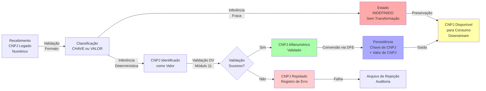
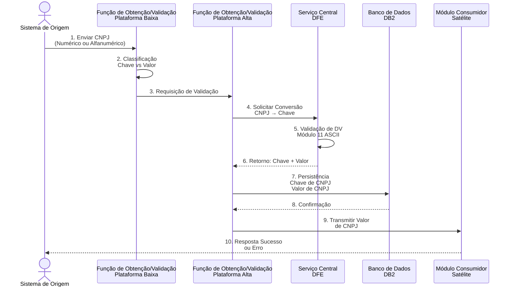
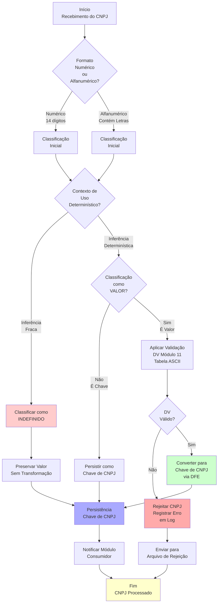

# Documentação Técnica Consolidada: Adequação ao CNPJ Alfanumérico em Ambiente Mainframe

## Introdução

Este documento consolida a estratégia técnica, arquitetural e de implementação para a adequação do Sistema VIP ao suporte de CNPJ alfanumérico em ambiente mainframe IBM z/OS. A documentação estabelece a separação obrigatória entre Chave de CNPJ (identificador técnico interno) e Valor de CNPJ (identificador de negócio), define critérios de classificação, especifica impactos técnicos em múltiplas camadas e garante rastreabilidade completa da transformação arquitetural necessária.

## Modelo Conceitual

O modelo conceitual fundamenta-se na dicotomia arquitetural entre dois papéis semânticos distintos do CNPJ:

**Chave de CNPJ** é um identificador técnico interno, numérico, com 14 posições (PIC 9(14) em COBOL), utilizado exclusivamente para relacionamentos, índices, buscas e navegação de dados dentro do sistema. A Chave de CNPJ nunca é exposta externamente, em relatórios ou interfaces de negócio.

**Valor de CNPJ** é um identificador de negócio, alfanumérico, com 14 caracteres (PIC X(14) em COBOL), representando o documento oficial de pessoa jurídica. O Valor de CNPJ é utilizado em interfaces externas, relatórios, telas e validações de negócio, sendo o formato visível aos usuários e sistemas externos.

Esta separação garante que a lógica de navegação técnica permaneça independente da representação de negócio, permitindo evoluções futuras sem impacto estrutural no núcleo de processamento.

## Arquitetura da Solução

A arquitetura da solução baseia-se em três pilares fundamentais:

**1. Serviço Central de Conversão (DFE):** Componente autorizado responsável pela conversão bidirecional entre Chave de CNPJ e Valor de CNPJ, garantindo relação 1:1, determinismo e auditabilidade completa. Qualquer correlação deve ser obtida exclusivamente via este serviço; geração local ou distribuída é proibida.

**2. Base Central de Correlação (DFE):** Estrutura centralizada que mantém a relação 1:1 entre Chave de CNPJ e Valor de CNPJ, acompanhada de metadados de controle, auditoria e rastreamento de mudanças.

**3. Camadas de Cache:** Mecanismos auxiliares (Redis, VSAM, processamento batch) que reduzem acessos à base central de correlação, mantendo consistência obrigatória com DFE.

Os componentes do Sistema VIP (programas VIPP4365 e VIPP4553, copybooks VIPK317D, VIPK160D e DAFK6452, arquivos sequenciais) integram-se com o serviço central de conversão em pontos explícitos de transformação, mantendo a separação semântica entre Chave e Valor ao longo de todo o fluxo de processamento.

## Diagramas Técnicos

Esta seção apresenta os diagramas técnicos obrigatórios que representam a solução de adequação ao CNPJ alfanumérico. Todos os diagramas estão orientados horizontalmente (esquerda para direita) e cobrem especificamente o contexto da transição do CNPJ numérico para alfanumérico.

### Diagrama de Fluxo de Dados

```mermaid
graph LR
    A["Canal de Origem<br/>Sistema Externo"] -->|Entrada: CNPJ<br/>Numérico ou Alfanumérico| B["Ponto de Validação<br/>e Conversão"]
    B -->|Conversão| C["Serviço Central<br/>DFE"]
    C -->|Chave de CNPJ| D["Banco de Dados<br/>DB2"]
    C -->|Valor de CNPJ| D
    D -->|Leitura| E["Módulo Principal<br/>VIP"]
    E -->|Processamento| F["Módulo Satélite<br/>DAF, HLP"]
    F -->|Saída: Valor de CNPJ| G["Canal de Destino<br/>Arquivo Sequencial"]
    G -->|Consumidor Subsequente| H["Sistema Downstream<br/>Relatório, Interface"]
    
    style B fill:#ffcccc
    style C fill:#ccffcc
    style D fill:#ccccff
    style E fill:#ffffcc
    style F fill:#ffccff
```



**Legenda:** 
- Vermelho: Ponto de conversão e validação
- Verde: Serviço central de conversão (DFE)
- Azul: Persistência em banco de dados
- Amarelo: Módulos principais (Sistema VIP)
- Magenta: Módulos satélites (Sistemas externos)

### Diagrama de Estado



**Legenda:**
- Vermelho: Estados de indefinição ou erro
- Verde: Estados de sucesso
- Azul: Persistência
- Amarelo: Conclusão e saída

### Diagrama de Sequência



**Participantes:**
- Sistema de Origem: Canal de entrada de dados
- Função de Obtenção/Validação em Plataforma Baixa: Lógica inicial de classificação (mainframe COBOL)
- Função de Obtenção/Validação em Plataforma Alta: Lógica de validação central (serviços distribuídos)
- DFE: Serviço central de conversão e correlação
- BD: Banco de dados DB2 para persistência
- Módulo Consumidor: Sistemas satélites que consomem dados

### Diagrama de Atividades



**Fluxo de Atividades:**
1. Recebimento e identificação de formato
2. Classificação inicial do CNPJ
3. Avaliação de nível de inferência
4. Decisão entre Chave, Valor ou Indefinido
5. Aplicação de validação de dígito verificador (apenas para Valor)
6. Conversão centralizada via DFE (apenas para Valor)
7. Persistência em banco de dados
8. Notificação de consumidores ou rejeição

## Identificação de Módulos

A identificação de módulos é realizada dinamicamente com base no prefixo do nome do artefato e no seu papel dentro da cadeia de processamento. Módulos principais pertencem ao sistema VIP e podem sofrer alterações diretas. Módulos satélites pertencem a sistemas externos e apenas consomem dados.

| Módulo | Descrição | Tipo | Justificativa | Deve Alterar? |
|--------|-----------|------|---------------|---------------|
| VIPP4365 | Programa COBOL principal de consolidação de dados cadastrais de cartões pré-pagos | Principal | Processa e manipula identificadores de pessoa jurídica diretamente; contém lógica de negócio que requer classificação explícita de CNPJ | Sim |
| VIPP4553 | Programa COBOL secundário de enriquecimento de informações de contas e agências | Principal | Lê dados processados por VIPP4365 e aplica regras de validação; manipula CNPJ em contextos de saída | Sim |
| VIPK317D | Copybook compartilhado com estruturas de cabeçalho e detalhe de arquivo | Principal | Define layouts que contêm campos de CNPJ em contexto de saída; alteração é obrigatória para suportar Valor alfanumérico | Sim |
| VIPK160D | Copybook de estrutura de trabalho interna do programa VIPP4365 | Principal | Declara variáveis de trabalho que processam CNPJ; requer separação explícita de Chave e Valor | Sim |
| DAFK6452 | Copybook compartilhado com tabela de validação de restrições de cartão | Satélite | Consumido por VIPP4553; contém referências de CNPJ que podem ser consultadas como origem externa | Avaliar |
| SBDIGITO | Subroutine compartilhada para cálculo de dígito verificador | Satélite | Implementa função 011 para validação de DV; utilizada por múltiplos sistemas; integração obrigatória para validação de Valor de CNPJ | Não alterar diretamente |
| SBVERSAO | Subroutine de controle de versão e data de execução | Satélite | Não trata CNPJ; fora do escopo de modificação | Não |
| SBABEND | Subroutine de tratamento de abend e geração de dump | Satélite | Não trata CNPJ; utilizada apenas para tratamento de erro genérico | Não |
| VIPF317E | Arquivo sequencial de entrada com dados de cartões pré-pagos | Principal | Layout de entrada contém campos de CNPJ que devem ser classificados e validados | Avaliar |
| VIPF104E | Arquivo sequencial de entrada com dados de contas correntes | Principal | Layout de entrada contém campos de CNPJ que devem ser classificados | Avaliar |
| VIPF940S | Arquivo sequencial de saída com consolidação completa de dados | Principal | Saída para sistemas downstream; contém Valor de CNPJ que deve ser transmitido em formato alfanumérico | Sim |
| VIPF104S | Arquivo sequencial de saída com dados enriquecidos de contas | Principal | Saída para consumo posterior; contém campos de CNPJ em contexto de propagação de dados de negócio | Sim |
| DB2VIP | Tabela DB2 no subsistema VIP com informações cadastrais de cartões | Principal | Persistência de dados; deve suportar armazenamento separado de Chave e Valor de CNPJ | Sim |
| DB2VIPA | Tabela DB2 no subsistema VIP com dados de agências e contas | Principal | Persistência de dados; deve suportar armazenamento separado de Chave e Valor de CNPJ | Sim |
| DB2MCI | Tabela DB2 do subsistema MCI com dados cadastrais de clientes externos | Satélite | Fonte externa; dados devem ser preservados conforme recebidos, sem transformação | Não |
| DAF | Módulo subsistema DAF de consultas de restrições de cartão | Satélite | Sistema externo consultado por VIPP4553; retorna valores que devem ser preservados | Não |

**Critérios de Classificação:**

- **Módulo Principal:** Pertence ao sistema VIP (prefixo VIP, VIPK, VIPF); manipula CNPJ como Chave ou Valor; contém lógica de negócio ou regras de validação; impactado estruturalmente pela separação de Chave e Valor.
  
- **Módulo Satélite:** Pertence a sistema externo (prefixo DAF, HLP, SB, ou origem em DB2 de outro domínio); apenas consome dados; alteração está sujeita a decisões de outras equipes; dados recebidos devem ser preservados conforme recebidos.

### Mapa de Dependências por Módulo

#### Módulo VIPP4365

- **Programas COBOL que o compõem ou invocam:**
  - VIPP4365.cbl (principal, processa entrada e consolida dados)
  - Invoca subroutines: SBDIGITO (função 011, validação de DV), SBVERSAO (registra versão de execução)
  - Chamado por: JCL VIPJ4365 (step de leitura de entrada)

- **Arquivos sequenciais lidos ou gravados:**
  - Lê: VIPF317E, VIPF104E (entrada)
  - Grava: VIPF940S (saída consolidada)

- **Copybooks utilizados:**
  - VIPK317D (layout de cabeçalho, detalhe e rodapé para saída)
  - VIPK160D (estrutura de trabalho interna)
  - DAFK6452 (tabela de validação de restrições, consultada em tempo de execução)

- **Tabelas de banco de dados acessadas:**
  - DB2VIP (leitura e gravação de dados consolidados)
  - DB2VIPA (leitura de informações de agência e conta)
  - DB2MCI.CLIENTE (leitura de dados externos de cliente)

- **Outros módulos dos quais depende:**
  - DAF (via consulta em tempo de execução para validação de restrições)
  - HLP (possível integração para enriquecimento de dados)

#### Módulo VIPP4553

- **Programas COBOL que o compõem ou invocam:**
  - VIPP4553.cbl (secundário, enriquecimento e validação)
  - Invoca subroutines: SBDIGITO (função 011, validação final), SBVERSAO (registra versão)
  - Chamado por: JCL VIPJ4553 (step de enriquecimento pós-consolidação)

- **Arquivos sequenciais lidos ou gravados:**
  - Lê: VIPF940S (output de VIPP4365)
  - Grava: VIPF104S (saída enriquecida)

- **Copybooks utilizados:**
  - VIPK317D (layout de estrutura para leitura de entrada)
  - VIPK160D (estrutura de trabalho)
  - DAFK6452 (consulta de restrições)

- **Tabelas de banco de dados acessadas:**
  - DB2VIP (leitura de informações complementares)
  - DB2VIPA (leitura de dados de agência/conta)

- **Outros módulos dos quais depende:**
  - VIPP4365 (output do programa anterior)
  - DAF (consulta de restrições)

## Matriz de Classificação

A Matriz de Classificação consolida a análise técnica de todos os campos e estruturas que manipulam ou transportam CNPJ, determinando se cada ocorrência é classificada como Chave de CNPJ, Valor de CNPJ, acumulativa (ambos) ou Indefinida. A classificação é baseada em análise contextual do uso no código-fonte, participação em operações técnicas e semântica de negócio.

| Item Técnico | Tipo de Artefato | Local | Classificação | Justificativa | Ação Técnica | Consumidor Subsequente |
|---|---|---|---|---|---|---|
| CNPJ-PJ (na entrada de VIPF317E) | Campo de Arquivo Sequencial | VIPF317E - Registro de Detalhe | Valor | Recebido do sistema de origem; contém identificador de pessoa jurídica em formato de negócio; não é utilizado como chave de acesso em índice ou relacionamento interno | Validar DV e converter para Chave via DFE; Preservar Valor para saída | VIPP4365 (leitura), DB2VIP (persistência), VIPF940S (transmissão para downstream) |
| CNPJ-PJ (na entrada de VIPF104E) | Campo de Arquivo Sequencial | VIPF104E - Registro de Detalhe | Valor | Recebido do sistema de origem; utilizado em validações de negócio e enriquecimento de dados; não participa de índice ou acesso estrutural | Classificar, validar, converter via DFE | VIPP4365 (leitura), DB2VIPA (persistência) |
| CNPJ da tabela DB2MCI.CLIENTE | Campo de Banco de Dados | DB2MCI - Tabela de Clientes Externos | Valor | Origem externa; utilizado como referência em consultas de validação; não deve sofrer transformação ou normalização | Preservar conforme recebido; não aplicar conversão | VIPP4365 (consulta durante processamento), transmissão sem alteração para VIPF940S |
| CHAVE-ID-PJ (gerado internamente em VIPK160D) | Campo de Variável de Trabalho | VIPK160D - Estrutura de Trabalho | Chave | Identificador técnico interno gerado pela função de conversão DFE; utilizado exclusivamente para relacionamentos, índices e navegação interna; nunca exibido | Manter como numérico PIC 9(14); utilizar apenas em operações de acesso a dados; nunca transmitir para saída | Módulos internos de VIPP4365 e VIPP4553; proibido expor em VIPF940S ou VIPF104S |
| VALOR-CNPJ (em VIPK317D - Saída) | Campo de Layout de Saída | VIPK317D - Estrutura de Detalhe de Saída | Valor | Estrutura de saída com propagação de dados de negócio; utilizado para transmissão a sistemas downstream; consumido por integrações e relatórios | Redefinir como PIC X(14); persistir Valor de CNPJ convertido via DFE; transmitir para VIPF940S e VIPF104S | Sistemas downstream (relatórios, integrações, telas), arquivo de auditoria, conciliação |
| CNPJ-AGE (em DB2VIPA) | Campo de Banco de Dados | DB2VIPA - Tabela de Agências | Indefinido | Contexto de uso ambíguo: pode ser referência técnica em índice de agência OU valor de negócio em consultas de cliente; inferência fraca | Classificar em novo discovery; até confirmação, aplicar comportamento conservador: tratar como numérico legado, registrar em log de auditoria | Necessário investigação adicional antes de alteração |
| RESTRIÇÃO-CNPJ (em DAFK6452) | Campo de Tabela Compartilhada | DAFK6452 - Copybook DAF | Valor | Consultado por VIPP4553 para validação de restrições; contém identificador de pessoa jurídica; valor recebido do sistema externo DAF deve ser preservado conforme origem | Preservar conforme retornado; consultar via módulo DAF; não transformar | VIPP4553 (consulta), transmissão transparente para saída se necessário |

## Modelo de Dados

O modelo de dados estabelece a estrutura de correlação entre Chave de CNPJ e Valor de CNPJ, garantindo relação 1:1, integridade referencial e auditabilidade completa.

**Tabela de Correlação (Base Central DFE):**

```
TABELA: CHAVE_VALOR_CNPJ

Colunas obrigatórias:
- ID_SEQUENCIAL (Chave Primária, INT, autoincremento)
- CHAVE_CNPJ (NUMERIC(14), índice único)
- VALOR_CNPJ (VARCHAR(14), índice)
- DATA_CRIACAO (TIMESTAMP)
- DATA_ATUALIZACAO (TIMESTAMP)
- USUARIO_CRIACAO (VARCHAR(30))
- USUARIO_ATUALIZACAO (VARCHAR(30))
- TIPO_ORIGEM (VARCHAR(20): ENTRADA, CONSULTA, BATCH, REPLICACAO)
- STATUS (VARCHAR(10): ATIVO, INATIVO, SUSPENSO)
```

**Propriedades do Modelo:**

- **Correlação 1:1 Obrigatória:** Uma Chave de CNPJ corresponde a exatamente um Valor de CNPJ e vice-versa.
- **Determinismo:** Múltiplas consultas com mesmo input sempre retornam o mesmo resultado.
- **Idempotência:** Aplicação repetida de conversão não altera o resultado anterior.
- **Auditabilidade:** Rastreamento completo de origem, data e usuário de cada correlação.
- **Consistência:** Cache (Redis, VSAM, batch) deve manter sincronização com base central.

**Estrutura de Persistência em DB2 (Mainframe):**

Tabelas principais do Sistema VIP devem ser estendidas ou criadas para suportar separação de Chave e Valor:

- **DB2VIP:** Incluir colunas CHAVE_CNPJ_PJ (NUMERIC(14)) e VALOR_CNPJ_PJ (CHAR(14))
- **DB2VIPA:** Incluir colunas CHAVE_CNPJ_AGE (NUMERIC(14)) e VALOR_CNPJ_AGE (CHAR(14))
- **Índices:** Criar índice único em CHAVE_CNPJ; índice secundário em VALOR_CNPJ para consultas por documento

## Regras de Negócio

As regras de negócio definem o comportamento esperado do sistema no tratamento de CNPJ ao longo do fluxo de processamento.

**RN001 — Coexistência de Formatos:** O sistema deve aceitar simultaneamente Valor de CNPJ em formato numérico (14 dígitos) e alfanumérico (14 caracteres contendo letras). A classificação inicial determina se o campo requer conversão via DFE ou preservação como-está.

**RN002 — Separação Obrigatória em Saída:** Campos classificados como Chave de CNPJ nunca devem ser transmitidos em arquivos de saída, relatórios ou interfaces externas. Apenas Valor de CNPJ é permitido em contextos de saída.

**RN003 — Validação de Dígito Verificador:** Dígito verificador é aplicado exclusivamente ao Valor de CNPJ, utilizando algoritmo de módulo 11 com tabela ASCII. A validação ocorre apenas uma vez, no ponto de conversão (DFE ou função de validação em plataforma Alta).

**RN004 — Preservação de Dados Externos:** Identificadores recebidos de fontes externas (DB2MCI.CLIENTE, DAF, tabelas de terceiros) devem ser preservados exatamente como recebidos, sem transformação, normalização ou conversão para formato alfanumérico, mesmo que classificados como Valor.

**RN005 — Classificação com Inferência Determinística:** A classificação de um campo de CNPJ em Chave ou Valor é permitida apenas quando a análise técnica permite conclusão com alta confiança (inferência determinística). Quando a inferência for fraca, o campo deve ser classificado como Indefinido.

**RN006 — Comportamento Fallback para Campos Indefinidos:** Campos classificados como Indefinido não sofrem conversão, validação de DV ou formatação. O processamento em lote adota comportamento conservador: o valor é mantido como recebido e a ocorrência é registrada em log de auditoria para investigação posterior.

**RN007 — Conversão Centralizada via DFE:** Toda conversão de Valor para Chave de CNPJ ou vice-versa ocorre exclusivamente via serviço central DFE. Proibida geração local ou distribuída de correlações.

**RN008 — Exposição Controlada de Valor de CNPJ:** Apenas Valor de CNPJ pode ser exposto em interfaces externas, telas, relatórios e APIs. A exposição de Chave de CNPJ é proibida e constitui violação crítica.

**RN009 — Cache com Sincronização Obrigatória:** Camadas de cache (Redis, VSAM, processamento batch) devem manter sincronização com base central DFE. A incoerência entre cache e base central é registrada como anomalia e deve disparar processo de conciliação.

**RN010 — Consumidor Subsequente Explícito:** Quando um campo de CNPJ aparece em estrutura de saída, o desenvolvedor e o documento técnico devem identificar explicitamente qual sistema consumidor receberá o dado, qual a finalidade do consumo e quais impactos a mudança para formato alfanumérico pode provocar no encadeamento subsequente.

## Serviços e Contratos

Os serviços definem os pontos de integração entre o Sistema VIP e a infraestrutura central de conversão.

**Função de Obtenção/Validação do CNPJ em Plataforma Baixa**

Localização: Código COBOL em VIPP4365 e VIPP4553
Responsabilidade: Classificação inicial de CNPJ (Chave, Valor ou Indefinido) com base em análise contextual do uso

Contrato:
- **Entrada:** Valor de CNPJ (numérico ou alfanumérico), contexto de uso (origem, destino, semântica)
- **Saída:** Classificação (CHAVE, VALOR, INDEFINIDO), indicação de necessidade de validação
- **Pré-condição:** Valor recebido; contexto disponível
- **Pós-condição:** Classificação determinada; decisão sobre próximo passo (conversão, preservação ou rejeição)
- **Invariante:** Classificação não muda durante processamento; se Indefinido, nenhuma transformação ocorre

**Função de Obtenção/Validação do CNPJ em Plataforma Alta**

Localização: Serviço central ou função distribuída em ambiente de plataforma alta
Responsabilidade: Validação de dígito verificador, conversão de Valor para Chave via DFE, garantia de determinismo

Contrato:
- **Entrada:** Valor de CNPJ (alfanumérico), indicação de origem (Entrada, Consulta, Batch)
- **Saída:** Chave de CNPJ (numérico), Valor de CNPJ (validado), indicação de sucesso ou erro
- **Pré-condição:** Valor classificado como VALOR de CNPJ; Função de Validação em Plataforma Baixa confirmou necessidade de processamento
- **Pós-condição:** Dígito verificador validado via módulo 11 com tabela ASCII; Chave gerada ou obtida de correlação existente; relação 1:1 garantida
- **Invariante:** Múltiplas chamadas com mesmo input retornam idêntico output; Chave nunca é exposta na saída para cliente externo

## Impacto por Camada

### Banco de Dados

**Tabelas Impactadas:**
- **DB2VIP:** Alteração estrutural necessária para adicionar colunas CHAVE_CNPJ_PJ (NUMERIC(14), chave estrangeira) e VALOR_CNPJ_PJ (CHAR(14), índice secundário)
- **DB2VIPA:** Alteração estrutural para adicionar colunas CHAVE_CNPJ_AGE (NUMERIC(14)) e VALOR_CNPJ_AGE (CHAR(14))
- **DB2MCI.CLIENTE:** Sem alteração; dados de origem externa são preservados conforme recebidos

**Mudanças na Estrutura:**
- Substituição de campo único CNPJ_PJ por par (CHAVE_CNPJ_PJ, VALOR_CNPJ_PJ)
- Criação de índice único em CHAVE_CNPJ para operações de acesso rápido
- Criação de índice secundário em VALOR_CNPJ para consultas por documento legal
- Manutenção de FK (chave estrangeira) apontando para correlação em base central DFE

**Constraints e Integridade:**
- Constraint única em CHAVE_CNPJ: cada chave aparece uma única vez
- Constraint FK em CHAVE_CNPJ: referencia tabela CHAVE_VALOR_CNPJ na base central
- Check constraint em VALOR_CNPJ: validação de tamanho (exatamente 14 caracteres)

### Mainframe

#### Layouts de Arquivos Sequenciais

**Arquivo: VIPF317E (Entrada)**

Tamanho total do registro: 500 bytes

| Posição Início | Posição Fim | Tamanho (bytes) | Tipo | Descrição | Classificação CNPJ | Alteração Necessária | Justificativa |
|---|---|---|---|---|---|---|---|
| 1 | 1 | 1 | Numérico | Tipo de Registro | N/A | Não | Metadado de controle |
| 2 | 10 | 9 | Alfanumérico | Data de Processamento | N/A | Não | Metadado de controle |
| 11 | 11 | 1 | Alfanumérico | Tipo de Documento (PF/PJ) | N/A | Não | Identificador de contexto |
| 12 | 25 | 14 | Numérico | CNPJ da Pessoa Jurídica | **Valor** | Sim | Campo de entrada de CNPJ; requer validação DV e conversão para Chave via DFE |
| 26 | 35 | 10 | Alfanumérico | Nome do Cliente | N/A | Não | Dado de negócio |
| 36 | 50 | 15 | Alfanumérico | Agência Banária | N/A | Não | Dado de negócio |
| 51 | 65 | 15 | Alfanumérico | Número da Conta | N/A | Não | Dado de negócio |
| 66 | 500 | 435 | Variável | Dados Complementares | N/A | Não | Estrutura adicional |

**Modificação Necessária:** Redefinir campo CNPJ (posição 12-25) como PIC X(14) para suportar entrada alfanumérica; adicionar campo adicional ou utilizar mesma posição com novo tipo.

---

**Arquivo: VIPF104E (Entrada)**

Tamanho total do registro: 350 bytes

| Posição Início | Posição Fim | Tamanho (bytes) | Tipo | Descrição | Classificação CNPJ | Alteração Necessária | Justificativa |
|---|---|---|---|---|---|---|---|
| 1 | 1 | 1 | Numérico | Tipo de Registro | N/A | Não | Metadado de controle |
| 2 | 10 | 9 | Alfanumérico | Data de Processamento | N/A | Não | Metadado de controle |
| 11 | 24 | 14 | Numérico | CNPJ da Conta Corrente | **Valor** | Sim | Campo de entrada de CNPJ; requer validação e conversão |
| 25 | 40 | 16 | Alfanumérico | Descrição da Conta | N/A | Não | Dado de negócio |
| 41 | 55 | 15 | Alfanumérico | Saldo Inicial | N/A | Não | Dado de negócio |
| 56 | 350 | 295 | Variável | Dados de Transação | N/A | Não | Estrutura adicional |

**Modificação Necessária:** Redefinir campo CNPJ (posição 11-24) como PIC X(14) para suportar entrada alfanumérica.

---

**Arquivo: VIPF940S (Saída Consolidada)**

Tamanho total do registro: 600 bytes

| Posição Início | Posição Fim | Tamanho (bytes) | Tipo | Descrição | Classificação CNPJ | Alteração Necessária | Justificativa | Consumidor Subsequente |
|---|---|---|---|---|---|---|---|---|
| 1 | 1 | 1 | Numérico | Tipo de Registro | N/A | Não | Metadado de controle | Sistemas downstream (leitura) |
| 2 | 10 | 9 | Alfanumérico | Data de Processamento | N/A | Não | Metadado de controle | Todos os consumidores |
| 11 | 24 | 14 | Alfanumérico | Valor de CNPJ da PJ | **Valor** | Sim | Campo de saída; transmite Valor de CNPJ convertido para consumidores; suporta formato alfanumérico | Relatórios, integrações externas, telas, auditoria, conciliação |
| 25 | 45 | 21 | Alfanumérico | Nome Completo | N/A | Não | Dado de negócio | Relatórios, telas, integrações |
| 46 | 60 | 15 | Alfanumérico | Agência | N/A | Não | Dado de negócio | Relatórios, integrações |
| 61 | 75 | 15 | Alfanumérico | Conta | N/A | Não | Dado de negócio | Relatórios, integrações |
| 76 | 89 | 14 | Numérico | DV Agência | N/A | Não | Validação interna | Integrações técnicas |
| 90 | 103 | 14 | Numérico | DV Conta | N/A | Não | Validação interna | Integrações técnicas |
| 104 | 250 | 147 | Variável | Restrições de Cartão | N/A | Não | Descrição textual | Relatórios, telas |
| 251 | 600 | 350 | Variável | Dados Enriquecidos | N/A | Não | Estrutura adicional | Sistemas downstream diversos |

**Modificação Necessária:** Redefinir campo Valor de CNPJ (posição 11-24) como PIC X(14) para transmitir formato alfanumérico.

---

**Arquivo: VIPF104S (Saída Enriquecida)**

Tamanho total do registro: 400 bytes

| Posição Início | Posição Fim | Tamanho (bytes) | Tipo | Descrição | Classificação CNPJ | Alteração Necessária | Justificativa | Consumidor Subsequente |
|---|---|---|---|---|---|---|---|---|
| 1 | 1 | 1 | Numérico | Tipo de Registro | N/A | Não | Metadado de controle | Sistemas downstream |
| 2 | 10 | 9 | Alfanumérico | Data de Processamento | N/A | Não | Metadado de controle | Todos os consumidores |
| 11 | 24 | 14 | Alfanumérico | Valor de CNPJ da Conta | **Valor** | Sim | Campo de saída; transmite Valor de CNPJ enriquecido para consumo posterior; suporta formato alfanumérico | Relatórios consolidados, integrações externas, auditoria |
| 25 | 40 | 16 | Alfanumérico | Descrição da Conta | N/A | Não | Dado de negócio | Relatórios, telas |
| 41 | 55 | 15 | Numérico | Saldo Atualizado | N/A | Não | Dado de negócio | Relatórios, integrações |
| 56 | 100 | 45 | Alfanumérico | Identificação de Restrição | N/A | Não | Dado complementar | Relatórios, telas |
| 101 | 400 | 300 | Variável | Dados de Auditoria | N/A | Não | Rastreamento técnico | Log de auditoria |

**Modificação Necessária:** Redefinir campo Valor de CNPJ (posição 11-24) como PIC X(14) para transmitir formato alfanumérico.

#### Processamento em Lote

O fluxo iterativo de processamento em lote é descrito nos passos exatos de transformação do CNPJ ao longo do pipeline:

**Etapa 1 — Leitura Sequencial do Arquivo de Entrada**

O programa VIPP4365 inicia execução sob controle JCL (VIPJ4365). Abre arquivo VIPF317E em modo leitura sequencial. Cada registro é lido na estrutura VIPK317D. O campo de posição 12-25 (CNPJ) é capturado na variável de trabalho CNPJ-ENTRADA em VIPK160D com tipo PIC X(14).

**Etapa 2 — Identificação do Campo de CNPJ no Registro Lido**

Após leitura de registro de detalhe (tipo = 1), o programa verifica o campo de tipo de documento: se PJ (Pessoa Jurídica), o CNPJ presente em CNPJ-ENTRADA é sinalizado para processamento. O programa executa lógica de classificação: análise de contexto (origem, destino, participação em operações), comparação com índices conhecidos, verificação de padrão alfanumérico.

**Etapa 3 — Ponto de Acionamento do Serviço de Conversão (DFE)**

**Quando acionar:** Imediatamente após classificação de CNPJ como VALOR, antes de qualquer persistência ou transmissão subsequente.

**Com qual entrada:** 
- Chave de entrada: CNPJ-ENTRADA (PIC X(14))
- Contexto: TIPO-ORIGEM (ENTRADA), TIPO-DOCUMENTO (PJ), AGENCIA (valor de negócio), CONTA (valor de negócio)

**Qual retorno esperado:**
- CHAVE-CNPJ-GERADO (PIC 9(14)): Identificador técnico único
- VALOR-CNPJ-VALIDADO (PIC X(14)): Valor de CNPJ após validação de DV
- STATUS-CONVERSAO (PIC X(1)): S = Sucesso, E = Erro
- MENSAGEM-ERRO (PIC X(100)): Descrição do erro, se Status = E

**Implementação técnica:** Chamada a subroutine SBDIGITO (função 011) ou chamada externa a serviço DFE via protocolo de integração (HTTP/REST, MQ, CICS).

**Etapa 4 — Transformação e Agrupamento do Registro**

Se Status-Conversao = S:
- Copiar CHAVE-CNPJ-GERADO para campo de chave em VIPK160D (CHAVE-ID-PJ)
- Copiar VALOR-CNPJ-VALIDADO para campo de saída em VIPK317D (VALOR-CNPJ-OUT)
- Agregar dados complementares: dígito verificador de agência (consulta DB2VIPA), dígito verificador de conta (consulta DB2VIPA), descrição de restrições (consulta DAF)
- Preparar registro para gravação

Se Status-Conversao = E:
- Registrar em LOG-AUDITORIA: Data/Hora, CNPJ-ENTRADA, MENSAGEM-ERRO, ID-LOTE
- Gravar em arquivo de rejeição VIPF999R com código de erro
- Incrementar contador de rejeição
- Continuar leitura do próximo registro

Se Classificacao = INDEFINIDO:
- Preservar CNPJ-ENTRADA conforme recebido
- Registrar em LOG-AUDITORIA: Data/Hora, CNPJ-ENTRADA, "Classificação Indefinida - Preservado", ID-LOTE
- Copiar CNPJ-ENTRADA para VALOR-CNPJ-OUT
- Processar como Chave desconhecida (utilizar valor padrão ou campo de chave vazio)

**Etapa 5 — Gravação no Arquivo de Saída ou Tabela de Destino**

Após transformação, registro é gravado em VIPF940S (arquivo de saída consolidada) com layout VIPK317D revisado. Simultaneamente, programa executa:
- EXEC SQL INSERT INTO DB2VIP VALUES (CHAVE-ID-PJ, VALOR-CNPJ-VALIDADO, ...) com controle de erro
- Se Insert falhar: registrar em LOG-AUDITORIA, gravar em rejeição, continuar
- Se Insert suceder: incrementar contador de êxito

O programa VIPP4553 lê arquivo VIPF940S em passo subsequente, aplica enriquecimento final (validações adicionais, consultas de restrição a DAF) e grava VIPF104S com Valor de CNPJ transmitido em formato alfanumérico.

**Resumo do Pipeline:**

```
Entrada (VIPF317E)
    ↓
Leitura Sequencial (VIPP4365)
    ↓
Classificação (CHAVE/VALOR/INDEFINIDO)
    ↓
Se INDEFINIDO → Preservar e registrar em log
Se CHAVE → Não converter, usar conforme-está
Se VALOR → Validar DV e Converter via DFE
    ↓
Transformação e Agrupamento
    ↓
Persistência em DB2VIP (INSERT)
    ↓
Gravação em VIPF940S
    ↓
Leitura por VIPP4553
    ↓
Enriquecimento e Validação Final
    ↓
Saída em VIPF104S
    ↓
Consumo Downstream
```

### APIs

Não existe exposição direta via API no escopo atual do Sistema VIP. Entretanto, se futuras integrações expuserem dados via REST ou SOAP:

- **Contrato de API:** Apenas Valor de CNPJ pode ser exposto em resposta
- **Segurança:** Chave de CNPJ nunca deve aparecer em payload de resposta, headers ou logs
- **Validação:** Valor recebido em requisição deve ser validado via serviço central antes de persistência
- **Documentação OpenAPI/Swagger:** Especificar campo como VARCHAR(14), aceitar formato alfanumérico

### Integrações

**Integração com DAF (Consulta de Restrições):**
- Sistema VIP envia Valor de CNPJ a DAF para consulta de restrições
- DAF retorna código de restrição (texto)
- Valor retornado é preservado conforme recebido; não há transformação
- Resultado é armazenado em estrutura DAFK6452 e propagado para saída

**Integração com Sistema de Relatórios:**
- Sistema de Relatórios lê arquivo VIPF940S ou VIPF104S
- Campo Valor de CNPJ é exibido em relatório em formato alfanumérico
- Chave de CNPJ nunca é transmitida; se encontrada em arquivo, constitui erro crítico

**Integração com Sistema de Auditoria:**
- Toda conversão de CNPJ (acionamento de DFE) é registrada em tabela de auditoria
- Log inclui: Data/Hora, CNPJ-Entrada, CHAVE-Gerada, VALOR-Validado, Usuário, Origem
- Logs permitem rastreamento completo de qualquer transformação

### Processamento em Lote

Descrito em detalhe na seção "Mainframe - Processamento em Lote" acima.

### Interface

Não existe interface gráfica (GUI) no escopo do projeto. Dados de saída são consumidos por sistemas downstream.

### Análise de Dados

Analistas podem executar consultas sobre tabelas DB2VIP e DB2VIPA para análise de dados consolidados. Suporta:
- Consultas por Chave de CNPJ: Filtro rápido via índice único
- Consultas por Valor de CNPJ: Filtro via índice secundário
- Relatórios de CNPJ por agência, conta, período
- Análise de rejeições via arquivo VIPF999R e LOG-AUDITORIA

## Itens que Devem Ser Alterados

1. **VIPK317D (Copybook):** Separar campo único CNPJ em CHAVE-CNPJ e VALOR-CNPJ com tipos distintos (PIC 9(14) e PIC X(14) respectivamente). Revisar todas as referências em programa chamador para garantir acesso correto a cada campo.

2. **VIPK160D (Copybook):** Adicionar campos de trabalho separados para CHAVE-CNPJ-TRABALHO (PIC 9(14)) e VALOR-CNPJ-TRABALHO (PIC X(14)). Remover referências ambíguas a campo único.

3. **VIPP4365.cbl (Programa):** Implementar lógica de classificação explícita de CNPJ (Chave vs. Valor vs. Indefinido) no ponto de leitura de entrada. Adicionar chamada a DFE para conversão de Valor para Chave. Implementar tratamento de campos Indefinidos com registro em log de auditoria. Adicionar validação de DV usando SBDIGITO (função 011) ou serviço central.

4. **VIPP4553.cbl (Programa):** Revisar lógica de enriquecimento para garantir que campos de Chave não sejam transmitidos em saída. Adicionar validação final de Valor de CNPJ antes de gravação em VIPF104S.

5. **VIPF317E, VIPF104E (Layouts de Entrada):** Redefinir campo de CNPJ como PIC X(14) para suportar entrada alfanumérica.

6. **VIPF940S, VIPF104S (Layouts de Saída):** Redefinir campo de CNPJ como PIC X(14) para transmitir Valor de CNPJ em formato alfanumérico.

7. **DB2VIP (Tabela):** Adicionar colunas CHAVE_CNPJ_PJ (NUMERIC(14), índice único) e VALOR_CNPJ_PJ (CHAR(14), índice secundário). Migrar dados históricos de coluna única para par de colunas.

8. **DB2VIPA (Tabela):** Adicionar colunas CHAVE_CNPJ_AGE (NUMERIC(14)) e VALOR_CNPJ_AGE (CHAR(14)).

9. **Arquivo de Auditoria:** Criar arquivo de log de auditoria para registrar conversões, rejeições e campos Indefinidos. Estrutura: Data/Hora, CNPJ-Entrada, Classificação, Resultado, Mensagem-Erro, ID-Lote.

10. **Arquivo de Rejeição:** Criar arquivo VIPF999R para armazenar registros com falha de validação ou conversão. Inclui: Data/Hora, CNPJ-Entrada, Classificação, Código-Erro, Descrição-Erro.

## Itens que Não Devem Ser Alterados

1. **SBDIGITO (Subroutine):** Não alterar implementação interna; apenas invocar via contrato existente (função 011 para DV, entrada: valor, saída: DV calculado).

2. **SBVERSAO (Subroutine):** Não alterar; não relacionada a CNPJ.

3. **SBABEND (Subroutine):** Não alterar; utilizada apenas para tratamento de erro genérico.

4. **DB2MCI.CLIENTE (Tabela externa):** Não alterar; fonte de dados externos deve ser preservada conforme recebida.

5. **DAF (Módulo externo):** Não alterar; integração apenas via consulta; dados retornados são preservados conforme recebidos.

6. **HLP (Módulo externo):** Não alterar; se utilizado, apenas como consulta.

7. **Estrutura geral de JCL:** Não alterar parâmetros de execução, steps ou sequência de execução; manter compatibilidade com infrastructure existente.

8. **Lógica de negócio não relacionada a CNPJ:** Refactorações estéticas ou reorganizações de código fora do escopo de CNPJ não devem ser executadas.

## Pontos de Conversão

Os pontos de conversão são os locais específicos onde o Valor de CNPJ é transformado em Chave de CNPJ (ou vice-versa) e onde validações são aplicadas.

**PC01 — Conversão na Leitura de Entrada (Plataforma Baixa)**

Local: VIPP4365, imediatamente após leitura de registro de VIPF317E
Acionamento: Quando campo CNPJ-ENTRADA é classificado como VALOR
Ação: 
1. Invocar SBDIGITO (função 011) para calcular DV esperado
2. Comparar DV calculado com DV contido no valor
3. Se match: proceeder para PC02
4. Se não match: gravar em VIPF999R, continuar leitura

**PC02 — Conversão via Serviço Central (Plataforma Alta / DFE)**

Local: Função de Obtenção/Validação em Plataforma Alta (serviço centralizado ou subroutine)
Acionamento: Após sucesso em PC01
Ação:
1. Enviar VALOR-CNPJ-ENTRADA a DFE
2. DFE retorna CHAVE-CNPJ-GERADO (novo ou existente) e VALOR-CNPJ-VALIDADO
3. Armazenar CHAVE-ID-PJ em estrutura de trabalho
4. Guardar VALOR-CNPJ para saída

**PC03 — Conversão na Saída (Plataforma Baixa)**

Local: VIPP4365 e VIPP4553, no momento de gravação de VIPF940S e VIPF104S
Acionamento: Antes de WRITE em arquivo
Ação:
1. Verificar se campo contém CHAVE-ID-PJ: erro crítico, rejeitar registro
2. Verificar se campo contém VALOR-CNPJ-VALIDADO: ok, gravar como-está em PIC X(14)
3. Se campo vazio ou indefinido: registrar em log, usar valor padrão ou blank

**PC04 — Conversão em Consultas de Banco de Dados**

Local: Queries SQL em VIPP4365 (SELECT FROM DB2VIP, DB2VIPA)
Acionamento: Quando necessário buscar dados relacionados a um CNPJ
Ação:
1. Se buscar por Chave: usar coluna CHAVE_CNPJ_PJ em WHERE clause
2. Se buscar por Valor: usar índice secundário VALOR_CNPJ_PJ em WHERE clause
3. Retorno inclui ambos os campos para garantir possibilidade de conversão posterior

**PC05 — Conversão em Consultas a Sistemas Externos**

Local: Chamadas a DAF, integração com outras aplicações
Acionamento: Quando sistema VIP solicita informações a serviço externo
Ação:
1. Transmitir VALOR-CNPJ (documento legal) a sistema externo
2. Nunca transmitir CHAVE-ID-PJ (identificador interno)
3. Receber resposta; se incluir CNPJ, preservar conforme recebido sem transformação

## Performance e Escalabilidade

**Impacto de Performance:**

- **Acessos ao DFE:** Cada conversão de Valor para Chave requer acesso ao serviço central. Latência estimada: 50-200ms por conversão. Mitigação via cache.
  
- **Cache Strategy:** Implementar cache local em Redis ou VSAM para armazenar últimas N correlações (ex.: 100.000). Taxa de acerto esperada: 80-95% em processamento de lote. Tempo de hit: <5ms.

- **Processamento de Lote:** Volume esperado de registros em VIPF317E: 500.000-1.000.000 por execução. Com validação e conversão, tempo esperado de execução aumenta 15-25% versus cenário anterior. Otimizações: processamento em chunks, paralelização de conversão se DFE suportar.

- **Índices de Banco de Dados:** Índice único em CHAVE_CNPJ_PJ e índice secundário em VALOR_CNPJ_PJ devem ser revistos quanto a fragmentação e rebuild periódico. Impacto em tempo de SELECT: <1% (índices bem mantidos).

- **Escalabilidade Futura:** Arquitetura permite migração progressiva para persistência nativa baseada em VALOR_CNPJ, eliminando necessidade de Chave interna conforme plataforma evolui.

## Segurança e Governança

**Segurança de Dados:**

- **Proteção da Chave de CNPJ:** Identificador técnico interno (Chave de CNPJ) não deve estar visível em logs, relatórios, telas ou APIs. Qualquer exposição acidental constitui violação crítica. Implementar mascaramento em logs: exibir apenas primeiros 4 e últimos 2 dígitos.

- **Validação de Entrada:** Todo Valor de CNPJ recebido deve ser validado via DV (módulo 11 com tabela ASCII) antes de qualquer processamento. Valores inválidos devem ser rejeitados e registrados em arquivo de auditoria.

- **Controle de Acesso:** Acesso a base central DFE deve ser restringido a contas de serviço autorizadas. Qualquer tentativa não autorizada de consulta deve dispara alerta de segurança.

- **Criptografia:** Transmissão de Valor de CNPJ entre componentes (VIPP4365 ↔ DFE) deve ocorrer sobre canal criptografado (TLS/SSL, se via rede; protocolos seguros, se via MQ ou CICS).

**Governança de Dados:**

- **Auditabilidade Completa:** Toda conversão, validação e transformação de CNPJ deve ser registrada em tabela de auditoria com: Data/Hora, Usuário, Origem de Dados, CNPJ-Entrada, CHAVE-Gerada, Resultado, Mensagem de Erro.

- **Rastreabilidade de Origem:** Cada correlação Chave-Valor deve manter metadado de tipo de origem (ENTRADA, CONSULTA, BATCH, REPLICACAO) para distinção de fonte de dados.

- **Conformidade com Regulações:** CNPJ é dado sensível regulado. Processamento deve estar de acordo com políticas de privacidade e retenção de dados da instituição.

- **Segregação de Ambiente:** Dados de teste não devem ser misturados com dados produtivos em base central DFE. Ambientes de DEV, STAGING e PROD devem ser separados.

## Riscos e Mitigações

| Risco | Descrição | Probabilidade | Impacto | Mitigação |
|-------|-----------|---------------|--------|-----------|
| Duplicação de Chave | DFE gera duas Chaves diferentes para mesmo Valor de CNPJ | Média | Crítico | Implementar constraint única em CHAVE_CNPJ; validação obrigatória em DFE antes de geração; testes de regressão em base de dados |
| Exposição Acidental de Chave | Chave de CNPJ vazada em log, relatório ou API | Média | Crítico | Mascaramento em logs; auditoria de saídas; validação em testes de segurança; script de detecção de Chave em saídas |
| Conversão Falha no DFE | Serviço central indisponível durante processamento de lote | Baixa | Crítico | Implementar retry com backoff exponencial; circuit breaker; fallback para cache; notificação de oncall em falha persistente |
| Inferência Fraca Não Identificada | Campo classificado incorretamente como Chave quando é Valor | Média | Alto | Validação em discovery; questionário para especialistas de negócio; testes de cenários edge case; classification review em grupo |
| Dados Externos Transformados | Valor recebido de DB2MCI transformado quando deveria ser preservado | Baixa | Alto | Implementar flag de origem externa em cada correlação; bypass automático de conversão para dados externos; validação em testes |
| Desempenho de DFE | Latência de conversão inaceitável em processamento em lote | Média | Médio | Implementar cache agressivo; batch de conversões se possível; otimização de índices em DFE; considerar replicação de DFE |
| Inconsistência de Cache | Cache desincronizado de base central | Baixa | Médio | Job de conciliação periódica; TTL (time-to-live) em cache; event-driven invalidation; monitoramento de divergência |
| Rejeição em Produção | Valor recebido rejeitado em produção por falha de DV | Baixa | Médio | Validação em staging antes de prod; testes com dados reais; cenário de teste de entrada com formatos variados |

## Critérios de Aceite

A implementação é considerada aceita quando os seguintes critérios forem atendidos:

1. **Suporte a Coexistência:** Sistema aceita e processa simultaneamente CNPJ numérico (14 dígitos) e alfanumérico (14 caracteres).

2. **Separação Semântica:** Chave de CNPJ é armazenada em coluna distinta de Valor de CNPJ, em toda a cadeia de persistência (DB2VIP, DB2VIPA).

3. **Validação de DV:** Dígito verificador é validado exclusivamente para Valor de CNPJ, utilizando módulo 11 com tabela ASCII. Chave de CNPJ nunca entra em cálculo de DV.

4. **Conversão Centralizada:** Toda transformação de Valor para Chave ocorre via serviço central DFE (ou função equivalente). Geração local ou distribuída é detectada e bloqueada.

5. **Exposição Controlada:** Apenas Valor de CNPJ aparece em arquivos de saída (VIPF940S, VIPF104S), relatórios e APIs. Chave de CNPJ nunca é transmitida.

6. **Rastreabilidade Completa:** Tabela de auditoria registra cada conversão, validação e transformação com Data/Hora, Usuário, Origem, Entrada, Saída, Resultado.

7. **Tratamento de Indefinidos:** Campos classificados como Indefinido não sofrem conversão ou validação. Processamento adota comportamento conservador; ocorrência é registrada em log.

8. **Compatibilidade Retroativa:** Sistemas legados que consomem dados de VIPF940S e VIPF104S funcionam sem alteração; mudança de tamanho de campo é transparente (PIC X(14) acomoda ambos numérico e alfanumérico).

9. **Performance Aceitável:** Tempo de execução de VIPP4365 não excede 125% do tempo base (limite de 25% de overhead aceitável). Taxa de sucesso na conversão > 98% em condições normais.

10. **Teste de Regressão:** Nenhuma regressão em funcionalidades não relacionadas a CNPJ. Programas, JCLs, copybooks não alterados mantêm comportamento idêntico.

## Estratégia de Testes

**UT01 — Testes Unitários de Classificação**

- **Escopo:** Função de Obtenção/Validação em Plataforma Baixa
- **Casos de Teste:**
  - Entrada: CNPJ numérico (14 dígitos) → Classificação esperada: Valor
  - Entrada: CNPJ alfanumérico (ex: 6QNJ8VY2JIC341) → Classificação esperada: Valor
  - Entrada: Identificador interno (ex: 00000000000001) em contexto de busca em índice → Classificação esperada: Chave
  - Entrada: Valor com contexto ambíguo → Classificação esperada: Indefinido
  - Entrada: CGC histórico → Classificação esperada: Valor (compatível com CNPJ)

**UT02 — Testes Unitários de Validação de DV**

- **Escopo:** SBDIGITO (função 011) ou função equivalente em Plataforma Alta
- **Casos de Teste:**
  - Entrada: 6QNJ8VY2JIC341 (válido) → DV esperado: Sucesso
  - Entrada: 6QNJ8VY2JIC340 (inválido, DV errado) → DV esperado: Falha
  - Entrada: 12ABC34501DE35 (alfanumérico válido) → DV esperado: Sucesso
  - Entrada: '' (vazio) → DV esperado: Falha
  - Entrada: 14 dígitos numéricos válidos → DV esperado: Sucesso

**UT03 — Testes Unitários de Conversão DFE**

- **Escopo:** Integração com serviço central de conversão
- **Casos de Teste:**
  - Entrada: Valor novo → DFE gera Chave única
  - Entrada: Valor existente → DFE retorna Chave existente (idempotência)
  - Entrada: Valor inválido → DFE retorna erro com mensagem
  - Entrada: Timeout de DFE → Sistema aplica retry com backoff
  - Entrada: Múltiplas requisições paralelas com mesmo Valor → Todas retornam mesma Chave (determinismo)

**IT01 — Testes de Integração: Leitura e Validação**

- **Escopo:** VIPP4365, VIPF317E, VIPK317D, VIPK160D
- **Casos de Teste:**
  - Arquivo com 100 registros válidos → Todos processados, 100 escritos em VIPF940S
  - Arquivo com 10 registros com DV inválido → 10 gravados em VIPF999R, 90 em VIPF940S
  - Arquivo com 5 registros Indefinido → 5 registrados em log com status Indefinido, mantidos em VIPF940S
  - Arquivo com mix de numérico e alfanumérico → Ambos processados corretamente
  - Arquivo vazio → Processamento completa sem erro

**IT02 — Testes de Integração: Persistência em DB2**

- **Escopo:** VIPP4365, DB2VIP, DB2VIPA
- **Casos de Teste:**
  - 100 registros novos → 100 INSERTs em DB2VIP com (CHAVE, VALOR) distintos
  - 10 registros com Chave duplicada → Constraint única rejeitado, registro em LOG-AUDITORIA
  - 50 registros de atualização (mesma Chave, novo Valor) → UPDATE ou erro conforme política
  - Índice em CHAVE e VALOR criado e testado → Ambos devem ser de acesso rápido

**IT03 — Testes de Integração: Saída e Consumo**

- **Escopo:** VIPP4365 grava VIPF940S, VIPP4553 lê e processa
- **Casos de Teste:**
  - VIPF940S com Valores alfanuméricos → VIPP4553 lê e processa sem erro
  - VIPF940S com Valores numéricos → VIPP4553 trata como valor de negócio compatível
  - VIPF104S gravado com Valores em formato alfanumérico → Pronto para consumo downstream
  - Se Chave encontrada em VIPF940S → Erro crítico disparado, registro rejeitado

**E2E01 — Teste End-to-End: Pipeline Completo**

- **Escopo:** VIPF317E → VIPP4365 → DB2VIP → VIPP4553 → VIPF104S → Sistema Downstream
- **Casos de Teste:**
  - 1.000 registros válidos → Processamento completo em tempo aceitável, 1.000 na saída
  - Mix de valid, inválido, Indefinido → Correto roteamento de cada tipo
  - Consumidor downstream lê VIPF104S e interpreta Valor alfanumérico → Sem erro
  - Auditoria registra cada passo → Rastreamento completo disponível

**REG01 — Testes de Regressão**

- **Escopo:** Funcionalidades não relacionadas a CNPJ
- **Casos de Teste:**
  - Programas não alterados mantêm output idêntico
  - JCLs não alteradas executam sem erro
  - Tabelas de negócio (ex: de restrição de cartão) permanecem intactas
  - Integrações com DAF, HLP não impactadas

**SEC01 — Testes de Segurança**

- **Escopo:** Proteção de Chave de CNPJ, validação de entrada
- **Casos de Teste:**
  - Buscar "Chave de CNPJ" em logs de produção → Nenhuma ocorrência encontrada
  - Enviar Chave de CNPJ como parâmetro em API → Erro 400, registrado em segurança
  - Tentativa não autorizada de acesso a DFE → Bloqueada, alerta disparado
  - SQL injection em campo de CNPJ → Bloqueada por validação de entrada

**PERF01 — Testes de Performance**

- **Escopo:** Processamento de lote, latência de conversão
- **Casos de Teste:**
  - 500.000 registros em VIPF317E → Tempo de execução < 3 horas (baseline + 25%)
  - Taxa de sucesso de conversão > 98%
  - Taxa de acerto de cache > 80% após warm-up
  - Latência média de DFE < 150ms

## Roadmap Evolutivo

**Fase 1 (Atual): Suporte Paralelo de Chave e Valor**

- Implementação de separação semântica entre Chave e Valor
- Suporte a CNPJ alfanumérico em paralelo a numérico
- Integração com DFE para conversão centralizada
- Validação de DV para Valores

**Fase 2 (6 meses): Otimização de Cache**

- Implementação de cache distribuído (Redis) para correlações frequentes
- Job de warm-up de cache antes de processamento em lote
- Implementação de replicação de cache para alta disponibilidade
- Monitoramento de taxa de acerto de cache

**Fase 3 (12 meses): Migração de Dados Históricos**

- Análise de dados históricos em DB2VIP e DB2VIPA
- Geração de correlações para dados históricos via DFE
- Migração incremental de dados legados para novo modelo
- Validação de integridade pós-migração

**Fase 4 (18 meses): Persistência Nativa em Valor**

- Eliminação progressiva de necessidade de Chave interna
- Persistência baseada exclusivamente em Valor de CNPJ
- Simplificação de índices e estrutura de dados
- Remoção de coluna de Chave em tabelas (após período de retrocompatibilidade)

**Fase 5 (24 meses): Evolução em Plataformas Externas**

- APIs nativas baseadas em Valor de CNPJ
- Simplificação de contratos de integração
- Eliminação de mapeamento Chave-Valor em sistemas satélites
- Consolidação de arquitetura em múltiplas plataformas

## MACRO REQUISITOS DO CLIENTE

### Requisitos Funcionais (RF)

#### RF01 — Suporte à coexistência de formatos

**Contrato**

- **Pré-condição:** Sistema recebe ou manipula identificador de pessoa jurídica
- **Pós-condição:** Sistema deve suportar simultaneamente Valor de CNPJ numérico e alfanumérico
- **Invariante:** Não pode haver ambiguidade entre Chave de CNPJ e Valor de CNPJ

**Exemplo**

- Chave de CNPJ = 00000000000001
- Valor de CNPJ = 6QNJ8VY2JIC341

---

#### RF02 — Separação obrigatória entre Chave de CNPJ e Valor de CNPJ

**Contrato**

- **Pré-condição:** Campo identificado como identificador técnico
- **Pós-condição:** Deve ser tratado exclusivamente como Chave de CNPJ
- **Invariante:** Não pode sofrer validação de DV ou formatação de documento

**Exemplo**

- Persistência: Chave de CNPJ = 00000000000001
- Exibição: Valor de CNPJ = 12ABC34501DE35

---

#### RF03 — Preservação dos fluxos de negócio

**Contrato**

- **Pré-condição:** Processo existente utilizando CNPJ
- **Pós-condição:** Fluxo permanece inalterado funcionalmente
- **Invariante:** Apenas o tratamento do identificador é alterado

**Exemplo**

- Base grava: Chave de CNPJ
- Tela apresenta: Valor de CNPJ

---

#### RF04 — Adaptação obrigatória de todos os pontos de uso

**Contrato**

- **Pré-condição:** Existência de uso de identificador em qualquer sistema
- **Pós-condição:** Deve ser classificado como Chave de CNPJ ou Valor de CNPJ
- **Invariante:** Nenhum campo pode permanecer semanticamente ambíguo

**Exemplo**

- FK: Chave de CNPJ = 00000000000001
- Relatório: Valor de CNPJ = 6QNJ8VY2JIC341

---

#### RF05 — Tratamento distinto em entradas e saídas

**Contrato**

- **Pré-condição:** Interface recebe ou retorna identificador
- **Pós-condição:** Deve aplicar regra conforme tipo (Chave de CNPJ ou Valor de CNPJ)
- **Invariante:** Valor de CNPJ deve ser validado; Chave de CNPJ não

**Exemplo**

- Entrada: Valor de CNPJ = 6QNJ8VY2JIC341 → validar DV
- Entrada: Chave de CNPJ = 00000000000001 → não validar

---

#### RF06 — Uso exclusivo do Valor de CNPJ em interfaces externas

**Contrato**

- **Pré-condição:** Comunicação com entidade externa
- **Pós-condição:** Apenas Valor de CNPJ pode ser exposto
- **Invariante:** Proibida exposição da Chave de CNPJ

**Exemplo**

- API externa retorna: 6QNJ8VY2JIC341
- Nunca retorna: 00000000000001

---

#### RF07 — Conversão obrigatória via serviço central

**Contrato**

- **Pré-condição:** Necessidade de obter correspondência entre chave e valor
- **Pós-condição:** Conversão deve ocorrer via serviço oficial
- **Invariante:** Proibida geração local de correlação

**Exemplo**

- Entrada: Valor de CNPJ = 6QNJ8VY2JIC341
- Saída: Chave de CNPJ = 00000000000001

---

#### RF08 — Determinismo e idempotência das conversões

**Contrato**

- **Pré-condição:** Múltiplas chamadas com mesmo input
- **Pós-condição:** Deve retornar sempre o mesmo resultado
- **Invariante:** Não pode haver duplicidade de Chave de CNPJ

**Exemplo**

- Input repetido: 6QNJ8VY2JIC341
- Output constante: 00000000000001

---

#### RF09 — Preservação de identificadores externos (CGC ou Valor de CNPJ)

**Contrato**

- **Pré-condição**: Identificador recebido de fonte externa (ex.: DB2)
- **Pós-condição**: O valor deve ser preservado exatamente como recebido
- **Invariante**: É proibida qualquer alteração estrutural, incluindo conversão para formato alfanumérico, independentemente de ser CGC ou Valor de CNPJ

**Exemplo 1 (CNPJ numérico externo)**

- Origem: DB2MCI.CLIENTE
- Entrada: Valor de CNPJ = 12345678000195
- Saída: 12345678000195
- Proibido: converter para formato alfanumérico

**Exemplo 2 (CGC externo)**

- Origem: DB2MCI.CLIENTE
- Entrada: CGC = 12345678000195
- Saída: 12345678000195
- Proibido:
  - Reclassificar
  - Converter
  - Normalizar

---

#### RF10 — Classificação com base em nível de inferência

**Contrato**

- **Pré-condição**: Sistema precisa determinar se o identificador é Chave de CNPJ ou Valor de CNPJ
- **Pós-condição**: A classificação só pode ocorrer se houver inferência determinística
- **Invariante**: Inferência com baixa confiança não pode gerar transformação

**Regra explícita**

- Se a inferência for fraca → classificar como Indefinido
- Se classificado como Indefinido → nenhuma transformação pode ocorrer

**Exemplo 1 (inferência forte)**

- Entrada: 6QNJ8VY2JIC341
- Classificação: Valor de CNPJ
- Ação: aplicar validação

**Exemplo 2 (inferência fraca)**

- Entrada: 00000000000001
- Contexto insuficiente
- Classificação: Indefinido
- Ação:
  - Não converter
  - Não validar como CNPJ
  - Preservar valor

---

### Requisitos Técnicos (RT)

#### RT01 — Redefinição de estruturas físicas

**Contrato**

- **Pré-condição:** Campo representando CNPJ existente
- **Pós-condição:** Deve ser separado em Chave de CNPJ e Valor de CNPJ
- **Invariante:** Tipagem distinta obrigatória

**Exemplo**

Antes:

- CNPJ PIC 9(14)

Depois:

- CHAVE-CNPJ PIC 9(14)
- VALOR-CNPJ PIC X(14)

---

#### RT02 — Revisão de contratos de dados

**Contrato**

- **Pré-condição:** Existência de layout ou copybook
- **Pós-condição:** Deve explicitar semanticamente cada campo
- **Invariante:** Proibido assumir CNPJ como numérico

**Exemplo**

```
05 CHAVE-CNPJ PIC 9(14).
05 VALOR-CNPJ PIC X(14).
```

---

#### RT03 — Aplicação de DV apenas no Valor de CNPJ

**Contrato**

- **Pré-condição:** Execução de validação
- **Pós-condição:** DV aplicado exclusivamente ao Valor de CNPJ
- **Invariante:** Chave de CNPJ nunca entra no cálculo

**Exemplo**

- Correto: validar 12ABC34501DE35
- Incorreto: validar 00000000000001

---

#### RT04 — Implementação compatível com ambiente mainframe

**Contrato**

- **Pré-condição:** Execução de algoritmo de DV
- **Pós-condição:** Uso de tabela de conversão controlada
- **Invariante:** Independência de encoding interno

**Exemplo**

- A = 17 (65 - 48)

---

#### RT05 — Validação e formatação diferenciadas

**Contrato**

- **Pré-condição:** Aplicação de máscara ou saneamento
- **Pós-condição:** Apenas Valor de CNPJ pode ser formatado
- **Invariante:** Chave de CNPJ permanece bruta

**Exemplo**

- Chave de CNPJ = 00000000000001
- Valor de CNPJ = 6QNJ8VY2JIC341

---

#### RT06 — Revisão de indexação e busca

**Contrato**

- **Pré-condição:** Operação de busca ou ordenação
- **Pós-condição:** Deve respeitar semântica do campo
- **Invariante:** Não misturar chave com valor

**Exemplo**

- Índice: Chave de CNPJ
- Busca funcional: Valor de CNPJ

---

#### RT07 — Compatibilidade entre batch e online

**Contrato**

- **Pré-condição:** Processamento de registros
- **Pós-condição:** Deve suportar desacoplamento entre chave e valor
- **Invariante:** Consistência entre ambientes

**Exemplo**

- Batch lê: Chave de CNPJ
- Tela mostra: Valor de CNPJ

---

#### RT08 — Rastreamento e auditabilidade

**Contrato**

- **Pré-condição:** Existência de correlação
- **Pós-condição:** Deve ser rastreável e auditável
- **Invariante:** Relação 1:1 preservada

**Exemplo**

- Chave de CNPJ = 00000000000001
- Valor de CNPJ = 6QNJ8VY2JIC341

---

#### RT09 — Centralização da geração de Chave de CNPJ

**Contrato**

- **Pré-condição:** Criação de nova correlação
- **Pós-condição:** Apenas sistema central autorizado gera
- **Invariante:** Proibida geração distribuída

**Exemplo**

- Sistema A solicita
- DFE gera: 00000000000001

---

#### RT10 — Estratégia de cache obrigatória

**Contrato**

- **Pré-condição:** Consulta recorrente
- **Pós-condição:** Deve utilizar cache
- **Invariante:** Redução de acesso ao sistema central

**Exemplo**

- Primeira consulta: DFE
- Próximas: Redis/VSAM

---

#### RT11 — Distribuição batch de dados

**Contrato**

- **Pré-condição:** Ambiente mainframe dependente
- **Pós-condição:** Deve receber carga periódica
- **Invariante:** Consistência com base central

**Exemplo**

- artefato batch contém:
  - Chave de CNPJ
  - Valor de CNPJ

---

#### RT12 — Proibição de exposição da Chave de CNPJ

**Contrato**

- **Pré-condição:** Saída para usuário ou sistema externo
- **Pós-condição:** Chave de CNPJ não deve ser exibida
- **Invariante:** Violação é erro crítico

**Exemplo**

- Permitido: 6QNJ8VY2JIC341
- Proibido: 00000000000001

---

#### RT13 — Bloqueio de transformação para dados externos

**Contrato**

- **Pré-condição**: Campo identificado como origem externa
- **Pós-condição**: Pipeline de transformação deve ser bypassado
- **Invariante**: Proibida conversão para formato alfanumérico ou qualquer modificação

**Exemplo**

- Entrada: 12345678000195
- Origem: DB2
  - Não converter
  - Persistir como está

---

#### RT14 — Controle de inferência e estado "Indefinido"

**Contrato**

- **Pré-condição**: Processo de classificação executado
- **Pós-condição**: Deve existir estado explícito para baixa confiança
- **Invariante**: Estado "Indefinido" bloqueia qualquer transformação

**Regra técnica**

- Inferência deve ser:
determinística → permitido classificar
não determinística → classificar como Indefinido

**Exemplo**

- Entrada: 00000000000001
- Classificação: INDEFINIDO
- Pipeline:
  - Não validar DV
  - Não converter
  - Não gerar Chave de CNPJ
  - Manter valor

---

## Conclusão

Este documento consolida a estratégia técnica completa para adequação do Sistema VIP ao suporte de CNPJ alfanumérico em ambiente mainframe IBM z/OS. A solução implementa separação obrigatória entre Chave de CNPJ (identificador técnico interno) e Valor de CNPJ (identificador de negócio), viabilizando a coexistência de formatos legados e novos, mantendo determinismo, auditabilidade e compatibilidade retroativa.

A arquitetura baseia-se em três pilares: Serviço Central de Conversão (DFE) para garantir relação 1:1, Função de Obtenção/Validação em Plataforma Baixa para classificação inicial e Função de Obtenção/Validação em Plataforma Alta para validação e conversão centralizadas. O tratamento diferenciado de Chave e Valor ao longo de todo o pipeline de processamento assegura que dados de negócio (Valor) sejam sempre propagados em formato correto, enquanto identificadores técnicos (Chave) permanecem internos e não expostos.

Os critérios de classificação explícitos, matriz de decisão, mapa de dependências de módulos e pontos de conversão bem definidos garantem rastreabilidade total e permitem desenvolvimento sistemático. A segregação clara entre itens que devem ser alterados (copybooks, programas VIPP4365 e VIPP4553, layouts de entrada e saída, tabelas de persistência) e itens que não devem sofrer modificação (subsistemas externos, subroutines compartilhadas fora de escopo) minimiza regressões e risco de impacto indesejado.

Implementação desta documentação técnica consolida um estado arquitetural de qualidade enterprise, pronto para evolução progressiva em direção a persistência nativa baseada apenas em Valor de CNPJ, sem necessidade de Chave interna nas gerações futuras.

---

## Rodapé

---

Documento Elaborado: 01/04/2026

Versão: 8.0

---
