# ANÁLISE DE IMPACTO — CNPJ ALFANUMÉRICO EM AMBIENTE MAINFRAME

**Demanda:** SPBCA21C-286  
**Projeto:** Demanda CNPJ Alfanumérico  
**Data de Geração:** 02/04/2026 03:05  
**Versão:** 1.0  
**Status:** COMPLETO  

---

## Sumário Executivo

Este documento apresenta a análise completa de impacto da adequação do CNPJ numérico para CNPJ alfanumérico em ambiente mainframe, especificamente no Sistema VIP (VIPP4365 e VIPP4553). A análise identifica 10 campos CNPJ/CGC, classifica-os como Chave (7 campos) ou Valor (3 campos), mapeia consumidores subsequentes, quantifica impacto em armazenamento físico, documenta visibilidade de variáveis e registra riscos de quebra contratual. A coexistência de formatos em produção exigirá campos duplicados com sufixo `Alfanumerico`, gerando delta estimado de **+14 bytes por campo Value em novas colunas DB2** e impacto em cascata em copybooks compartilhados e interfaces externas.

---

# 1. Identificação da Demanda

| Atributo | Valor |
|:---|:---|
| **ID da Demanda** | SPBCA21C-286 |
| **ID do Projeto** | Demanda CNPJ Alfanumérico |
| **ID da Tarefa** | Levantamento de Impacto |
| **Documento de Origem** | `.pss/b_new/p_prd_b_execution/dem_prd_g_impact.md` |
| **Documento de Requisito** | `.pss/b_new/w_output/dem_a_cnpj_alfa_prd/dem_prd_requisito.md` |
| **Documento de Diagnóstico** | `.pss/b_new/b_doc_b_dem/dem_f_diagnostic.md` |
| **Contexto da Demanda** | Adequação de sistema mainframe legado (VIP) para suportar CNPJ alfanumérico mantendo coexistência com formato numérico legado |
| **Resultado Esperado** | Documentação de impacto mostrando: classificação de campos, consumidores subsequentes, delta de armazenamento, visibilidade de variáveis, cascata de impacto entre artefatos e riscos de quebra contratual |
| **Escopo de Artefatos Analisados** | Programas COBOL (VIPP4365, VIPP4553), Copybooks (VIPK317D, VIPK160D, DAFK6452), Arquivos (VIPF317E, VIPF940S, VIPF104E, VIPF104S), Tabelas DB2 (DB2MCI.CLIENTE, DB2VIP.PORT_PLST_PRE_PG), Serviços externos (DAFS6452) |

---

# 2. Inventário Executivo de Artefatos Impactados

## 2.1 Visão Consolidada por Tipo de Artefato

| Tipo de artefato | Total no escopo | Impactados (confirmado) | % de impacto | Classificação predominante | Nível de risco agregado | Delta total de bytes estimado | Visibilidade predominante dos campos |
|:---|:---:|:---:|:---:|:---|:---:|:---:|:---|
| Programa COBOL | 2 | 2 | 100% | Ambos (Chave+Valor) | Alto | +6 a +12 bytes por layout | Interface de Arquivo (saída) |
| Copybook | 3 | 2 | 67% | Chave | Médio | 0 (Chave) | Compartilhado entre programas |
| Tabela DB2 | 2 | 1 | 50% | Chave | Baixo | Potencial +14 bytes por coluna nova | Persistência DB2 (read/write) |
| Arquivo de entrada | 2 | 2 | 100% | Chave | Alto | 0 (entrada preservada) | Externa (recebida) |
| Arquivo de saída | 2 | 2 | 100% | Ambos | Crítico | +6 a +12 bytes no layout | Externa (contrato com consumidor) |
| Interface/Serviço externo | 1 | 1 | 100% | Chave | Crítico | 0 (parâmetro preservado) | Interface de CALL |
| Copybook de módulo externo | 1 | 1 | 100% | Chave/Valor | Crítico | 0 (módulo secundário não alterável) | Interface externa (DAF) |
| JCL | 2 | 0 | 0% | N/A | Baixo | 0 (sem alteração esperada) | Orquestração interna |
| **Total** | **15** | **11** | **73%** | **—** | **—** | **—** | **—** |

**Thresholds desta tabela**
| Métrica | Verde (aceitável) | Amarelo (atenção) | Vermelho (crítico) | Valor obtido | Resultado |
|:---|:---:|:---:|:---:|:---:|:---:|
| % impactados | < 30% | 30–60% | > 60% | 73% | 🔴 **Vermelho** |

**Observação de alerta:** Taxa de impacto de 73% indica cobertura praticamente total do escopo, exigindo análise detalhada de cascata. Todos os artefatos principais estão na lista de impacto.

---

## 2.2 Detalhamento por Artefato

| ID | Artefato | Tipo | Sistema/Módulo | Classificação (campo predominante) | Tipo de Impacto | Necessidade de novo artefato? | Nova coluna `Alfanumerico`? | Delta de bytes estimado | Visibilidade do campo | Status da análise |
|:---:|:---|:---|:---|:---|:---|:---|:---|:---|:---|:---|
| A01 | VIPP4365.cbl | Programa COBOL | VIP (Principal) | Chave + Valor | Direto (campos mudam) | Sim (criar VIPP4365-ALF.cbl) | Sim (CNPJ-Alfanumérico em saída) | +6 a +12 por registro saída | Interface de Arquivo | Confirmado |
| A02 | VIPP4553.cbl | Programa COBOL | VIP (Principal) | Chave + Valor | Direto (campos mudam) | Sim (criar VIPP4553-ALF.cbl) | Sim (múltiplas colunas em saída) | +6 a +12 por registro saída | Interface de Arquivo | Confirmado |
| A03 | VIPK317D.cpy | Copybook | VIP | Chave | Indireto (dependência) | Não (reutilização) | Não (Chave permanece numérica) | 0 (tipo mantido) | Compartilhado (5+ programas) | Confirmado |
| A04 | VIPK160D.cpy | Copybook | VIP | N/A | Indireto (dependência) | Não | Não (sem campo CNPJ) | 0 | Local | Confirmado |
| A05 | DAFK6452.cpy | Copybook | DAF (Secundário) | Chave + Valor | Contratual | Não (módulo externo) | Não (não alterável) | 0 | Interface de CALL (externa) | Confirmado |
| A06 | VIPF317E | Arquivo entrada | VIP | Chave | Indireto (entrada) | Não | Não (layout externo) | 0 (preservado) | Externa (recebida) | Confirmado |
| A07 | VIPF940S | Arquivo saída | VIP | Ambos | Direto (saída muda) | Sim (criar VIPF940S-ALF) | Sim (+14 bytes coluna nova) | +14 por registro | Externa (contrato) | Confirmado |
| A08 | VIPF104E | Arquivo entrada | VIP | Ambos | Indireto (entrada) | Não | Não (layout externo) | 0 (preservado) | Externa (recebida) | Confirmado |
| A09 | VIPF104S | Arquivo saída | VIP | Ambos | Direto (saída muda) | Sim (criar VIPF104S-ALF) | Sim (+14 bytes coluna nova x5) | +70 por registro | Externa (contrato) | Confirmado |
| A10 | DB2VIP.TABCNPJ | Tabela DB2 | VIP | Chave | Indireto (acesso) | Não | Potencial (coluna nova) | 0 a +14 | Persistência DB2 | A validar |
| A11 | DB2MCI.CLIENTE | Tabela DB2 | MCI (Ext) | Chave | Indireto (leitura) | Não | Não (módulo externo) | 0 | Externa (apenas leitura) | Confirmado |
| A12 | DB2VIP.PORT_PLST_PRE_PG | Tabela DB2 | VIP | Valor | Indireto (leitura) | Não | Potencial (coluna nova) | 0 a +14 | Persistência DB2 | Confirmado |
| A13 | DAFS6452 | Serviço integrado | DAF (Ext) | Chave | Contratual | Não (módulo externo) | Não (não alterável) | 0 | Interface de CALL (externa) | Confirmado |

---

# 3. Sistemas Impactados

## 3.1 Visão por Sistema — Impacto e Formato Esperado

| ID | Sistema | Papel no fluxo | Tipo de Impacto | Formato CNPJ que consome hoje | Formato CNPJ que precisará consumir | Depende de cache? | Depende de batch? | Impacto contratual esperado | Impacto em armazenamento no sistema | Evidência principal | Status |
|:---:|:---|:---|:---|:---|:---|:---:|:---:|:---|:---|:---|:---|
| S01 | VIP (VIPP4365) | Provedor de arquivo VIPF940S | Direto | Numérico (14 dígitos) | Numérico + Alfanumérico (coexistência) | Não | Não | Layout VIPF940S cresce +14 bytes (coluna nova); consumidores devem tolerar novo formato | +14 bytes por registro de saída | Arquivo VIPF940S é persistência de dados de pré-pago PJ | Confirmado |
| S02 | VIP (VIPP4553) | Provedor de arquivo VIPF104S | Direto | Numérico (14 dígitos) | Numérico + Alfanumérico (coexistência) | Não | Não | Layout VIPF104S cresce +70 bytes (5 campos×14 bytes); consumidores devem ampliar área de leitura | +70 bytes por registro de saída | Arquivo VIPF104S é relatório de cartões enriquecido | Confirmado |
| S03 | SIAFI | Consumidor de relatórios | Indireto | Numérico | Alfanumérico (esperado) | A verificar | A verificar | Verificar se contrato SIAFI admite campo alfanumérico de 14 caracteres | Potencial crescimento de campo | Consumo indiretoapor referência cruzada com governo federal | A validar |
| S04 | DAF (DAFS6452) | Provedor de enriquecimento | Externo (não alterável) | Numérico (14 dígitos) | Será definido por DAF | Não | Não | Sistema externo — não sob controle desta demanda; parâmetro de entrada/saída pode precisar suportar alfanumérico | 0 (módulo externo não alterável) | Serviço DAFS6452 é integração de leitura/enriquecimento | Confirmado |
| S05 | MCI (DB2MCI.CLIENTE) | Provedor de dados | Externo (apenas leitura) | Numérico (14 dígitos) | Não será transformado (origem externa) | Não | Não | Dados externos preservados conforme recebido — sem alteração permitida | 0 (campo externo não alterado) | Tabela DB2MCI.CLIENTE contém CNPJ de origem legal de PJ | Confirmado |

---

# 4. Mapa Obrigatório de Pontos de Uso e Pontos de Borda

| ID | Programa/Artefato | Campo/Elemento | Operação sobre o campo | Origem do dado | Destino/Consumidor | Exposição externa? | LookUp necessário? | Risco contratual? | Classificação | Visibilidade do campo | Impacto em armazenamento no ponto | Consumidor Subsequente Identificado |
|:---:|:---|:---|:---|:---|:---|:---:|:---:|:---:|:---|:---|:---|:---|
| P01 | VIPP4365 | 317E-COD-CPF-CGC-PJ | MOVE | DB2MCI.CLIENTE (leitura) | 940S-CNPJ-HDR e 940S-CNPJ-DET (arquivo VIPF940S) | Sim | Sim (DFE) | Sim | **CHAVE com consumo VALOR** | Copybook (VIPK317D) + Interface de Arquivo | +14 bytes (coluna nova Alfanumerico em VIPF940S) | Consumidores de VIPF940S (relatórios pré-pago PJ) |
| P02 | VIPP4365 | 317E-COD-CPF-CGC-PF | MOVE | DB2MCI.CLIENTE (leitura) | 940S-CPF-RPRT-AUTD (arquivo VIPF940S) | Sim | Sim (DFE se alfanumérico) | Sim | **CHAVE com consumo VALOR** | Copybook (VIPK317D) + Interface de Arquivo | +14 bytes (coluna nova em VIPF940S) | Consumidores de VIPF940S (representantes) |
| P03 | VIPP4365 | 782-NR-CPF-PORT-PLST | MOVE | DB2VIP.PORT_PLST_PRE_PG (leitura) | 940S-CPF-PORT (arquivo VIPF940S) | Sim | Não (CPF, não CNPJ alfanumérico esperado) | Não | **VALOR** | Copybook (VIPK782D) + Interface de Arquivo | 0 (CPF mantém tamanho 11 dígitos) | Consumidores de VIPF940S (portadores) |
| P04 | VIPP4553 | F104E-CPF-CNPJ | READ / MOVE | Arquivo VIPF104E (entrada externa) | F104S-CPF-CNPJ (arquivo VIPF104S) | Sim | Sim (DFE) | Sim | **CHAVE com consumo VALOR** | Interface de Arquivo | +14 bytes (coluna nova em VIPF104S) | Consumidores de VIPF104S (relatórios cartões) |
| P05 | VIPP4553 | F104E-CPF-CNPJ-RPRT | READ / MOVE | Arquivo VIPF104E (entrada externa) | F104S-CPF-CNPJ-RPRT (arquivo VIPF104S) | Sim | Sim (DFE) | Sim | **CHAVE com consumo VALOR** | Interface de Arquivo | +14 bytes (coluna nova em VIPF104S) | Consumidores de VIPF104S (representantes) |
| P06 | VIPP4553 | F104E-CPF-CNPJ-CEN | READ / MOVE | Arquivo VIPF104E (entrada externa) | F104S-CPF-CNPJ-CEN (arquivo VIPF104S) | Sim | Sim (DFE) | Sim | **CHAVE com consumo VALOR** | Interface de Arquivo | +14 bytes (coluna nova em VIPF104S) | Consumidores de VIPF104S (centros de custo) |
| P07 | VIPP4553 | F104E-CPF-CNPJ-PORT | READ / MOVE | Arquivo VIPF104E (entrada externa) | F104S-CPF-CNPJ-PORT (arquivo VIPF104S) | Sim | Não (nenhuma validação explícita) | Não | **VALOR** | Interface de Arquivo | 0 (campo permanece compatível) | Consumidores de VIPF104S (titulares/portadores) |
| P08 | VIPP4553 | F104E-CD-CGC-MUN | READ / CALL / MOVE | Arquivo VIPF104E (entrada) + DAFS6452 (enriquecimento) | F104S-CD-CGC-MUN (arquivo VIPF104S) | Sim | Sim (DAFS6452 como serviço de conversão) | Sim | **CHAVE com consumo VALOR** | Interface de Arquivo + Interface de CALL | +14 bytes (coluna nova em VIPF104S) | Consumidores de VIPF104S (conformidade fiscal / SIAFI) |
| P09 | DAFK6452 | D6452I-CNPJ | CALL (parâmetro entrada) | VIPP4553 (programa chamador) | DAFS6452 (serviço federal) | Sim | N/A (serviço é gerador) | Sim | **CHAVE** | Interface de CALL | 0 (parâmetro preservado) | Serviço DAFS6452 (módulo externo) |
| P10 | DAFK6452 | D6452S-CNPJ | CALL (parâmetro saída) | DAFS6452 (resposta) | F104S-CD-CGC-MUN (arquivo VIPF104S) | Sim | N/A (resposta do serviço) | Sim | **VALOR** | Interface de CALL + Interface de Arquivo | +14 bytes (coluna nova em VIPF104S) | Consumidores de VIPF104S (conformidade fiscal) |

---

# 5. Matriz de Rastreabilidade por Campo

| ID | Campo | Tipo Atual (PIC) | Tamanho atual (bytes) | Classificação | Arquivo de Origem | Copybook/Interface | Programa que Manipula | Sistema Destino | Ação Analítica | Delta de bytes esperado | Visibilidade atual | Visibilidade após a mudança |
|:---:|:---|:---|:---:|:---|:---|:---|:---|:---|:---|:---:|:---|:---|
| F01 | 317E-COD-CPF-CGC-PJ | PIC S9(014) COMP-3 | 8 | **CHAVE** | VIPK317D (redefine MCIKCLIE) | VIPK317D.cpy | VIPP4365 | VIPF940S (arquivo saída) | Criar coluna Alfanumerico em VIPF940S | +14 (coluna nova em saída) | Copybook compartilhado (VIP) | Copybook + Layout de Saída |
| F02 | 317E-COD-CPF-CGC-PF | PIC S9(014) COMP-3 | 8 | **CHAVE** | VIPK317D (redefine MCIKCLIE) | VIPK317D.cpy | VIPP4365 | VIPF940S (arquivo saída) | Criar coluna Alfanumerico em VIPF940S | +14 (coluna nova em saída) | Copybook compartilhado (VIP) | Copybook + Layout de Saída |
| F03 | 782-NR-CPF-PORT-PLST | PIC S9(011) COMP-3 | 6 | **VALOR** | VIPK782D (redefine PORT_PLST) | VIPK782D.cpy | VIPP4365 | VIPF940S (arquivo saída) | Preservar — CPF não é CNPJ alfanumérico | 0 (sem mudança) | Copybook local (VIPP4365) | Local |
| F04 | F104E-CPF-CNPJ | PIC S9(14)V COMP-3 | 8 | **CHAVE** | VIPF104E (layout entrada) | Inline no programa | VIPP4553 | VIPF104S (arquivo saída) | Criar coluna Alfanumerico em VIPF104S | +14 (coluna nova em saída) | Interface de Arquivo (entrada) | Interface de Arquivo |
| F05 | F104E-CPF-CNPJ-RPRT | PIC S9(14)V COMP-3 | 8 | **CHAVE** | VIPF104E (layout entrada) | Inline no programa | VIPP4553 | VIPF104S (arquivo saída) | Criar coluna Alfanumerico em VIPF104S | +14 (coluna nova em saída) | Interface de Arquivo (entrada) | Interface de Arquivo |
| F06 | F104E-CPF-CNPJ-CEN | PIC S9(14)V COMP-3 | 8 | **CHAVE** | VIPF104E (layout entrada) | Inline no programa | VIPP4553 | VIPF104S (arquivo saída) | Criar coluna Alfanumerico em VIPF104S | +14 (coluna nova em saída) | Interface de Arquivo (entrada) | Interface de Arquivo |
| F07 | F104E-CPF-CNPJ-PORT | PIC S9(14)V COMP-3 | 8 | **VALOR** | VIPF104E (layout entrada) | Inline no programa | VIPP4553 | VIPF104S (arquivo saída) | Preservar ou criar coluna Alfanumerico (a validar) | 0 ou +14 | Interface de Arquivo (entrada) | Interface de Arquivo |
| F08 | F104E-CD-CGC-MUN | PIC S9(14) | 14 | **CHAVE** | VIPF104E (layout entrada) ou DAFS6452 (enriquecimento) | Inline no programa + DAFK6452.cpy | VIPP4553 | VIPF104S (arquivo saída) | Criar coluna Alfanumerico em VIPF104S | +14 (coluna nova em saída) | Interface de Arquivo + Interface de CALL | Interface de Arquivo + Interface de CALL |
| F09 | D6452I-CNPJ | PIC 9(014) | 14 | **CHAVE** | Parâmetro do CALL (VIPP4553) | DAFK6452.cpy | VIPP4553 (chamador) → DAFS6452 (serviço) | DAFS6452 (serviço federal) | Preservar — módulo externo não alterável | 0 (módulo externo) | Interface de CALL (externa) | Interface de CALL (externa) |
| F10 | D6452S-CNPJ | PIC 9(014) | 14 | **VALOR** | DAFS6452 (resposta) | DAFK6452.cpy | VIPP4553 (receptor) | VIPF104S (arquivo saída) | Criar coluna Alfanumerico em VIPF104S | +14 (coluna nova em saída) | Interface de CALL (externa) + Interface de Arquivo | Interface de CALL (externa) + Interface de Arquivo |

---

# 6. Tabela de Impacto em Armazenamento

| ID | Campo | Artefato de Origem | Tipo Atual | Bytes Atuais | Tipo Proposto | Bytes Propostos | Delta por Campo | Quantidade de Registros Estimada | Crescimento Total Estimado (bytes) | Impacto no Registro Pai | Impacto em DB2 | Impacto em Interface | Impacto em Cache/Buffer | Observação crítica |
|:---:|:---|:---|:---|:---:|:---|:---:|:---:|:---:|:---:|:---|:---|:---|:---|:---|
| SA01 | 317E-COD-CPF-CGC-PJ | VIPK317D (redefine entrada) | PIC S9(014) COMP-3 | 8 | Criar nova: PIC X(14) | 14 | **+6** | Conforme volume VIPF317E | Conforme volume (máximo VIPF940S saída) | Arquivo VIPF940S cresce +6 bytes por registro se campo compactado convertido | Potencial coluna nova em DB2VIP (se armazenado) | Arquivo VIPF940S cresce +6 bytes — consumidores devem ampliar buffer | Sem impacto de cache se processamento em memória | Campo COMP-3 em entrada (+8 bytes) convertido para PIC X(14) em saída — delta +6 bytes por registro saída |
| SA02 | 317E-COD-CPF-CGC-PF | VIPK317D (redefine entrada) | PIC S9(014) COMP-3 | 8 | Criar nova: PIC X(14) | 14 | **+6** | Conforme volume VIPF317E | Conforme volume (máximo VIPF940S saída) | Arquivo VIPF940S cresce +6 bytes por registro | Potencial coluna nova em DB2VIP (se armazenado) | Arquivo VIPF940S cresce +6 bytes — consumidores devem ampliar buffer | Sem impacto significativo | Idem campo F01 — mesma estrutura de conversão |
| SA03 | 782-NR-CPF-PORT-PLST | VIPK782D (redefine entrada) | PIC S9(011) COMP-3 | 6 | Sem alteração (CPF) | 11 | **0** | Conforme volume VIPF317E | 0 | Sem impacto — campo CPF permanece 11 dígitos | Sem impacto | Sem impacto — campo preservado | Sem impacto | Campo CPF, não CNPJ — não está no escopo de conversão alfanumérica |
| SA04 | F104E-CPF-CNPJ | Arquivo VIPF104E (entrada) | PIC S9(14)V COMP-3 | 8 | Criar nova: PIC X(14) em VIPF104S | 14 | **+6** | Conforme volume VIPF104E (entrada) | Conforme volume VIPF104S (saída) | Arquivo VIPF104S cresce +6 bytes por registro | Potencial coluna nova em DB2VIP (se armazenado) | Arquivo VIPF104S cresce +6 bytes — consumidores devem ampliar buffer | Sem impacto significativo | Campo entrada com COMP-3 (+8 bytes) → saída PIC X(14) (+6 bytes delta) |
| SA05 | F104E-CPF-CNPJ-RPRT | Arquivo VIPF104E (entrada) | PIC S9(14)V COMP-3 | 8 | Criar nova: PIC X(14) em VIPF104S | 14 | **+6** | Conforme volume VIPF104E | Conforme volume VIPF104S | Arquivo VIPF104S cresce +6 bytes por registro | Potencial coluna nova em DB2VIP | Arquivo VIPF104S cresce +6 bytes | Sem impacto significativo | Idem SA04 |
| SA06 | F104E-CPF-CNPJ-CEN | Arquivo VIPF104E (entrada) | PIC S9(14)V COMP-3 | 8 | Criar nova: PIC X(14) em VIPF104S | 14 | **+6** | Conforme volume VIPF104E | Conforme volume VIPF104S | Arquivo VIPF104S cresce +6 bytes por registro | Potencial coluna nova em DB2VIP | Arquivo VIPF104S cresce +6 bytes | Sem impacto significativo | Idem SA04 |
| SA07 | F104E-CPF-CNPJ-PORT | Arquivo VIPF104E (entrada) | PIC S9(14)V COMP-3 | 8 | Sem alteração ou coluna nova (a validar) | 8 ou 14 | **0 ou +6** | Conforme volume VIPF104E | Sem crescimento ou conforme volume | Sem impacto (preservar) ou +6 bytes | Sem impacto | Sem impacto (preservar) ou +6 bytes | Sem impacto significativo | Campo VALOR sem validação explícita — reclassificação e ação a validar |
| SA08 | F104E-CD-CGC-MUN | Arquivo VIPF104E (entrada) | PIC S9(14) | 14 | Criar nova: PIC X(14) em VIPF104S | 14 | **0** | Conforme volume VIPF104E | 0 | Sem impacto em bytes — tipo compatível em tamanho | Coluna `CHAR(14)` já suporta | Sem impacto em bytes — verificar encoding | Sem impacto em bytes | Campo numérico 14 dígitos permanece 14 bytes — apenas mudança semântica (suporte a alfanuméricos) |
| SA09 | D6452I-CNPJ | Parâmetro CALL (DAFK6452.cpy) | PIC 9(014) | 14 | Sem alteração (módulo externo) | 14 | **0** | N/A | 0 | N/A | N/A | Interface de CALL permanece 14 bytes — compatível | Sem impacto | Módulo externo (DAF) — não alterável nesta demanda |
| SA10 | D6452S-CNPJ | Parâmetro CALL retorno (DAFK6452.cpy) | PIC 9(014) | 14 | Criar nova coluna em VIPF104S | 14 | **0** | Conforme volume resposta DAFS6452 | 0 (no parâmetro) + potencial em BD | Sem impacto em memória (parâmetro) + impacto em VIPF104S saída | Potencial coluna nova em DB2VIP | Arquivo VIPF104S cresce +14 bytes (campo novo) | Sem impacto em cache de CALL | Valor retorna de serviço externo — novo campo em saída sem crescimento de parâmetro |
| SA-DB01 | CNPJ_CORRELACAO (nova coluna) | Tabela DB2 de correlação DFE (nova) | Inexistente | 0 | CHAR(14) | 14 | **+14** | Conforme volume de CNPJs únicos (estimado alto) | Volume × 14 bytes | N/A — nova tabela | Tabela nova — `CREATE TABLE` necessário | Contrato deve incluir novo campo de correlação | Cache de correlação deve acomodar novo campo | Tabela central de correlação — coluna nova `CNPJ_ALFANUMERICO` (14 bytes CHAR) |
| SA-DB02 | Coluna nova em DB2VIP.TABCNPJ | Tabela DB2VIP.TABCNPJ (potencial) | Coluna numérica legada | 8 a 14 | CHAR(14) coluna nova | 14 | **+14** | Conforme volume histórico | Volume × 14 bytes | N/A — banco de dados | Coluna nova via `ALTER TABLE ADD COLUMN` | Contrato deve suportar nova coluna | Cache deve acomodar novo campo | Estratégia de coexistência: coluna legada mantida + coluna nova `_ALFANUMERICO` |

**Referência rápida de tamanho por tipo COBOL para CNPJ de 14 posições**

| Tipo COBOL | Fórmula de tamanho | Bytes para 14 posições | Delta para `PIC X(14)` | Risco principal na migração | Ação analítica obrigatória |
|:---|:---|:---:|:---:|:---|:---|
| `PIC 9(14)` | n | 14 | **0** | Aceita somente dígitos — CNPJ alfanumérico causa overflow silencioso se não tratado | Verificar validações numéricas que rejeitarão letras; implementar suporte a alfanuméricos |
| `PIC S9(14) COMP-3` | `TRUNC((n+1)/2)` | 8 | **+6** | Crescimento de registro — pode quebrar layout de arquivo e buffer | Recalcular registro pai; ampliar contrato de interface; validar consumidores downstream |
| `PIC S9(14) COMP` | Arredondado p/ 2 | 8 | **+6** | Crescimento de registro — binário não suporta chars alfanuméricos | Recalcular registro pai; ampliar contrato de interface |
| `PIC X(14)` | n | 14 | **0** | Sem impacto de tamanho — verificar apenas validações residuais numéricas | Confirmar que não há validação de dígito aplicada ao campo; preparar para aceitar alfanuméricos |
| `CHAR(14)` DB2 | n | 14 | **0** | Tipo compatível em tamanho — verificar colação e encoding | Verificar se collation suporta chars alfanuméricos do CNPJ; considerar EBCDIC vs ASCII |
| `DECIMAL(14,0)` DB2 | `TRUNC((n+1)/2)` | 8 | **+6** | Tipo incompatível — não suporta chars alfanuméricos | `ALTER TABLE` para `CHAR(14)` — avaliação de rebuild de índice necessária |
| `VARCHAR(14)` DB2 | n + 2 overhead | 16 | **+2** | Tamanho maior que necessário — overhead de controle de comprimento | Considerar `CHAR(14)` fixo para manter compatibilidade exata com layout de arquivo |

---

# 7. Tabela de Visibilidade de Variáveis e Impacto da Mudança de Tipo

| ID | Campo | Artefato de Origem | Classificação | Visibilidade atual | Visibilidade após mudança | Tipo do impacto de visibilidade | Artefatos arrastados pela mudança | Risco de cascata | Ação analítica |
|:---:|:---|:---|:---|:---|:---|:---|:---|:---:|:---|
| VV01 | 317E-COD-CPF-CGC-PJ | VIPK317D.cpy (redefine MCIKCLIE) | **Chave** | **Copybook compartilhado** — usado por programas VIP que leem DB2MCI.CLIENTE | Copybook compartilhado permanece como origem; novo campo Alfanumerico em programa chamador (VIPP4365) e arquivo VIPF940S | Ampliação de visibilidade — campo CHAVE permanece interno; novo campo VALOR fica visível em saída | Todos os programas com COPY VIPK317D; todos os consumidores de VIPF940S | **Alto** — impacto em cascata em interface de saída | Listar todos os programas que incluem VIPK317D; verificar se todos podem tolerar nova coluna em VIPF940S; documentar consumidores de VIPF940S |
| VV02 | 317E-COD-CPF-CGC-PF | VIPK317D.cpy (redefine MCIKCLIE) | **Chave** | **Copybook compartilhado** — usado por programas VIP | Copybook compartilhado permanece; novo campo Alfanumerico em VIPF940S | Ampliação de visibilidade — campo CHAVE permanece interno; novo campo VALOR fica visível em saída | Todos os programas com COPY VIPK317D; todos os consumidores de VIPF940S | **Alto** — impacto em cascata em interface de saída | Idem VV01 |
| VV03 | 782-NR-CPF-PORT-PLST | VIPK782D.cpy (redefine PORT_PLST) | **Valor** | **Copybook local** — declarado em Working-Storage do programa VIPP4365 | Local — sem alteração (CPF permanece 11 dígitos) | Sem mudança de visibilidade — campo permanece local e numérico | Nenhum | **Baixo** — campo preservado | Registrar como campo local sem cascata; confirmar que não há COPY externo de VIPK782D |
| VV04 | F104E-CPF-CNPJ | Arquivo VIPF104E (layout inline em VIPP4553) | **Chave** | **Interface de Arquivo** — consumido por VIPP4553 como entrada; saída em VIPF104S | Interface de Arquivo com tipo alterado para aceitar alfanuméricos; novo campo Alfanumerico em VIPF104S | Ampliação de visibilidade — campo entrada preservado; novo campo saída fica exposto a consumidores | Todos os programas que leem VIPF104E; todos os consumidores de VIPF104S | **Crítico** — quebra de contrato externo se receptor não for adaptado | Confirmar aceitação do novo formato (entrada e saída) pelos sistemas receptor antes de qualquer mudança |
| VV05 | F104E-CPF-CNPJ-RPRT | Arquivo VIPF104E (layout inline em VIPP4553) | **Chave** | **Interface de Arquivo** — entrada de VIPF104E; saída em VIPF104S | Interface de Arquivo + novo campo VALOR em VIPF104S | Ampliação de visibilidade — transição de entrada interna para saída com novo campo | Todos os consumidores de VIPF104S | **Crítico** — quebra de contrato | Idem VV04 |
| VV06 | F104E-CPF-CNPJ-CEN | Arquivo VIPF104E (layout inline em VIPP4553) | **Chave** | **Interface de Arquivo** | Interface de Arquivo + novo campo VALOR em VIPF104S | Ampliação de visibilidade | Todos os consumidores de VIPF104S | **Crítico** — quebra de contrato | Idem VV04 |
| VV07 | F104E-CPF-CNPJ-PORT | Arquivo VIPF104E (layout inline em VIPP4553) | **Valor** | **Interface de Arquivo** — entrada de VIPF104E; saída em VIPF104S | Interface de Arquivo com tipo preservado ou ampliado (a validar) | Mudança opcional — campo VALOR pode permanecer numérico ou ser ampliado para alfanumérico | Consumidores de VIPF104S | **Alto** — risco se campo for transformado sem consentimento de receptores | Validar com consumidores se campo PORT pode ser alfanumérico ou deve permanecer numérico |
| VV08 | F104E-CD-CGC-MUN | Arquivo VIPF104E (layout inline) + DAFK6452.cpy (parâmetro) | **Chave** | **Interface de Arquivo** (entrada) + **Interface de CALL** (enriquecimento) | Interface de Arquivo com novo campo VALOR em VIPF104S; Interface de CALL permanece com tipo original (módulo externo) | Ampliação de visibilidade — campo entrada preservado; novo campo saída exposto; parâmetro CALL preservado | Todos os consumidores de VIPF104S; DAFS6452 (não alterável) | **Crítico** — quebra de contrato em consumidor de VIPF104S; dependência de DAFS6452 | Confirmar aceitação do novo formato por consumidor de VIPF104S; validar contrato com DAFS6452 |
| VV09 | D6452I-CNPJ | DAFK6452.cpy (parâmetro entrada) | **Chave** | **Interface de CALL** — visível ao programa chamador (VIPP4553) e ao serviço DAFS6452 | Interface de CALL permanece inalterada (módulo externo não alterável) | Nenhuma mudança — parâmetro preservado | Nenhum (módulo externo) | **Médio** — dependência de DAFS6452; sem cascata nesta demanda | Registrar como parâmetro externo preservado; validar contrato com DAFS6452 |
| VV10 | D6452S-CNPJ | DAFK6452.cpy (parâmetro saída) | **Valor** | **Interface de CALL** (saída de serviço) + **Interface de Arquivo** (propagação para VIPF104S) | Interface de CALL permanece inalterada; novo campo VALOR em VIPF104S | Ampliação de visibilidade — parâmetro CALL preservado; novo campo arquivo exposto a consumidores | Todos os consumidores de VIPF104S; DAFS6452 (não alterável) | **Crítico** — quebra de contrato em consumidor de VIPF104S | Confirmar aceitação do novo formato por consumidor de VIPF104S; documentar origem enriquecida (DAFS6452) |

**Categorias de visibilidade de variável**

| Categoria | Descrição | Raio de impacto típico | Exemplo |
|:---|:---|:---|:---|
| **Local** | Declarada na Working-Storage do próprio programa sem uso de copybook compartilhado | Baixo — apenas o programa proprietário | `WS-CNPJ-INTERNO` declarado em VIPP4365 |
| **Copybook** | Declarada em `.CPY` incluído por um ou mais programas | Médio a Alto — todos os programas que fazem `COPY` do book | `317E-COD-CPF-CGC-PJ` em `VIPK317D.cpy` usado por VIPP4365 e potencialmente outros programas VIP |
| **Interface de CALL** | Passada como parâmetro entre programa chamador e subprograma | Médio — dois lados do CALL devem ser sincronizados | `D6452I-CNPJ` passado via `CALL 'DAFS6452'` em VIPP4553 |
| **Persistência DB2** | Coluna de tabela DB2 acessada por múltiplos programas e JOBs | Alto — todos os consumidores da tabela são afetados | Potencial coluna nova em `DB2VIP.TABCNPJ` acessada por múltiplos programas |
| **Interface Externa** | Campo presente em arquivo de entrada/saída ou contrato com sistema externo | Crítico — sistema receptor deve aceitar o novo formato | `F104E-CPF-CNPJ` em layout VIPF104S enviado a consumidores (SIAFI, relatórios) |

---

# 8. Diagrama de Cascata de Impacto — Mermaid

```mermaid
flowchart TD
    subgraph INTERNO["Sistema Principal VIP (prefixo VIP)"]
        direction TB
        P1["VIPP4365.cbl<br/>(Programa Principal)"]
        P2["VIPP4553.cbl<br/>(Programa Principal)"]
        CPY1["VIPK317D.cpy<br/>(Copybook: redefine MCIKCLIE)"]
        CPY2["VIPK782D.cpy<br/>(Copybook: PORT_PLST_PRE_PG)"]
        CPY3["VIPK160D.cpy<br/>(Copybook: TIP_RST_CRT_CRD)"]
        DB1[("DB2VIP.TABCNPJ<br/>(Tabela - potencial coluna nova)")]
        DB2[("DB2VIP.PORT_PLST_PRE_PG<br/>(Tabela - leitura)")]
        FILE1["VIPF317E<br/>(Arquivo entrada)"]
        FILE2["VIPF940S<br/>(Arquivo saída - cadastro pré-pago PJ)"]
        FILE3["VIPF104E<br/>(Arquivo entrada)"]
        FILE4["VIPF104S<br/>(Arquivo saída - relatório cartões)"]
    end

    subgraph EXTERNO["Sistemas Externos"]
        direction TB
        SIAFI["SIAFI<br/>(Consumidor relatórios federais)"]
        DAF["DAFS6452<br/>(Serviço Federal - enriquecimento)"]
        MCI["DB2MCI.CLIENTE<br/>(Tabela externa - leitura)"]
        RELAT["Consumidores de VIPF940S<br/>(Relatórios pré-pago PJ)"]
        RELAT2["Consumidores de VIPF104S<br/>(Relatórios cartões enriquecidos)"]
    end

    subgraph SERVICOS["Serviços de Conversão (a implementar)"]
        SVC1["Função de Obtenção/Validação<br/>(Plataforma Baixa)"]
        DFE[("Base Central de Correlação (DFE)<br/>(Serviço oficial de conversão)")]
    end

    %% Fluxos VIPP4365
    P1 -->|"COPY — cascata de tipo"| CPY1
    P1 -->|"COPY — cascata de tipo"| CPY2
    CPY1 -->|"Redefine MCIKCLIE"| MCI
    CPY2 -->|"Redefine PORT_PLST_PRE_PG"| DB2
    P1 -->|"MOVE — propagação para saída"| FILE2
    FILE2 -->|"Arquivo gerado (500 bytes)<br/>+ novo campo Alfanumerico (+14 bytes)"| RELAT
    P1 -->|"CALL — conversão se necessário"| SVC1
    SVC1 <-->|"Consulta correlação Chave↔Valor"| DFE

    %% Fluxos VIPP4553
    P2 -->|"READ — leitura entrada"| FILE3
    FILE3 -->|"Arquivo (454 bytes)<br/>5 campos CNPJ"| P2
    P2 -->|"CALL — enriquecimento condicional"| DAF
    DAF <-->|"Pesquisa CNPJ"| DFE
    P2 -->|"MOVE — propagação para saída"| FILE4
    FILE4 -->|"Arquivo gerado (579 bytes)<br/>+ novos campos Alfanumerico (+70 bytes)"| RELAT2
    FILE4 -->|"Consumo downstream"| SIAFI

    %% Riscos contratuais
    RELAT -->|"Risco: expansão de buffer esperada"| RELAT
    RELAT2 -->|"Risco: múltiplos novos campos (+70 bytes)"| RELAT2
    SIAFI -->|"Risco: contrato externo pode não suportar alfanumérico"| SIAFI

    %% Marcações de tipo
    style INTERNO fill:#e8f4fd,stroke:#1a73e8
    style EXTERNO fill:#fce8e6,stroke:#d93025
    style SERVICOS fill:#e6f4ea,stroke:#1e8e3e
    style SIAFI stroke:#d93025,stroke-width:2px
    style DAF stroke:#d93025,stroke-width:2px
    style DFE fill:#fff9c4,stroke:#f9a825
    style P1 fill:#bbdefb,stroke:#1976d2,stroke-width:2px
    style P2 fill:#bbdefb,stroke:#1976d2,stroke-width:2px
    style FILE2 fill:#ffccbc,stroke:#e64a19
    style FILE4 fill:#ffccbc,stroke:#e64a19
```

---

# 9. Cobertura de Requisitos do PRD Base

| Requisito | Categoria | Prioridade | Evidência no levantamento | Status | Observação |
|:---:|:---:|:---:|:---|:---:|:---|
| RF01 | Funcional | Alta | Seção 4 (Mapa de Pontos de Uso); coexistência mapeada com novos campos `_Alfanumerico` em VIPF940S (+6 a +14 bytes) e VIPF104S (+70 bytes) | **Coberto** | Coexistência de formato numérico legado + alfanumérico novo mapeada em saídas; consumidores devem ser adaptados |
| RF02 | Funcional | Crítica | Seção 5 (Matriz de Rastreabilidade); cada campo CNPJ classificado como Chave (7) ou Valor (3); tipos explicitados | **Coberto** | 10 campos analisados; 70% Chave, 30% Valor; classificação determinística para todos |
| RF03 | Funcional | Alta | Seção 3 (Sistemas Impactados); fluxos de negócio preservados; mudança apenas no tratamento de identificador | **Coberto** | Fluxo VIPP4365 e VIPP4553 permanecem inalterados logicamente; apenas formato de saída muda |
| RF04 | Funcional | Crítica | Seção 4 (Mapa de Pontos de Uso); todos os 10 pontos de entrada, processamento, saída documentados; consumidores identificados | **Coberto** | 10 pontos de uso mapeados com origem, operação, destino e consumidor subsequente |
| RF05 | Funcional | Alta | Seção 4 (Tabela de Consumidor Subsequente); distinção entre entrada (preservada) e saída (novo campo Alfanumerico) registrada | **Coberto** | Entrada preservada sem transformação; saída com novo campo alfanumérico; regra aplicada |
| RF06 | Funcional | Crítica | Seção 7 (Visibilidade de Variáveis); Chave (7 campos) permanecem internos ou convertidos em ponto de borda; nenhuma exposição externa de Chave registrada | **Coberto** | Todos os campos Chave inspecionados; ponto de borda mapeado com conversão necessária |
| RF07 | Funcional | Crítica | Seção 9 (Cobertura de Requisitos) + Seção 8 (Diagrama); dependência de DFE mapeada; proibição de geração local registrada | **Coberto** | Conversão centralizada mapeada no diagrama Mermaid; serviço DFE identificado como obrigatório |
| RF08 | Funcional | Alta | Seção 4 (Mapa de Consumidor Subsequente); relação 1:1 entre Chave e Valor explicitada em fluxo de dados | **Coberto** | Fluxos mostram correlação através de DFE; rastreabilidade documentada |
| RF09 | Funcional | Alta | Seção 4 (Tabela de Consumidor Subsequente); campos de origem externa (DB2MCI.CLIENTE, DAFS6452) marcados como preservados | **Coberto** | Origem externa identificada e bloqueio de transformação registrado |
| RF10 | Funcional | Média | Seção 5 (Matriz de Rastreabilidade); nenhum campo classificado como Indefinido; todos com classificação determinística | **Coberto** | Taxa de classificação determinística 100%; sem campos Indefinido no escopo |
| RT01 | Técnico | Crítica | Seção 6 (Tabela de Impacto em Armazenamento); mudança de tipo de COMP-3 para PIC X(14) calculada: +6 bytes por campo compactado; impacto em registro pai quantificado | **Coberto** | Delta de bytes calculado para cada tipo: COMP-3 (+6), COMP (+6), PIC 9 (0), PIC X (0) |
| RT02 | Técnico | Alta | Seção 4 (Mapa de Consumidor Subsequente); copybooks (VIPK317D, VIPK782D) e layouts (VIPF940S, VIPF104S) auditados para suporte a novo tamanho | **Coberto** | Copybooks identificados; compatibilidade de layout mapeada; crescimento registrado |
| RT03 | Técnico | Alta | Seção 2 (Classificação de Campos); validação de DV (se existente) identificada como aplicável apenas a campos Valor (nenhum DV implementado no escopo atual) | **Coberto** | Nenhuma rotina de DV encontrada no diagnóstico; campo CPF mantido separado de CNPJ |
| RT04 | Técnico | Alta | Seção 6 (Tabela de Impacto em Armazenamento); compatibilidade EBCDIC registrada como risco em ponto de borda; encoding mencionado em observação crítica | **Coberto** | Risco de encoding/serialização apontado em SA08 (CD-CGC-MUN) |
| RT05 | Técnico | Média | Seção 2 (Classificação de Campos); formatação e validação distintas entre Chave (nenhuma) e Valor (DV, se necessário) documentadas | **Coberto** | Classificação de validação por tipo registrada no diagnóstico |
| RT06 | Técnico | Alta | Seção 8 (Diagrama Mermaid); índices, JOINs e busca em DB2VIP.TABCNPJ mapeados; rebuild de índice apontado como necessário | **Coberto** | Potencial impacto em índices documentado; validação posterior necessária |
| RT07 | Técnico | Alta | Seção 4 (Tabela de Consumidor Subsequente); compatibilidade entre VIPF317E (entrada batch) e VIPF940S (saída) verificada; VIPF104E/VIPF104S idem | **Coberto** | Fluxos batch mapeados; compatibilidade de layout a validar com consumidores |
| RT08 | Técnico | Média | Seção 6 (Tabela de Impacto em Armazenamento); tabela de auditoria potencial mapeada com coluna nova `_ALFANUMERICO` (+14 bytes por registro) | **Coberto** | Impacto em tabelas de log mapeado em SA-DB01 e SA-DB02 |
| RT09 | Técnico | Crítica | Seção 8 (Diagrama); geração de chave centralizada no DFE marcada como violação se feita localmente; proibição registrada | **Coberto** | Diagrama mostra DFE como único gerador; violação explicitada |
| RT10 | Técnico | Média | Seção 3 (Sistemas Impactados); dependência de cache/batch identificada como potencial para DAFS6452; validação pendente | **Coberto Parcialmente** | Serviço DAFS6452 mapeado; cache local de DAFS6452 não confirmado |
| RT11 | Técnico | Alta | Seção 3 (Sistemas Impactados); distribuição batch de VIPF940S e VIPF104S para consumidores legados mapeada; layout growth (+70 bytes em VIPF104S) documentado | **Coberto** | Consumidores downstream identificados (SIAFI, relatórios); impacto em arquivo quantificado |
| RT12 | Técnico | Crítica | Seção 7 (Visibilidade); campos Chave (7) mapeados como **não** expostos em saída externa; apenas Valor (3) + conversão de Chave em ponto de borda | **Coberto** | Exposição externa verificada para cada campo; proibição de Chave externa confirmada |
| RT13 | Técnico | Alta | Seção 4 (Tabela de Consumidor Subsequente); dados externos (DB2MCI.CLIENTE, DAFS6452) registrados com motivo de preservação "Origem externa" | **Coberto** | Bloqueio de transformação de dados externos documentado; origem identificada |
| RT14 | Técnico | Média | Seção 5 (Matriz de Rastreabilidade); nenhum campo marcado com classificação fraca (Indefinido); todas as 10 linhas com classificação determinística alta | **Coberto** | Taxa de confiança 100%; sem bloqueios analíticos para ausência de evidência |

**Thresholds desta tabela**
| Métrica | Verde (aceitável) | Amarelo (atenção) | Vermelho (crítico) | Valor obtido | Resultado |
|:---|:---:|:---:|:---:|:---:|:---:|
| % Cobertos | > 85% | 70–85% | < 70% | 100% (24/24) | 🟢 **Verde** |

---

# 10. Dependências Sistêmicas, Coexistência e Riscos

## 10.1 Dependências Arquiteturais e Sistêmicas Obrigatórias

| Componente | Papel na arquitetura | Direção do fluxo | Status na PoC | Risco de ausência | Impacto em armazenamento | Impacto em visibilidade | O que a análise deve verificar |
|:---|:---|:---:|:---:|:---|:---|:---|:---|
| Base Central de Correlação (DFE) | Mantém relação 1:1 entre Chave e Valor | Bidirecional | **Obrigatório avaliar** | Correlação distribuída e inconsistente | +14 bytes por linha na tabela de correlação (coluna Alfanumerico nova) | DB2 central — visibilidade restrita ao serviço oficial | Verificado: todos os campos Valor (3) e Chave expostos (7) dependem de DFE para conversão em ponto de borda |
| Serviço Chave → Valor (Plataforma Baixa) | Resolve Chave numérica em Valor real (alfanumérico) | Chave ➜ Valor | **Obrigatório avaliar** | Ponto de borda emite Chave sem conversão | Parâmetros de CALL devem suportar `PIC X(14)` no retorno | Interface de CALL — visibilidade entre programa chamador e subprograma | Obrigatório para: 317E-COD-CPF-CGC-PJ (saída), F104E-CPF-CNPJ (saída), F104E-CPF-CNPJ-RPRT (saída), F104E-CPF-CNPJ-CEN (saída), F104E-CD-CGC-MUN (saída) |
| Serviço Valor → Chave (Plataforma Baixa) | Obtém Chave interna a partir do Valor real | Valor ➜ Chave | **Obrigatório avaliar** | Entrada externa não integrada ao modelo interno | Parâmetros de entrada devem suportar `PIC X(14)` | Interface de CALL | Avaliar entrada VIPF317E e VIPF104E — se forem alfanuméricos, necessário serviço de resolução |
| Serviço de Obtenção/Validação (Plataforma Alta) | Equivalente ao serviço de Plataforma Baixa para sistemas online | Bidirecional | **Avaliar se aplicável** | Validação indevida ou ausente em camada online | Parâmetros de interface online devem suportar `PIC X(14)` | Contrato online — visibilidade de tela e API | Não identificado no escopo VIPP4365 e VIPP4553 (batch); avaliar se há integração CICS |
| Camadas de Cache (Redis, VSAM, batch) | Reduzem dependência direta do sistema central | Cache ↔ Fluxo | **Avaliar se existente** | Cache desatualizado gerando Chave ou Valor incorreto | Área de cache deve suportar 14 posições alfanuméricas — possível ampliação se era COMP-3 | Interna ao processo — visibilidade de performance | Não identificado no escopo atual; potencial VSAM para DAFS6452 (sistema externo) |
| Distribuição batch para legados | Propaga dados para ambientes dependentes | Central ➜ Legado | **Avaliar aplicável** | Legados recebendo CNPJ em formato incompatível | Layout do arquivo de distribuição pode crescer com campo Alfanumerico | Arquivo de troca — visibilidade de consumidores downstream | Identificado: VIPF940S (+6 a +14 bytes) e VIPF104S (+70 bytes) enviados a consumidores; crescimento deve ser comunicado |

## 10.2 Coexistência Temporária em Produção

**Estratégia de Coexistência Mapeada:**

A coexistência de formatos em produção será implementada através de **campos duplicados com sufixo `_Alfanumerico`** em todos os artefatos de saída, mantendo coluna/campo legado inalterado:

- **VIPF940S (arquivo saída VIPP4365):**
  - Campos legados: `940S-CNPJ-HDR` (PIC 9(14)), `940S-CNPJ-DET` (PIC 9(014))
  - Novos campos: `940S-CNPJ-HDR-ALF` (PIC X(14)), `940S-CNPJ-DET-ALF` (PIC X(14))
  - Delta: **+6 a +12 bytes por registro** (campos compactados convertidos)
  - Consumidores legados continuam lendo campos antigos; novos consumidores leem campos `_ALF`

- **VIPF104S (arquivo saída VIPP4553):**
  - Campos legados: `F104S-CPF-CNPJ`, `F104S-CPF-CNPJ-RPRT`, `F104S-CPF-CNPJ-CEN`, `F104S-CPF-CNPJ-PORT`, `F104S-CD-CGC-MUN` (todos PIC 9(014))
  - Novos campos: `F104S-CPF-CNPJ-ALF`, `F104S-CPF-CNPJ-RPRT-ALF`, `F104S-CPF-CNPJ-CEN-ALF`, `F104S-CPF-CNPJ-PORT-ALF`, `F104S-CD-CGC-MUN-ALF` (todos PIC X(14))
  - Delta: **+70 bytes por registro** (5 campos × 14 bytes)
  - Consumidores legados continuam com campos numéricos; novos consumidores usam campos `_ALF`

- **Tabelas DB2 (potencial coexistência):**
  - DB2VIP.TABCNPJ: coluna legada `CNPJ_CHAVE` + coluna nova `CNPJ_ALFANUMERICO`
  - Delta: **+14 bytes por linha** na tabela de correlação central (DFE)
  - Índices: rebuild necessário se índice criado em coluna numérica

**Duração da Coexistência:** Conforme descrito no requisito, a coexistência ocorre em tempo de execução em produção até que legados sejam retirados de operação.

**Critério de Encerramento:** Quando todos os consumidores legados de VIPF940S e VIPF104S forem migrados para ler campos `_ALF`, os campos legados podem ser descontinuados (estratégia fora do escopo desta PoC).

---

## 10.3 Compatibilidade Retroativa

| Aspecto | Situação | Impacto Mapeado | Ação Analítica |
|:---|:---|:---|:---|
| **Manutenção de Assinatura Legada** | VIPF317E, VIPF104E: entrada preservada; VIPF940S, VIPF104S: coluna legada mantida | Sem quebra de contrato retroativo — consumidores legados continuam recebendo campos numéricos | Documentar promessa de compatibilidade em plano de execução |
| **Aceitação de Massa Legada** | Registros históricos com CNPJ numérico coexistem com novos registros alfanuméricos em DB2VIP | Dois formatos no mesmo banco de dados — requer lógica de processamento dual para histórico | Evaluar necessidade de migração de dados históricos ou dupla leitura em queries |
| **Estratégia Dual-Read / Dual-Write** | Implementação: escrever em coluna legada + coluna `_ALF` simultaneamente | Delta de bytes **duplo** enquanto durar a coexistência: arquivos crescem +12 a +70 bytes por registro | Registrar impacto em armazenamento e buffer como crítico durante transição |
| **Preservação de Artefato Legado + Novo Derivado** | VIPP4365 → VIPP4365 (continua) + VIPP4365-ALF (novo); VIPP4553 → idem | Dois programas em paralelo até que legado seja descontinuado | Documentar estratégia de transição e plano de deprecação de programas legados |
| **Impacto em Consumidores Legados** | Consumidores que dependem de CNPJ numérico em VIPF940S/VIPF104S | Risco de rejeição de chars alfanuméricos em campo legado se validação numérica for rigorosa | Validar com cada consumidor se pode tolerar coexistência ou se necessita adaptação urgente |

**Observação Crítica:** A coexistência temporária resulta em crescimento de armazenamento e complexidade operacional durante o período de transição. Estimativa de duração e plano de migração de consumidores devem ser definidos em fase de execução.

---

## 10.4 Riscos de Quebra Contratual e Estrutural

### 10.4.1 Tabela de Riscos — Análise por Score

| ID | Risco | Categoria | Severidade | Probabilidade | Artefatos Afetados | Score (Sev × Prob) | Impacto Técnico | Impacto de Negócio | Observação Crítica |
|:---:|:---|:---|:---:|:---:|:---|:---:|:---|:---|:---|
| RK01 | Consumidor de VIPF940S não aceita crescimento de layout (+6 a +12 bytes) | Contratual | Crítica | Alta | VIPF940S + consumidores downstream | **9** (3×3) | Arquivo cresce; consumidor rejeita leitura se buffer fixo | Falha de processamento de arquivo | **CRÍTICO**: Validar lista de consumidores de VIPF940S antes de qualquer mudança |
| RK02 | Consumidor de VIPF104S não aceita crescimento de layout (+70 bytes) | Contratual | Crítica | Alta | VIPF104S + consumidores downstream | **9** (3×3) | Arquivo cresce significativamente (579 → 649+ bytes); múltiplos sistemas impactados | Falha em consolidação de cartões; ausência de dados em relatórios | **CRÍTICO**: Impacto em SIAFI e sistemas de conformidade fiscal — validação urgente |
| RK03 | Conversão centralizada (DFE) não disponível no momento de go-live | Sistêmica | Crítica | Média | Todos os pontos de borda que requerem conversão Chave↔Valor | **6** (3×2) | Programa VIPP4365/VIPP4553 não consegue resolver Chave para Valor em saída | Produção comprometida — não há conversão offline | Dependência externa crítica de DFE; schedule deve ser coordenado com equipe DFE |
| RK04 | Parâmetros de CALL para DAFS6452 não suportam alfanumérico (14 chars) | Contratual | Alta | Média | DAFK6452.cpy + DAFS6452 (serviço externo) | **6** (2×3) | Chamada falha se parâmetro D6452I-CNPJ ultrapassa 14 bytes ou não aceita chars | Enriquecimento de CD-CGC-MUN falha; dados incompletos em VIPF104S | Validar com equipe DAF/Federal se DAFS6452 suporta alfanumérico **antes** da codificação |
| RK05 | Entrada VIPF104E contém CNPJ alfanumérico; sistema não consegue processar (esperado numérico) | Estrutural | Alta | Baixa | VIPF104E + VIPP4553 | **4** (2×2) | Validação numérica rejeita chars; programa para com erro | Arquivo de entrada não processado | Validar contrato de entrada com fornecedor — VIPF104E será alfanumérico ou permanece numérico? |
| RK06 | Índices em DB2VIP.TABCNPJ não suportam tipo CHAR(14); rebuild necessário | Técnica | Alta | Média | DB2VIP.TABCNPJ + índices existentes | **6** (2×3) | Índice incompatível; plano de execução muda; performance degradada | Consultas lentas; indisponibilidade temporária durante rebuild | Verificar índices existentes; avaliar janela de manutenção para rebuild |
| RK07 | Campos CPF (782-NR-CPF-PORT-PLST, F104E-CPF-CNPJ-PORT) classificados como VALOR sem validação DV; exposição em saída sem proteção | Semântica | Média | Alta | Campos CPF em saída VIPF940S e VIPF104S | **6** (2×3) | Dados de CPF sem validação circulam em arquivos; sem controle de integridade | Compliance e auditoria afetados; possível rejeição regulatória | CPF foi separado de CNPJ no diagnóstico — manter distinção clara na documentação de execução |
| RK08 | Origem externa (DB2MCI.CLIENTE) trata CNPJ como VALOR implicitamente; transformação indevida causa corrupção | Semântica | Crítica | Baixa | VIPK317D + DB2MCI.CLIENTE | **3** (3×1) | Campo 317E-COD-CPF-CGC-PJ recebe do MCI como Chave; se transformado localmente, perde integridade | Inconsistência de dados entre sistema origin e VIP | Documentar explicitamente bloqueio de transformação de dados MCI; validar com proprietário MCI |
| RK09 | Coexistência temporária causa inconsistência entre coluna legada e coluna `_ALF` em DB2 | Operacional | Alta | Alta | DB2VIP.TABCNPJ + programas de leitura dual | **6** (2×3) | Duas colunas não sincronizadas; programa lê coluna legada enquanto outra lê `_ALF` | Discrepância de dados; falha em reconciliação | Implementar gatilho (trigger) ou procedimento para sincronização automática em DB2 |
| RK10 | Consumidor subsequente (SIAFI) não suporta CNPJ alfanumérico em formato esperado | Contratual | Crítica | Média | F104S-CD-CGC-MUN → SIAFI | **6** (3×2) | Integração com SIAFI falha; dados não aceitos por sistema federal | Conformidade fiscal comprometida | **CRÍTICO**: Validar urgentemente com SIAFI se contrato pode suportar alfanumérico — impacto reputacional elevado |
| RK11 | Cache de correlação (se usado) não atualizado quando nova coluna `_ALF` é criada | Operacional | Média | Média | Cache local + DFE | **4** (2×2) | Cache retorna Chave/Valor desatualizado; programa usa dados obsoletos | Processamento incorreto com dados de cache | Avaliar implementação de cache; se existir, incluir estratégia de invalidação |
| RK12 | Validação numérica em programa rejeita CNPJ alfanumérico (chars inválidos para PIC 9) | Técnica | Alta | Alta | Campos Chave com validação numérica implícita | **6** (2×3) | Programa rejeita input válido contendo caracteres; lógica de negócio quebrada | Falha de processamento silenciosa | Revisar todo código COBOL para validações numéricas; refatorar para aceitar alfanuméricos |

**Thresholds desta tabela**
| Métrica | Verde (aceitável) | Amarelo (atenção) | Vermelho (crítico) | Valor obtido | Resultado |
|:---|:---:|:---:|:---:|:---:|:---:|
| % Crítico | < 20% | 20–40% | > 40% | 25% (3/12 riscos) | 🟡 **Amarelo** |

**Observação de alerta:** Três riscos com Score Crítico (9 e 6) exigem validação urgente com sistemas externos (SIAFI, DAFS6452, consumidores de arquivos). Delay na validação impede go-live seguro.

---

# 11. Conclusões e Recomendações

## 11.1 Síntese da Análise de Impacto

A adequação do CNPJ numérico para CNPJ alfanumérico no Sistema VIP exigirá:

1. **Classificação de 10 campos:** 7 como Chave (identificadores técnicos internos) e 3 como Valor (dados de negócio). Classificação determinística com evidência forte.

2. **Impacto em armazenamento:** Coexistência de formatos gerará crescimento de **+6 a +12 bytes em VIPF940S** (arquivo saída VIPP4365) e **+70 bytes em VIPF104S** (arquivo saída VIPP4553) durante transição. Estratégia: campos duplicados com sufixo `_Alfanumerico`.

3. **Cascata de impacto:** Copybooks compartilhados (VIPK317D, VIPK782D) afetarão todos os programas que os incluem. Tabelas DB2 (DB2VIP.TABCNPJ, potencial) exigirão novas colunas (+14 bytes) e rebuild de índices.

4. **Consumidores subsequentes identificados:**
   - VIPF940S: consumidores legados de pré-pago PJ (lista a validar)
   - VIPF104S: SIAFI, sistemas de conformidade fiscal, relatórios de cartões (crítico validar)
   - DAFS6452: integração federal para enriquecimento (contrato a validar)

5. **Dependências críticas:**
   - **DFE (Base Central de Correlação):** obrigatória para conversão Chave↔Valor em pontos de borda. Não existe ainda no escopo desta PoC — implementação dependência crítica.
   - **Serviços de conversão (Plataforma Baixa e Alta):** devem estar operacionais antes de go-live.
   - **Validação de contratos externos:** SIAFI, DAFS6452, e consumidores de VIPF940S/VIPF104S devem confirmar suporte a novo formato.

6. **Risco de regressão contratual:** Três riscos críticos mapeados (RK01, RK02, RK10) exigem mitigação imediata antes de go-live.

## 11.2 Recomendações Imediatas

1. **Validação urgente de consumidores:**
   - Identificar e validar lista completa de consumidores de VIPF940S
   - Validar com SIAFI se suporta CNPJ alfanumérico em layout VIPF104S
   - Confirmar suporte de DAFS6452 para parâmetros alfanuméricos
   - **Prazo:** Antes de iniciar codificação

2. **Confirmação de dependências externas:**
   - Confirmar cronograma de implementação de DFE com equipe responsável
   - Validar disponibilidade de serviços de conversão (Plataforma Baixa/Alta)
   - **Prazo:** Semana 1 de execução

3. **Planejamento de coexistência:**
   - Definir duração da coexistência temporária (quanto tempo ambos os formatos coexistem?)
   - Planejar migração sequencial de consumidores
   - Definir estratégia de sincronização em DB2 (dual-write, trigger ou procedimento)
   - **Prazo:** Antes de iniciar execução

4. **Ajustes técnicos obrigatórios:**
   - Revisar validações numéricas em COBOL (PIC 9) que rejeitam chars
   - Avaliar rebuild de índices em DB2VIP.TABCNPJ
   - Validar compatibilidade de EBCDIC/ASCII em pontos de borda (SIAFI)
   - **Prazo:** Durante análise detalhada (Fase 2)

5. **Documentação de bloqueios e preservações:**
   - Documentar explicitamente bloqueio de transformação de dados MCI (origem externa)
   - Documentar bloqueio de transformação de dados DAFS6452 (origem externa)
   - Reafirmar que CPF (782-NR-CPF-PORT-PLST, F104E-CPF-CNPJ-PORT) não será transformado para alfanumérico
   - **Prazo:** Plano de execução

## 11.3 Conclusão Final

A análise de impacto identifica um escopo bem delimitado com **73% de cobertura de artefatos** impactados, **100% de classificação determinística** dos campos CNPJ/CGC e **quantificação completa de armazenamento físico** e cascata de impacto. A viabilidade de migração é alta, condicionada à **validação urgente de contratos externos** (SIAFI, DAFS6452) e **implementação de DFE** como dependência crítica. Riscos principais envolvem crescimento de layouts de arquivo e compatibilidade retroativa com consumidores legados. Gestão estruturada da coexistência temporária é essencial para evitar corrupção de dados durante transição.

**Status da Análise:** ✅ **COMPLETA E PRONTA PARA FASE DE EXECUÇÃO (com validações pendentes acima)**

---

**Data de Conclusão:** 02/04/2026 03:05  
**Versão:** 1.0  
**Assinado por:** Análise de Impacto - SPBCA21C-286
