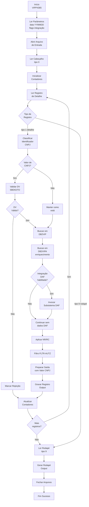
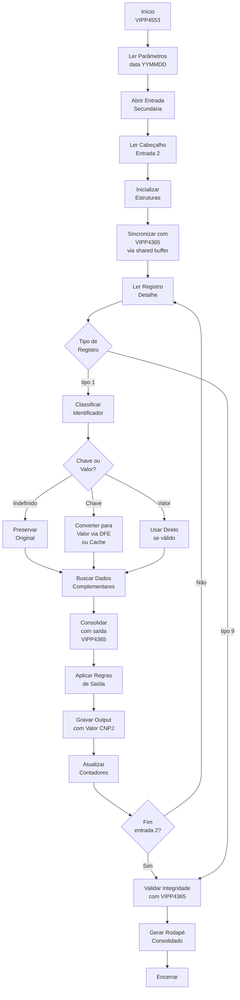
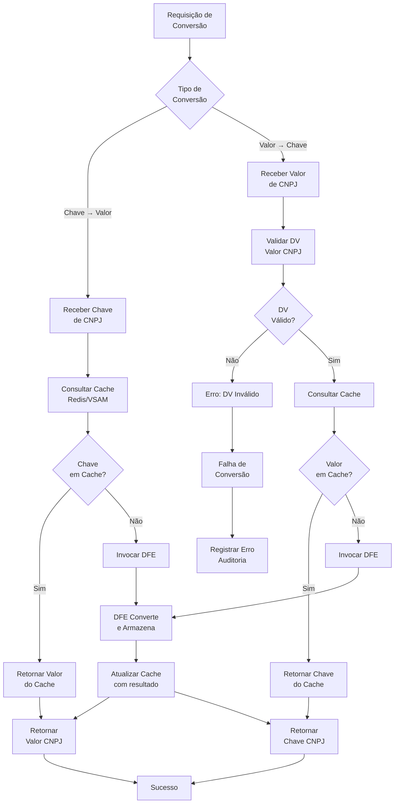

# Documentação Funcional — Adequação ao CNPJ Alfanumérico em Ambiente Mainframe

## Introdução

O projeto Demanda CNPJ Alfanumérico representa uma transformação essencial no tratamento de identificadores de pessoa jurídica dentro do Sistema VIP. Este documento consolida os requisitos funcionais necessários para implementar o suporte simultâneo ao formato numérico legado (Chave de CNPJ) e ao formato alfanumérico (Valor de CNPJ), com separação semântica clara entre identificadores técnicos e dados de negócio. A funcionalidade proposta garante que o sistema mantenha compatibilidade com fluxos existentes enquanto evolui para novos padrões de identificação, atendendo requisitos regulatórios e operacionais da instituição.

---

## Identificação Funcional

Tabela 1 — Identificação do sistema, finalidade, público-alvo e problema de negócio que o requisito resolve.

| Elemento | Conteúdo |
|----------|----------|
| **Nome do Sistema** | Sistema VIP (processamento em lote de cartões pré-pagos) |
| **Finalidade Principal** | Gerar e manter arquivos cadastrais padronizados de cartões pré-pagos para pessoas jurídicas, integrando dados de múltiplas fontes e enriquecendo-os com informações técnicas e de negócio |
| **Escopo da Demanda** | Adequação do tratamento de CNPJ para suportar simultaneamente identificadores numéricos internos (Chave de CNPJ) e identificadores alfanuméricos de negócio (Valor de CNPJ) |
| **Público-Alvo** | Sistemas downstream (operacionais, reporte, integração), áreas de negócio, operações e conformidade |
| **Problema de Negócio** | O CNPJ evoluiu para formato alfanumérico, exigindo que o sistema suporte ambos os formatos sem ambiguidade semântica, mantendo rastreabilidade, integridade relacional e determinismo nas conversões |

---

## Pontos de Decisão Funcional

Tabela 2 — Pontos de decisão críticos no fluxo de processamento, com condições avaliadas e possíveis resultados.

| Ponto de Decisão | Condição Avaliada | Resultado A | Resultado B |
|---|---|---|---|
| **Classificação de Campo de CNPJ** | Analisando contexto de uso no código e arquitetura de dados | Classificar como Chave de CNPJ (identificador técnico) | Classificar como Valor de CNPJ (identificador de negócio) ou Indefinido |
| **Nível de Inferência Determinística** | Avaliando clareza de evidências técnicas para classificação | Inferência Determinística (alta confiança) → Aplicar transformações | Inferência Fraca (baixa confiança) → Classificar como Indefinido, não transformar |
| **Origem do Identificador** | Identificador provém de fonte interna ou externa | Interna (Sistema VIP, DFE) → Aplicar regras de transformação | Externa (DB2MCI.CLIENTE, DAF, legacy) → Preservar conforme recebido |
| **Contexto de Saída** | Campo detectado em estrutura de detalhe, output, interface de transmissão | Explicitar Consumidor Subsequente e impacto da mudança para formato alfanumérico | Classificar como Valor de Negócio com rastreabilidade downstream |
| **Necessidade de Conversão** | Sistema precisa converter entre Chave de CNPJ e Valor de CNPJ | Invocar Serviço Central de Conversão (DFE) | Utilizar cache (Redis, VSAM, batch) se disponível |
| **Validação de Dígito Verificador (DV)** | Campo identificado como Valor de CNPJ em contexto de entrada | Aplicar validação de DV via subroutine SBDIGITO (função 011) | Não validar (campo é Chave de CNPJ ou Indefinido) |
| **Persistência de Dados** | Preparando dados para gravação em base de dados ou arquivo | Persistir com Chave de CNPJ (identificador técnico numérico) | Persistir com Valor de CNPJ se contexto exigir (raro em processamento interno) |
| **Exposição em Interface** | Preparando dados para saída (tela, relatório, arquivo, API) | Expor exclusivamente Valor de CNPJ | Nunca expor Chave de CNPJ (violação crítica) |

---

## Entradas e Saídas do Sistema

Tabela 3 — Campos de entrada do sistema, com descrição funcional e exemplos de valores.

| Campo de Negócio | Descrição Funcional | Exemplo |
|---|---|---|
| **Identificador de Pessoa Jurídica (Entrada)** | Pode ser Chave de CNPJ (numérico, 14 posições) ou Valor de CNPJ (alfanumérico, 14 caracteres). Se alfanumérico, deve passar por validação de dígito verificador. | Chave: 00000000000001 / Valor: 6QNJ8VY2JIC341 |
| **Dados Cadastrais do Titular** | Informações de plástico e conta provenientes de múltiplas fontes (tabelas DB2, arquivos sequenciais). Enriquecidas com informações técnicas. | Nome, Agência, Conta, Descrição de Restrição |
| **Indicador de Classificação** | Campo que indica se o identificador deve ser tratado como Chave ou Valor. Define comportamento de validação e transformação. | Chave / Valor / Indefinido |
| **Metadados de Controle** | Data de processamento (formato YYMMDD), hora, identificação de lote, marca de auditoria. | 260401, 153022, LOTE001 |

Tabela 4 — Campos de saída do sistema, com descrição funcional e consumidores subsequentes.

| Campo de Negócio | Descrição Funcional | Exemplo | Consumidor Subsequente |
|---|---|---|---|
| **Identificador de Pessoa Jurídica (Saída — Detalhe)** | Valor de CNPJ exposto em arquivo de saída, relatório ou integração. Nunca deve ser Chave de CNPJ. Consumido por sistemas downstream para identificação de pessoa jurídica. | 6QNJ8VY2JIC341 | Sistemas operacionais, reporte, integração, interfaces externas, áreas de negócio |
| **Dados Cadastrais Enriquecidos** | Conteúdo completo de plástico e conta com descrições e validações aplicadas. Reflete transformações internas preservando integridade semântica. | Nome, Agência, Conta, Descrição de Restrição, Dígito Verificador | Downstream, auditoria, conciliação, impressão de extrato |
| **Marcas de Processamento** | Indicadores de status de validação, sucesso/erro, auditoria e rastreabilidade. Permite análise pós-processamento e reprocessamento selectivo. | Status OK / ERRO, ID Transação, Timestamp | Monitoramento, auditoria, reprocessamento, relatórios de conformidade |
| **Rodapé de Arquivo** | Registro de encerramento contendo contagem total de registros processados, totalizadores e marcas de validação agregada. | Total: 5000 registros, CRC, Timestamp | Validação de integridade, auditoria de volume, reconhecimento de JCL |

---

## Objetivo e Contexto de Negócio

O Sistema VIP é um conjunto integrado de programas COBOL em ambiente mainframe IBM z/OS dedicado ao processamento em lote de cartões pré-pagos para pessoas jurídicas. O sistema consolida dados cadastrais de plásticos e contas de cartão a partir de múltiplas fontes (tabelas DB2, arquivos sequenciais, consultas ao subsistema DAF), enriquecendo-os com informações técnicas como dígitos verificadores de agência/conta e descrições de restrições de cartão. A arquitetura segue o padrão sequencial de lote com estrutura de arquivo padronizada em cabeçalho, detalhe e rodapé.

O projeto Demanda CNPJ Alfanumérico complementa o objetivo histórico do Sistema VIP ao garantir que o tratamento de identificadores legais seja compatível com a evolução regulatória e tecnológica da instituição financeira, suportando a coexistência de identificadores numéricos legados com novos formatos alfanuméricos, sem ambiguidade semântica e com rastreabilidade total de conversões.

---

## Macro Requisitos do Cliente (RF01 até RF10)

### RF01 — Suporte à coexistência de formatos

**Descrição**

O sistema deve suportar simultaneamente identificadores de pessoa jurídica em formato numérico (Chave de CNPJ, 14 dígitos) e formato alfanumérico (Valor de CNPJ, 14 caracteres), sem ambiguidade semântica entre os dois.

**Pré-condição**

Sistema recebe ou manipula identificador de pessoa jurídica originário de múltiplas fontes (entrada em arquivo, base de dados, integração).

**Pós-condição**

Sistema processa o identificador respeitando sua natureza semântica (Chave ou Valor), aplicando regras de validação e transformação apropriadas.

**Invariante**

Não pode haver ambiguidade entre Chave de CNPJ e Valor de CNPJ em qualquer ponto do fluxo de processamento. Cada campo deve ter classificação explícita.

**Exemplos**

- Chave de CNPJ: 00000000000001 (entrada interna, numérica)
- Valor de CNPJ: 6QNJ8VY2JIC341 (entrada de negócio, alfanumérica)

---

### RF02 — Separação obrigatória entre Chave de CNPJ e Valor de CNPJ

**Descrição**

Campos identificados como identificadores técnicos devem ser tratados exclusivamente como Chave de CNPJ, sem sofrer validação de dígito verificador ou formatação de documento oficial.

**Pré-condição**

Campo identificado em análise técnica como identificador para relacionamento, índice, lookup ou navegação de dados.

**Pós-condição**

Campo é tratado exclusivamente como Chave de CNPJ numérica, nunca submetido a validação de DV ou transformação para formato alfanumérico.

**Invariante**

Chave de CNPJ não pode ser confundida com Valor de CNPJ em qualquer operação de persistência, busca, validação ou exibição.

**Exemplos**

- Persistência em base de dados: Chave de CNPJ = 00000000000001
- Exibição em tela/relatório: Valor de CNPJ = 12ABC34501DE35

---

### RF03 — Preservação dos fluxos de negócio

**Descrição**

O processo existente de geração de arquivos cadastrais deve permanecer funcionalmente inalterado. Apenas o tratamento semântico do identificador é alterado.

**Pré-condição**

Processo existente utiliza CNPJ em qualquer contexto de transformação, enriquecimento ou saída.

**Pós-condição**

Fluxo permanece com mesma lógica operacional; mudanças são restritas a classificação, validação e transformação de identificador.

**Invariante**

Nenhuma regra de negócio, sequenciamento de processamento, ou contrato de saída pode ser alterado além do necessário para CNPJ.

**Exemplos**

- Base grava identificador com mesma sintaxe de antes; semântica é reclassificada.
- Tela apresenta identificador em novo formato apenas quando necessário para comunicação com usuário.

---

### RF04 — Adaptação obrigatória de todos os pontos de uso

**Descrição**

Todos os locais no código onde ocorra uso de identificador de pessoa jurídica devem ser classificados como Chave de CNPJ ou Valor de CNPJ. Nenhum campo pode permanecer ambíguo.

**Pré-condição**

Existência de uso de identificador em qualquer sistema, programa, copybook, layout ou tabela.

**Pós-condição**

Cada uso de identificador possui classificação explícita e rastreável, com tratamento apropriado.

**Invariante**

Não é permitido deixar classificação indefinida ou ambígua em artefatos em produção.

**Exemplos**

- Chave estrangeira (FK) em índice de tabela DB2: Chave de CNPJ
- Campo em relatório de saída: Valor de CNPJ

---

### RF05 — Tratamento distinto em entradas e saídas

**Descrição**

Interfaces de entrada e saída devem aplicar regras diferenciadas de validação e transformação conforme o tipo de identificador (Chave ou Valor).

**Pré-condição**

Interface recebe ou retorna identificador em contexto de entrada ou saída.

**Pós-condição**

Validação de DV aplicada apenas a Valor de CNPJ; Chave de CNPJ permanece sem validação.

**Invariante**

Valor de CNPJ em entrada deve sempre passar por validação de dígito verificador. Chave de CNPJ nunca entra em cálculo de DV.

**Exemplos**

- Entrada: Valor de CNPJ = 6QNJ8VY2JIC341 → validar DV antes de processar
- Entrada: Chave de CNPJ = 00000000000001 → não validar, usar como está

---

### RF06 — Uso exclusivo do Valor de CNPJ em interfaces externas

**Descrição**

Apenas Valor de CNPJ (identificador alfanumérico de negócio) pode ser exposto em interfaces externas, relatórios, telas, APIs ou qualquer contexto de comunicação com entidade fora do sistema.

**Pré-condição**

Comunicação com entidade externa (sistema, usuário, integração, API).

**Pós-condição**

Apenas Valor de CNPJ é transmitido. Chave de CNPJ permanece interna e nunca é exposta.

**Invariante**

Exposição de Chave de CNPJ em interface externa é erro crítico de segurança e conformidade.

**Exemplos**

- API externa retorna: 6QNJ8VY2JIC341 (Valor de CNPJ)
- Nunca retorna: 00000000000001 (Chave de CNPJ)

---

### RF07 — Conversão obrigatória via serviço central

**Descrição**

Conversão entre Chave de CNPJ e Valor de CNPJ deve ocorrer exclusivamente via Serviço Central de Conversão (DFE). Geração local ou distribuída de correlação é proibida.

**Pré-condição**

Necessidade de obter correspondência entre Chave de CNPJ e Valor de CNPJ (transformação bidirecional).

**Pós-condição**

Conversão é realizada via invocação do serviço oficial (DFE), garantindo determinismo e auditabilidade.

**Invariante**

Nenhuma rotina local, tabela auxiliar ou algoritmo interno pode gerar ou manter correlação Chave-Valor.

**Exemplos**

- Entrada: Valor de CNPJ = 6QNJ8VY2JIC341
- Sistema invoca DFE
- Saída: Chave de CNPJ = 00000000000001 (determinístico)

---

### RF08 — Determinismo e idempotência das conversões

**Descrição**

Múltiplas chamadas ao Serviço Central de Conversão com mesmo input devem retornar sempre o mesmo resultado. Não pode haver duplicidade de Chave de CNPJ.

**Pré-condição**

Múltiplas invocações de conversão com mesmo identificador de entrada.

**Pós-condição**

Resultado é constante, determinístico e rastreável. Relação 1:1 é preservada.

**Invariante**

Base Central de Correlação (DFE) garante correlação obrigatória e inequívoca entre Chave e Valor.

**Exemplos**

- Input repetido: 6QNJ8VY2JIC341
- Output constante na primeira chamada: 00000000000001
- Output constante na N-ésima chamada: 00000000000001
- Nenhuma variação ou degradação na correspondência

---

### RF09 — Preservação de identificadores externos

**Descrição**

Identificadores recebidos de fonte externa devem ser preservados exatamente como recebidos. Nenhuma transformação estrutural, incluindo conversão para formato alfanumérico, é permitida.

**Pré-condição**

Identificador originário de fonte externa (sistema, tabela, integração fora do escopo desta demanda).

**Pós-condição**

Valor é preservado integralmente; nenhuma alteração estrutural, normalização ou conversão ocorre.

**Invariante**

Dados de fontes externas não estão no escopo de modificação desta demanda.

**Exemplo 1 — CNPJ numérico externo**

- Origem: DB2MCI.CLIENTE
- Entrada: Valor de CNPJ = 12345678000195
- Saída: 12345678000195 (preservado)
- Proibido: converter para formato alfanumérico

**Exemplo 2 — CGC externo**

- Origem: DB2MCI.CLIENTE
- Entrada: CGC = 12345678000195
- Saída: 12345678000195 (preservado)
- Proibido: reclassificar, converter ou normalizar

---

### RF10 — Classificação com base em nível de inferência

**Descrição**

Classificação de campo como Chave de CNPJ ou Valor de CNPJ só pode ocorrer se houver inferência determinística. Inferência com baixa confiança resulta em classificação como Indefinido, bloqueando qualquer transformação.

**Pré-condição**

Sistema precisa determinar se um identificador é Chave de CNPJ ou Valor de CNPJ durante análise técnica.

**Pós-condição**

Campo recebe classificação explícita: Chave, Valor ou Indefinido. Classificação Indefinido bloqueia transformações.

**Invariante**

Nenhuma transformação pode ocorrer em campo classificado como Indefinido.

**Exemplo 1 — Inferência Determinística (Alta Confiança)**

- Campo: Identificador em índice de tabela DB2
- Evidência: Nomeação, posição estrutural, contexto de uso em JOINs
- Classificação: Chave de CNPJ
- Ação: Aplicar regras de Chave (sem validação DV, usar em navegação)

**Exemplo 2 — Inferência Fraca (Baixa Confiança)**

- Campo: 00000000000001 em layout ambíguo
- Contexto insuficiente para determinar natureza
- Classificação: Indefinido
- Ação:
  - Não converter
  - Não validar como CNPJ
  - Preservar valor

---

## Regras de Negócio

As regras de negócio do projeto estabelecem comportamentos funcionais obrigatórios que garantem integridade semântica, rastreabilidade e conformidade:

**RN01 — Dicotomia Semântica Obrigatória**

Não pode existir campo que represente simultaneamente Chave de CNPJ e Valor de CNPJ no mesmo contexto de processamento. Cada campo deve ter natureza semântica única e explícita.

**RN02 — Correlação 1:1 Obrigatória**

Relação entre Chave de CNPJ e Valor de CNPJ deve ser obrigatória, inequívoca e determinística. Uma Chave corresponde a exatamente um Valor, e vice-versa.

**RN03 — Dígito Verificador (DV) Aplicável Apenas a Valor de CNPJ**

Dígito verificador é cálculo matemático de validação aplicado exclusivamente ao Valor de CNPJ. Nunca pode ser aplicado a Chave de CNPJ.

**RN04 — Persistência Interna com Chave de CNPJ**

Identificadores persistidos em bases de dados internas do Sistema VIP devem utilizar Chave de CNPJ como identificador técnico primário.

**RN05 — Exposição Externa com Valor de CNPJ**

Identificadores expostos em interfaces externas, relatórios, telas e integrações devem ser exclusivamente Valor de CNPJ.

**RN06 — Classificação NR/RC Preservada**

Classificação de Nível de Risco (NR) e Risco de Crédito (RC) baseada em identificador deve ser preservada independentemente da transformação de formato.

**RN07 — Filtro FLTR-AUTZ Preservado**

Filtro de autorização deve ser preservado em todas as transformações de identificador.

**RN08 — Contagem de Rodapé Precisa**

Registro de rodapé deve refletir contagem exata de registros processados, independentemente de transformações de identificador.

**RN09 — Integração Seletiva DAFS6452 Respeitada**

Integração com subsistema DAF deve ocorrer apenas quando estratégia de execução assim determinar, preservando comportamento existente.

**RN10 — Fonte Externa Nunca é Transformada**

Identificadores recebidos de sistemas externos não devem sofrer transformação ou normalização em nenhuma circunstância.

---

## Regras de Transformação

As regras de transformação definem mecanismo técnico de conversão entre Chave de CNPJ e Valor de CNPJ:

**TF01 — Transformação Unidirecional Chave → Valor**

Quando necessário converter Chave de CNPJ para Valor de CNPJ:

1. Invocar Serviço Central de Conversão (DFE)
2. Transmitir Chave de CNPJ como parâmetro de entrada
3. Receber Valor de CNPJ como resultado
4. Armazenar em variável/campo de tipo alfanumérico

**TF02 — Transformação Unidirecional Valor → Chave**

Quando necessário converter Valor de CNPJ para Chave de CNPJ:

1. Validar Valor de CNPJ (confirmar formato alfanumérico e dígito verificador)
2. Invocar Serviço Central de Conversão (DFE)
3. Transmitir Valor de CNPJ como parâmetro de entrada
4. Receber Chave de CNPJ como resultado
5. Armazenar em variável/campo de tipo numérico

**TF03 — Persistência com Chave de CNPJ**

Dados persistidos em arquivos, tabelas ou estruturas internas devem usar Chave de CNPJ:

1. Manter campo PIC 9(14) como identificador técnico principal
2. Não aplicar DV nem formatação de documento
3. Preservar numérico puro para operações de índice e busca

**TF04 — Exposição com Valor de CNPJ**

Dados expostos em saída devem usar Valor de CNPJ:

1. Obter Valor de CNPJ correspondente (via serviço ou cache)
2. Formatar como PIC X(14) alfanumérico
3. Transmitir a interfaces externas
4. Nunca expor Chave de CNPJ

**TF05 — Estratégia de Cache**

Conversões devem utilizar estratégia de cache para reduzir acesso ao DFE:

1. Primeira invocação: consultar DFE, armazenar resultado em cache (Redis, VSAM ou lote)
2. Próximas invocações: consultar cache antes de invocar DFE
3. Manter consistência entre cache e DFE
4. Implementar política de expiração ou invalidação conforme arquitetura

---

## Integrações do Sistema

Tabela 7 — Sistemas e tabelas integradas ao Sistema VIP, com finalidade funcional, dados trocados e impacto em caso de falha.

| Sistema Integrado | Finalidade Funcional | Dados Trocados | Impacto em Caso de Falha |
|---|---|---|---|
| **DB2VIP** | Tabelas primárias do Sistema VIP. Armazenam plásticos, contas, restrições e metadados de cartão. | Chave de CNPJ (acesso), Valor de CNPJ (se existente), dados cadastrais | Interrupção de processamento; incapacidade de enriquecer dados de cartão |
| **DB2VIPA** | Tabelas auxiliares de apoio; restrições de cartão, agências, contas. Consultadas para enriquecimento. | Chave de CNPJ (busca), descrições de restrição | Cartões processados sem descrição de restrição; relatórios incompletos |
| **DB2MCI** | Tabela de clientes corporativos; origem externa. CNPJ de fonte externa não deve ser transformado. | CNPJ (forma como recebido), dados de cliente | Correlação incorreta entre portador e cliente; perda de rastreabilidade de origem |
| **Serviço Central de Conversão (DFE)** | Conversão oficial entre Chave de CNPJ e Valor de CNPJ. Mantém Base Central de Correlação. | Chave de CNPJ, Valor de CNPJ, metadados de auditoria | Incapacidade de converter identificadores; operação não determinística; violação de integridade relacional |
| **Subsistema DAF** | Integração seletiva para dados complementares de cartão. Consulta controlada por parâmetro de execução. | Chave de CNPJ (busca), dados de cartão extendido | Cartões sem dados complementares; incompletude de saída quando DAF estava disponível |
| **Sistema SBDIGITO** | Subroutine de cálculo de dígito verificador (função 011). Valida Valor de CNPJ em entrada. | Valor de CNPJ (entrada), dígito calculado (saída) | Validação incorreta de CNPJ; aceitação de valores inválidos |
| **Arquivos Sequenciais de Entrada** | Fornecimento de registros de plástico em lote. Padrão: cabeçalho, detalhe, rodapé. | Chave ou Valor de CNPJ (conforme configuração), dados cadastrais | Interrupção de processamento; rejeição de lote; inconsistência de dados |
| **Arquivos de Saída** | Geração de arquivos padronizados com dados enriquecidos. Consumidos por sistemas downstream. | Valor de CNPJ (sempre), dados cadastrais e metadados | Downstream recebe dados incompletos ou com identificadores ambíguos |

### Módulos Utilitários Integrados

O sistema depende de módulos utilitários compartilhados que suportam funcionalidades técnicas complementares:

**SBDIGITO (Função 011)** — Subroutine de cálculo de dígito verificador. Recebe Valor de CNPJ como entrada (nunca Chave de CNPJ) e retorna dígito calculado para validação. Implementação compatível com ambiente mainframe, utilizando tabela de conversão controlada.

**SBVERSAO** — Subroutine de versionamento e controle de lançamento. Identifica versão de programa e artefatos, permitindo rastreabilidade de mudanças.

**SBABEND** — Subroutine de tratamento de abends (encerramento anormal). Registra erros críticos, permite reprocessamento seletivo e auditoria de falhas.

---

## Fluxo Funcional Principal

O fluxo principal do Sistema VIP segue o padrão de processamento em lote com as seguintes etapas:

**1. Inicialização**

- Ler parâmetros de execução (data de processamento em formato YYMMDD, identificação de lote, flags de integração)
- Abrir arquivo de entrada sequencial
- Inicializar estruturas de cabeçalho e contadores

**2. Leitura de Cabeçalho**

- Ler primeiro registro do arquivo de entrada (tipo 0 = cabeçalho)
- Validar formato de cabeçalho
- Extrair data de processamento, identificação de lote e metadados

**3. Processamento de Detalhe (Loop Principal)**

Para cada registro de detalhe (tipo 1):

- Classificar se campo de pessoa jurídica é Chave de CNPJ ou Valor de CNPJ conforme contexto
- Se Valor de CNPJ, invocar SBDIGITO para validar dígito verificador
- Consultar tabelas primárias usando Chave de CNPJ (ou converter antes de buscar)
- Consultar tabelas de suporte para enriquecimento
- Se necessário, consultar dados de cliente externos preservando conforme origem
- Se parâmetro permite, invocar subsistema DAF para dados complementares
- Consolidar informações de múltiplas fontes
- Aplicar classificação de nível de risco e risco de crédito
- Aplicar filtro de autorização conforme regras de negócio
- Formatar registro de detalhe com Valor de CNPJ exposto
- Gravar registro em arquivo de saída
- Incrementar contagem de registros processados

**4. Leitura de Rodapé**

- Ler último registro do arquivo de entrada (tipo 9 = rodapé)
- Validar contagem de entrada contra registros lidos
- Detectar inconsistências ou encerramento prematuro

**5. Geração de Rodapé de Saída**

- Calcular contagem total de registros processados
- Gerar registro de rodapé com metadados finais
- Incluir CRC ou checksum de validação
- Registrar timestamp de conclusão

**6. Encerramento**

- Fechar arquivo de entrada e saída
- Liberar recursos (conexões DB2, cache, buffers)
- Retornar status de conclusão (sucesso ou erro)

---

## Fluxos Alternativos

**FA01 — Reprocessamento Seletivo**

Se durante processamento ocorrer erro em registro específico:

1. Registrar identificador do registro com erro
2. Continuar processamento dos demais registros
3. Gerar relatório de rejeição com detalhes
4. Permitir reprocessamento apenas dos registros rejeitados em execução subsequente

**FA02 — Bypass de Integração DAF**

Se integração com subsistema DAF estiver indisponível:

1. Continuar processamento sem dados complementares
2. Marcar registro como processado sem enriquecimento DAF
3. Gerar alerta de incompletude em rodapé de saída
4. Permitir reprocessamento posterior com retry automático

**FA03 — Fallback de Cache**

Se cache de conversões estiver indisponível:

1. Invocar diretamente Serviço Central de Conversão (DFE)
2. Aceitar latência aumentada
3. Registrar tentativa de fallback em auditoria
4. Continuar processamento determinístico

**FA04 — Tratamento de Identificador Indefinido**

Se classificação de identificador resultar em estado Indefinido:

1. Não aplicar validação de DV
2. Não aplicar transformação ou conversão
3. Preservar valor original
4. Marcar em auditoria para análise posterior
5. Continuar processamento com identificador intocado

---

## Fluxos de Exceção

**FE01 — Falha de Validação de DV**

Se Valor de CNPJ falhar em validação de dígito verificador:

1. Registrar erro de validação
2. Marcar registro para rejeição
3. Continuar processamento (não interromper lote)
4. Incluir detalhes em relatório de rejeição
5. Não persistir registro com CNPJ inválido

**FE02 — Falha de Serviço Central de Conversão (DFE)**

Se invocação de DFE retornar erro ou timeout:

1. Invocar estratégia de retry automático (máx 3 tentativas)
2. Se retry esgotado, registrar erro crítico
3. Suspender processamento de lote (ou continuar conforme política)
4. Gerar alerta de criticidade para operação
5. Incluir detalhes de erro em auditoria

**FE03 — Falha de Consulta em DB2**

Se consulta a tabelas DB2 retornar erro ou timeout:

1. Aplicar retry com backoff exponencial
2. Se dados não forem críticos para saída, continuar com valores defaults
3. Se dados forem críticos, marcar registro para rejeição
4. Registrar erro detalhado em auditoria
5. Gerar relatório de indisponibilidade de base

**FE04 — Encerramento Prematuro de Arquivo**

Se arquivo de entrada terminar antes do registro de rodapé esperado:

1. Gerar alerta de incompletude de lote
2. Contar registros lidos até interrupção
3. Gerar rodapé de saída com advertência de truncamento
4. Retornar status de erro (não sucesso)
5. Permitir reprocessamento com arquivo corrigido

**FE05 — Violação de Contrato de Entrada**

Se registro de entrada violou contrato esperado:

1. Registrar erro específico de validação de contrato
2. Descartar registro (não processar)
3. Continuar com próximo registro
4. Gerar relatório de registros rejeitados por contrato

---

## Diagramas Funcionais

### Diagrama 1 — Fluxo de Processamento do Programa VIPP4365

### Diagrama 2 — Fluxo de Processamento do Programa VIPP4553

### Diagrama 3 — Fluxo de Conversão CNPJ (Chave ↔ Valor)

---

## Riscos Funcionais e Técnicos

**R01 — Portador sem Cadastro Correspondente (Risco Crítico)**

Se registro de entrada contiver identificador de pessoa jurídica que não possua correspondência em base de dados interna, o processamento pode resultar em rejeição silenciosa ou geração de registro incompleto.

Mitigação:
- Validar existência de Chave de CNPJ em base antes de enriquecimento
- Gerar registro de exceção para portadores não encontrados
- Permitir reprocessamento com dados complementares posteriores
- Registrar em auditoria com identificador específico

**R02 — Encerramento de Artefato Interpretado como Erro (Risco Médio)**

Se programa encerrar naturalmente mas registro de rodapé indicar inconsistência de contagem, sistema pode gerar alerta falso de erro.

Mitigação:
- Validar separadamente status de programa e contagem de rodapé
- Distinguir entre encerramento normal e erro técnico
- Registrar claramente tipo de encerramento em auditoria
- Gerar código de status específico para cada cenário

---

## Glossário

Tabela 8 — Termos técnicos, funcionais e conceituais utilizados no projeto, com definições que garantem consistência de vocabulário.

| Termo | Definição |
|-------|-----------|
| **Chave de CNPJ** | Identificador técnico interno, numérico, 14 posições. Utilizado exclusivamente para relacionamentos, índices, buscas e navegação de dados dentro do sistema. Nunca exposto externamente. Exemplo: 00000000000001. |
| **Valor de CNPJ** | Identificador de negócio, alfanumérico, 14 caracteres. Representa o documento oficial de pessoa jurídica. Utilizado em interfaces externas, relatórios, telas e validações. Exemplo: 6QNJ8VY2JIC341. |
| **Classificação** | Processo de análise técnica de um campo de CNPJ para determinar se atua como Chave de CNPJ, Valor de CNPJ, ou ambos. Baseada em contexto de uso e semântica de negócio. |
| **Indefinido** | Estado de classificação para campos cuja natureza semântica não pode ser determinada com confiança. Campos Indefinidos não sofrem transformação ou validação. |
| **Correlação 1:1** | Relação obrigatória e determinística entre uma Chave de CNPJ e um Valor de CNPJ, rastreável e auditável. Garantida pelo serviço central (DFE). |
| **Serviço Central de Conversão** | Sistema autorizado (DFE) responsável por converter Chave de CNPJ em Valor de CNPJ e vice-versa. Proibida geração local desta correlação. |
| **Base Central de Correlação (DFE)** | Estrutura centralizada que mantém a relação 1:1 entre Chave de CNPJ e Valor de CNPJ, com metadados de controle e auditoria. |
| **Cache** | Camadas auxiliares de desempenho que reduzem acessos à base central. Deve ser consistente com DFE. |
| **Dígito Verificador (DV)** | Dígito de validação matemática aplicado ao Valor de CNPJ. Calculado via subroutine SBDIGITO (função 011). |
| **Fonte Externa** | Sistema ou tabela fora do escopo desta modificação. Dados devem ser preservados conforme recebido. |
| **Módulo Principal** | Artefato de código pertencente ao sistema VIP. Identificado pelo prefixo. |
| **Módulo Secundário** | Artefato compartilhado com outros sistemas. Pode estar sujeito a mudanças em outros projetos. |
| **Consumidor Subsequente** | Sistema, programa ou artefato que recebe e processa um campo de CNPJ após sua saída de um programa. |
| **Inferência Determinística** | Análise que permite classificar um campo com alta confiança, baseada em evidências técnicas claras. |
| **Inferência Fraca** | Análise com incerteza quanto à natureza semântica do campo. Resulta em classificação Indefinido. |
| **CGC** | Denominação anterior do CNPJ. Campos nomeados CGC devem ser tratados com as mesmas regras aplicáveis ao CNPJ. |
| **PJ** | Pessoa Jurídica. Entidade legal identificada por CNPJ. |
| **Processamento em Lote** | Execução de programa COBOL sob controle JCL, lendo arquivo sequencial e produzindo saída. Padrão do Sistema VIP. |
| **Cabeçalho** | Primeiro registro de um arquivo, contendo metadados. Tipo de registro = 0. |
| **Detalhe** | Registros de conteúdo principal portadores de dados de negócio. Tipo de registro = 1. |
| **Rodapé** | Último registro de um arquivo, contendo resumo e contagem. Tipo de registro = 9. |

---

## Conclusão

O projeto Demanda CNPJ Alfanumérico representa evolução essencial do Sistema VIP para suportar novos formatos de identificação de pessoa jurídica, mantendo integridade técnica, rastreabilidade operacional e conformidade com requisitos regulatórios. A separação explícita entre Chave de CNPJ (identificador técnico interno) e Valor de CNPJ (identificador oficial de negócio) estabelece contrato semântico claro e determinístico que elimina ambiguidade, reduz risco de transformações incorretas e garante que sistemas downstream recebam identificadores válidos e rastreáveis.

A implementação deve respeitar rigorosamente os requisitos funcionais (RF01–RF10), as regras de negócio e as regras de transformação documentadas, garantindo que fluxos existentes sejam preservados enquanto a funcionalidade evolui. A centralização da conversão via Serviço Central de Conversão (DFE), o uso estratégico de cache e a classificação determinística de campos asseguram que o sistema mantém desempenho, determinismo e auditabilidade ao processar identificadores em ambos os formatos.

Os riscos funcionais e técnicos identificados devem ser mitigados através de validações obrigatórias, testes de regressão rigorosos e monitoramento operacional contínuo. A documentação de consumidores subsequentes de campos de CNPJ em contextos de saída permite que sistemas downstream compreendam o impacto da mudança de formato e adaptem seus contratos técnicos conforme necessário.

A demanda estabelece fundação sólida para evolução futura, incluindo possível eliminação progressiva de Chave de CNPJ em favor de persistência nativa baseada apenas em Valor de CNPJ, alinhada com modernização técnica de longo prazo da instituição.

---

**Documento Elaborado:** 02/04/2026

**Versão:** 2.0

---
