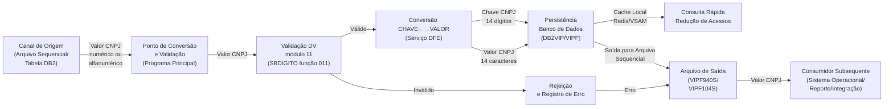
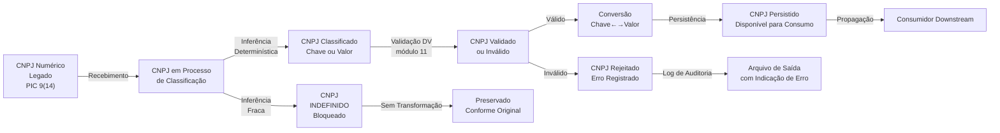
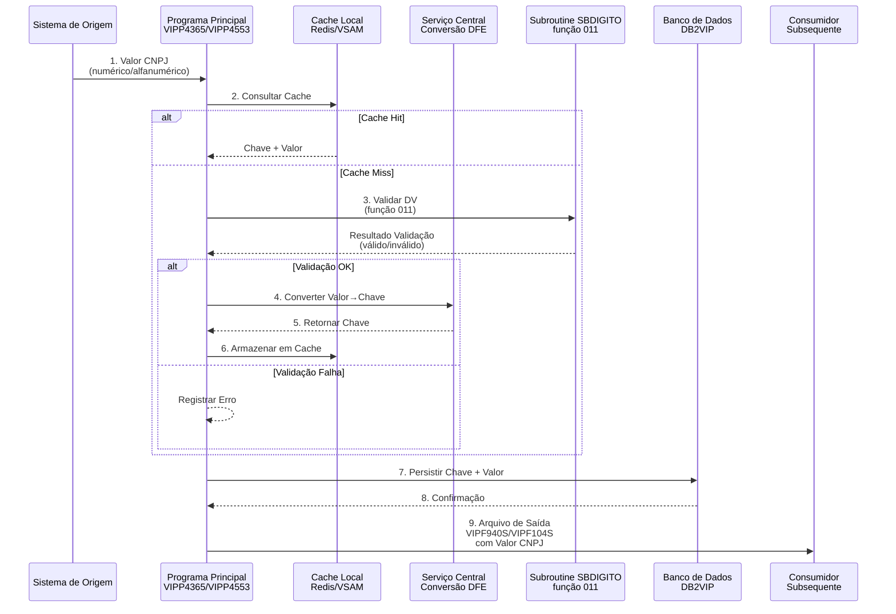
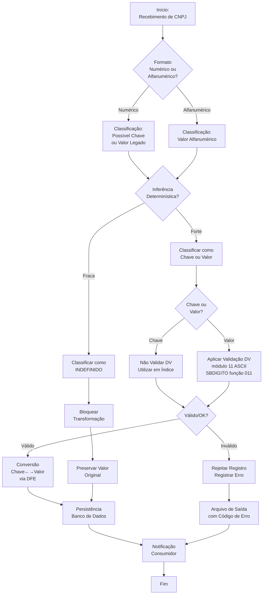

# Documentação Técnica Consolidada — Adequação ao CNPJ Alfanumérico em Ambiente Mainframe

## Introdução

Esta documentação técnica consolida a especificação completa para adequação do Sistema VIP ao suporte de CNPJ alfanumérico em ambiente mainframe IBM z/OS, integrando análise arquitetural, requisitos funcionais e técnicos, classificação de artefatos, matrizes de impacto e estratégia de implementação. O escopo abrange análise e modificação dos programas COBOL principais (VIPP4365, VIPP4553), revisão de copybooks e layouts de arquivo, implementação de lógica diferenciada para tratamento de Chave e Valor de CNPJ, e integração com serviços centrais de conversão e validação. A documentação serve como guia de implementação, mapa de dependências e artefato de rastreabilidade para desenvolvedores, arquitetos e equipes de testes.

---

## Modelo Conceitual

A solução é baseada na separação obrigatória entre dois conceitos semânticamente distintos:

- **Chave de CNPJ**: identificador técnico interno, numérico, 14 posições (PIC 9(14)), utilizado exclusivamente em operações de relacionamento, índices, buscas e navegação de dados dentro do sistema. Nunca exposto externamente.
- **Valor de CNPJ**: identificador de negócio, alfanumérico, 14 caracteres (PIC X(14)), representando o documento oficial de pessoa jurídica, podendo ser numérico legado (ex: 12345678000195) ou alfanumérico moderno (ex: 6QNJ8VY2JIC341). Único formato visível a usuários e sistemas externos.

Esta dicotomia garante desacoplamento arquitetural, determinismo das conversões e rastreabilidade completa da correlação entre identificadores internos e externos, preservando integridade relacional e conformidade regulatória.

---

## Arquitetura da Solução

A arquitetura implementa desacoplamento estrutural através de uma Base Central de Correlação (DFE) que mantém relação 1:1 entre Chave e Valor de CNPJ, com validação de dígito verificador exclusivamente aplicada ao Valor via subroutine SBDIGITO (função 011). Os programas principais (VIPP4365, VIPP4553) lêem dados de entrada, classificam campos de CNPJ conforme contexto de uso, aplicam transformações apenas onde apropriado, consultam serviços de conversão quando necessário, e geram saídas enriquecidas preservando dados originários de fontes externas. Camadas de cache (Redis, VSAM, processamento batch) reduzem acessos à base central, garantindo consistência e desempenho. A integração entre plataformas baixa (mainframe) e alta (APIs, sistemas operacionais) é mediada por serviços de conversão e validação, eliminando ambiguidades de formato e semanticamente diferenciando identificadores técnicos de dados de negócio.

---

## Diagramas Técnicos

Esta seção contém os diagramas técnicos obrigatórios da solução, gerados em Mermaid válido, orientados na horizontal (esquerda para direita), com nomenclatura exclusivamente em português e cobrindo o contexto da transição do CNPJ numérico para alfanumérico.

### Diagrama de Fluxo de Dados

Representa o fluxo de dados do CNPJ pela solução, contemplando entrada, conversão, separação e persistência.



### Diagrama de Estado

Representa os estados possíveis de um registro de CNPJ durante o ciclo de vida da transição.



### Diagrama de Sequência

Representa a sequência de interações entre os componentes da solução para o fluxo principal de recebimento, validação e persistência de um CNPJ.



### Diagrama de Atividades

Representa o fluxo de atividades do processo de validação e processamento do CNPJ alfanumérico.



---

## Identificação de Módulos

### Classificação de Módulos

Todos os artefatos envolvidos na solução são classificados em duas categorias:

- **Módulos Principais**: artefatos pertencentes ao Sistema VIP que sofrem alteração direta, contêm lógica de negócio ou manipulam CNPJ como Valor. Identificados dinamicamente pelo prefixo VIP.
- **Módulos Satélites**: artefatos compartilhados com outros sistemas (DAF, HLP, SBDIGITO, SBABEND) que apenas consomem dados e não devem sofrer alteração estrutural, ou cuja alteração é coordenada externamente.

### Tabela de Módulos

| Módulo | Descrição | Tipo | Justificativa | Deve Alterar? |
|--------|-----------|------|---------------|---------------|
| VIPP4365 | Programa principal de processamento de cartões pré-pagos, lê VIPF317E e gera VIPF940S | Principal | Contém lógica central de manipulação de CNPJ, necessita separação de Chave e Valor, integração com DFE | Sim |
| VIPP4553 | Programa principal de processamento de contas correntes, lê VIPF104E e gera VIPF104S | Principal | Contém múltiplos campos de CNPJ, consulta DAF com CNPJ, necessita diferenciação de tratamento | Sim |
| VIPK317D | Copybook DCLGEN para layout de entrada VIPF317E e tabelas DB2VIP | Principal | Define estrutura de dados contendo campos de CNPJ (317E-COD-CPF-CGC-PJ, 317E-COD-CPF-CGC-PF), necessita reclassificação semântica | Sim |
| VIPK160D | Copybook DCLGEN para tabela DB2VIP.TIP_RST_CRT_CRD | Principal | Tabela de restrições, não contém CNPJ diretamente, pode impactar contextos de enriquecimento | Não |
| DAFK6452 | Copybook de interface com subroutine DAFS6452 do sistema DAF | Satélite | Define D6452I-CNPJ (input Valor) e D6452S-CNPJ (output Chave), alterações coordenadas com equipe DAF | Coordenado |
| SBDIGITO | Subroutine compartilhada, função 011 para validação de dígito verificador | Satélite | Implementa cálculo módulo 11 com tabela ASCII, consumida por VIPP4365 e VIPP4553, não requer alteração se contrato já definido | Não |
| SBVERSAO | Subroutine de controle de versão, data e logging | Satélite | Não trata CNPJ diretamente, fora do escopo | Não |
| SBABEND | Subroutine de tratamento de abend e dump | Satélite | Não trata CNPJ, fora do escopo | Não |
| DAFS6452 | Subroutine do subsistema DAF, consulta por CNPJ com função 2 | Satélite | Sistema externo, alterações coordenadas com equipe DAF, dados retornados devem ser preservados | Coordenado |
| VIPF317E | Arquivo sequencial de entrada (358 bytes) | Principal | Layout de entrada contendo campos de CNPJ, necessita documentação de tipos (Chave/Valor) | Documentar |
| VIPF940S | Arquivo sequencial de saída (500 bytes) | Principal | Saída contendo CNPJ em contexto de negócio, consumidores subsequentes devem ser identificados | Documentar |
| VIPF104E | Arquivo sequencial de entrada (454 bytes) | Principal | Layout de entrada contendo múltiplos CNPJs, necessita análise de cada campo | Documentar |
| VIPF104S | Arquivo sequencial de saída (579 bytes) | Principal | Saída contendo CNPJs em múltiplos contextos, consumidores subsequentes devem ser identificados | Documentar |
| DB2VIP | Tabelas DB2 do subsistema VIP | Principal | Armazenamento central de dados, múltiplas tabelas contendo CNPJ, necessita análise de cada ocorrência | Analisar |
| DB2MCI.CLIENTE | Tabela DB2 do subsistema MCI | Satélite | Fonte externa, dados provenientes não estão no escopo de transformação, devem ser preservados | Não |
| DAF | Subsistema externo de consultoria de beneficiários | Satélite | Retorna dados de CNPJ de beneficiários, preservar conforme origem | Não |

### Mapa de Dependências por Módulo

#### VIPP4365

- **Programas COBOL que o compõem ou invocam**: VIPP4365 (programa principal)
- **Arquivos sequenciais lidos**: VIPF317E (entrada, 358 bytes)
- **Arquivos sequenciais gravados**: VIPF940S (saída, 500 bytes)
- **Copybooks utilizados**: VIPK317D (DCLGEN DB2VIP), VIPK160D (DCLGEN DB2VIP.TIP_RST_CRT_CRD)
- **Tabelas de banco de dados acessadas**: DB2VIP.PLST_PORT_PRE_PG, DB2VIP.SLCT_PLST_PRE_PG, DB2VIP.PLST_PORT, DB2VIP.PORT_CRT, DB2VIP.CT_CRT_PRE_PG, DB2VIP.UND_FAT_EPRL, DB2VIP.CEN_CST_EPRL, DB2VIP.CLI_EPRL, DB2VIP.TIP_RMAT, DB2VIP.TIP_RST_CRT_CRD, DB2MCI.CLIENTE
- **Subroutines invocadas**: SBDIGITO (função 011, validação DV), SBVERSAO (controle de versão), SBABEND (tratamento de exceção)
- **Serviços consumidos**: DFE (conversão Chave←→Valor)
- **Módulos dependentes**: VIPP4553 (compartilham estruturas de dados), sistemas operacionais (consumem VIPF940S)

#### VIPP4553

- **Programas COBOL que o compõem ou invocam**: VIPP4553 (programa principal)
- **Arquivos sequenciais lidos**: VIPF104E (entrada, 454 bytes)
- **Arquivos sequenciais gravados**: VIPF104S (saída, 579 bytes)
- **Copybooks utilizados**: VIPK317D (compartilhado com VIPP4365), DAFK6452 (interface DAF)
- **Tabelas de banco de dados acessadas**: DB2VIP.PLST_PORT_PRE_PG, DB2VIPA (dados de agências), DB2MCI.CLIENTE
- **Subroutines invocadas**: DAFS6452 (função 2, pesquisa de beneficiário por CNPJ), SBDIGITO (função 011), SBVERSAO, SBABEND
- **Serviços consumidos**: DFE (conversão), DAF (consulta de beneficiários)
- **Módulos dependentes**: VIPP4365 (compartilham lógica), sistemas operacionais (consumem VIPF104S)

---

## Matriz de Classificação

A classificação é realizada com base na análise contextual do uso do campo no código-fonte e sua função dentro da arquitetura de dados, considerando comportamento funcional, participação em operações técnicas (indexação, relacionamento, filtros) e semântica de negócio (exibição, comunicação, interface).

| Item Técnico | Tipo de Artefato | Local | Classificação | Justificativa | Consumidor Subsequente | Ação Técnica |
|--------------|------------------|-------|----------------|---------------|-----------------------|--------------|
| 317E-COD-CPF-CGC-PJ | Campo de Layout | VIPF317E (entrada) | Valor (com origem em fonte externa DB2MCI.CLIENTE) | Representa documento oficial de pessoa jurídica, origem externa, deve ser preservado conforme recebido | VIPP4365 (leitura), enriquecimento de dados, VIPF940S (propagação) | Preservar exatamente conforme origem, documentar origem externa |
| 317E-COD-CPF-CGC-PF | Campo de Layout | VIPF317E (entrada) | Valor PF (Pessoa Física) | Fora do escopo, não trata CNPJ | N/A | Não alterar |
| 940S-CNPJ-HDR | Campo de Layout | VIPF940S (saída, header) | Valor | Contexto de saída/cabeçalho, transmitido a consumidores downstream, exibido em relatórios | Sistemas operacionais, reporte, integração, auditoria | Suportar alfanumérico, validar, documentar consumidores |
| 940S-CNPJ-DET | Campo de Layout | VIPF940S (saída, detalhe) | Valor | Contexto de saída/detalhe, transmitido a consumidores downstream, utilizado em integração externa | Sistemas operacionais, reporte, conciliação, integração | Suportar alfanumérico, aplicar DV, documentar consumidores |
| F104E-CPF-CNPJ | Campo de Layout | VIPF104E (entrada) | Valor (com origem em fonte externa) | Identifica conta titular, pode ser numérico legado ou alfanumérico, origem parcialmente externa | VIPP4553 (leitura), enriquecimento, F104S (propagação) | Classificar com base em contexto, preservar se origem externa |
| F104E-CPF-CNPJ-RPRT | Campo de Layout | VIPF104E (entrada) | Valor | Reportagem de CNPJ, contexto de reporte, origem externa (DB2) | VIPP4553, sistemas de reporte | Preservar conforme origem |
| F104E-CPF-CNPJ-CEN | Campo de Layout | VIPF104E (entrada) | Valor | CNPJ de centralizadora, origem parcialmente externa | VIPP4553, sistemas de integração | Classificar e validar se necessário |
| F104E-CPF-CNPJ-PORT | Campo de Layout | VIPF104E (entrada) | Valor | CNPJ de portadora, origem parcialmente externa | VIPP4553, integração | Classificar e validar |
| F104E-CD-CGC-MUN | Campo de Layout | VIPF104E (entrada) | Valor (CGC = Valor legado) | CGC de município, denominação anterior de CNPJ, origem parcialmente externa | VIPP4553, sistemas municipais | Preservar denominação, aplicar mesmas regras CNPJ |
| F104S-CPF-CNPJ | Campo de Layout | VIPF104S (saída) | Valor | Contexto de saída, transmitido a consumidores downstream | Sistemas operacionais, reporte, integração | Suportar alfanumérico |
| F104S-CPF-CNPJ-RPRT | Campo de Layout | VIPF104S (saída) | Valor | Contexto de saída, reporte, consumo downstream | Sistemas de reporte | Documentar consumidor |
| F104S-CPF-CNPJ-CEN | Campo de Layout | VIPF104S (saída) | Valor | Contexto de saída, integração | Sistemas de integração | Documentar consumidor |
| F104S-CPF-CNPJ-PORT | Campo de Layout | VIPF104S (saída) | Valor | Contexto de saída, integração | Sistemas de integração | Documentar consumidor |
| F104S-CD-CGC-MUN | Campo de Layout | VIPF104S (saída) | Valor (CGC) | Contexto de saída, sistemas municipais | Sistemas municipais, integração | Documentar consumidor |
| D6452I-CNPJ | Campo de Linkage | DAFK6452 (interface DAF) | Valor | Input para subroutine DAFS6452, CNPJ de beneficiário enviado para DAF (função 2) | DAFS6452 (subsistema DAF) | Manter como Valor, validação coordenada com DAF |
| D6452S-CNPJ | Campo de Linkage | DAFK6452 (interface DAF) | Chave (contexto DAF) | Output de DAFS6452, retorna identificador interno do beneficiário no subsistema DAF | VIPP4553 (recebe e utiliza em lógica de negócio) | Documentar semanticamente como Chave interna DAF |
| CHAVE-CNPJ (DB2VIP) | Campo de Tabela | DB2VIP (múltiplas tabelas) | Chave | Utilizado como identificador técnico interno, relacionamentos, índices | Índices de banco de dados, operações de JOIN | Manter como numérico 14 dígitos |
| VALOR-CNPJ (DB2VIP) | Campo de Tabela | DB2VIP | Valor | Representa CNPJ oficial, exibição, integração, relatórios | Relatórios, interfaces externas, sistemas operacionais | Ampliar para alfanumérico 14 caracteres |
| CNPJ (DB2MCI.CLIENTE) | Campo de Tabela | DB2MCI.CLIENTE (fonte externa) | Valor (origem externa) | Origem: subsistema MCI (fora do escopo), preservar conforme original | VIPP4365, enriquecimento de dados | Preservar exatamente, não transformar |

---

## Modelo de Dados

### Estrutura de Correlação

A solução implementa correlação obrigatória 1:1 entre Chave de CNPJ e Valor de CNPJ, mantida pela Base Central de Correlação (DFE):

**Estrutura Chave de CNPJ:**
- Tipo: numérico
- Tamanho: 14 posições (PIC 9(14))
- Uso: identificador técnico interno
- Domínio: números naturais de 00000000000001 a 99999999999999
- Exemplo: 00000000000001

**Estrutura Valor de CNPJ:**
- Tipo: alfanumérico
- Tamanho: 14 caracteres (PIC X(14))
- Uso: identificador oficial de negócio
- Domínio: dígitos (0-9) e letras maiúsculas (A-Z)
- Exemplos: 12345678000195 (legado numérico), 6QNJ8VY2JIC341 (alfanumérico moderno)

**Tabela de Correlação (DFE):**
- Chave Primária: Chave de CNPJ
- Índice Secundário: Valor de CNPJ (único)
- Metadados: data de criação, data de atualização, status de validação, dígito verificador
- Garantia: 1 Chave ↔ exatamente 1 Valor, relação imutável

### Regra Fundamental

A relação 1:1 obrigatória entre Chave de CNPJ e Valor de CNPJ preserva rastreabilidade, integridade relacional, auditabilidade e determinismo da conversão. Qualquer desvio desta regra constitui violação de integridade de dados e deve ser detectado e sinalizado.

---

## Regras de Negócio

### RN01 — Coexistência de Formatos

O sistema deve suportar simultaneamente CNPJ numérico legado e alfanumérico moderno, garantindo que:
- Valor de CNPJ numérico (ex: 12345678000195) seja aceito e validado
- Valor de CNPJ alfanumérico (ex: 6QNJ8VY2JIC341) seja aceito e validado
- Não haja ambiguidade entre Chave de CNPJ e Valor de CNPJ
- Conversão entre formatos ocorra exclusivamente via DFE

### RN02 — Separação de Responsabilidades

- **Chave de CNPJ**: nunca validada, nunca formatada, nunca exposta externamente, utilizada apenas em operações de relacionamento e índice
- **Valor de CNPJ**: sempre validado (quando é Valor), formatado conforme necessário, exposto em interfaces de negócio

### RN03 — Validação de Dígito Verificador

- Aplicada exclusivamente ao Valor de CNPJ
- Utiliza algoritmo módulo 11 com tabela ASCII
- Implementada via subroutine SBDIGITO (função 011)
- Realizada no ponto de entrada do sistema (primeiro acesso ao dado)

### RN04 — Tratamento de Dados Externos

Dados provenientes de fontes externas (DB2MCI.CLIENTE, DAF, outras tabelas DB2 de domínios diferentes) devem ser preservados conforme recebidos:
- Sem normalização de formato
- Sem conversão para alfanumérico
- Sem reclassificação semântica
- Apenas documentados quanto à origem

### RN05 — Classificação com Inferência Determinística

A classificação de um campo de CNPJ como Chave ou Valor é permitida apenas se houver inferência determinística, baseada em:
- Contexto de uso no programa (índice, JOIN, exibição)
- Operações técnicas participadas (busca, navegação, transmissão)
- Semântica de negócio (interface interna, externa, relatório)

Inferência fraca resulta em classificação Indefinido, bloqueando qualquer transformação.

### RN06 — Fallback para Estado Indefinido

Quando um campo for classificado como Indefinido:
- Não deve sofrer conversão até que classificação seja confirmada
- Processamento em lote deve adotar comportamento conservador: tratar como numérico legado
- Registrar ocorrência em log de auditoria
- Preservar valor original

### RN07 — Rastreabilidade de Consumo

Qualquer campo de CNPJ em contexto de saída, especialmente em estruturas de detalhe, buffers de output, arquivos de remessa/retorno, deve ter explicitamente documentados:
- Quem consome o dado posteriormente (sistema, programa, rotina)
- Qual artefato subsequente recebe o campo
- Qual é a finalidade do consumo
- Se o campo é transportado ou utilizado em lógica de negócio
- Impactos da mudança de formato na cadeia downstream

### RN08 — Compatibilidade entre Batch e Online

Dados persistidos em batch devem ser acessíveis de forma consistente em online:
- Chave de CNPJ utilizada apenas para acesso técnico
- Valor de CNPJ exibido ao usuário
- Sem divergência entre ambientes

### RN09 — Proibição de Exposição da Chave de CNPJ

Chave de CNPJ nunca pode ser exibida, transmitida ou exposta a usuário ou sistema externo. Violação desta regra constitui erro crítico de segurança e conformidade.

### RN10 — Determinismo e Idempotência

Múltiplas chamadas com mesmo Valor de CNPJ devem retornar sempre a mesma Chave de CNPJ, garantindo determinismo, rastreabilidade e impossibilidade de duplicidade de chaves.

---

## Serviços e Contratos

### Função de Obtenção/Validação do CNPJ em Plataforma Baixa (Mainframe)

**Responsabilidade**: Receber Valor de CNPJ, validar dígito verificador, converter para Chave interna, garantir persistência determinística.

**Contrato**

**Pré-condição:**
- Programa principal ou subroutine precisa processar identificador de pessoa jurídica
- Identificador pode estar em formato numérico legado ou alfanumérico moderno
- Origem pode ser arquivo sequencial, tabela DB2, ou interface de entrada

**Pós-condição:**
- Valor de CNPJ é validado via módulo 11 (ASCII)
- Valor de CNPJ é convertido para Chave interna via DFE se necessário
- Chave de CNPJ é persistida em banco de dados
- Valor de CNPJ é armazenado em formato apropriado (numérico/alfanumérico)
- Metadados de auditoria são registrados

**Invariante:**
- Relação 1:1 é preservada
- Determinismo é garantido
- Dados externos são preservados conforme origem

### Função de Obtenção/Validação do CNPJ em Plataforma Alta (APIs/Sistemas Operacionais)

**Responsabilidade**: Expor Valor de CNPJ através de interfaces de negócio, garantir formatação apropriada, nunca expor Chave de CNPJ.

**Contrato**

**Pré-condição:**
- Consumidor externo (sistema operacional, relatório, integração, usuário) solicita dados contendo CNPJ
- Chave de CNPJ foi previamente persistida em banco de dados

**Pós-condição:**
- Valor de CNPJ correspondente é recuperado via DFE (ou cache)
- Valor é formatado conforme formato de negócio (ex: XX.XXX.XXX/XXXX-XX para numérico)
- Valor é transmitido ao consumidor
- Chave de CNPJ nunca é transmitida

**Invariante:**
- Segurança: Chave nunca é exposta
- Conformidade: Valor exibido é documento oficial
- Rastreabilidade: Todas as acessos são auditáveis

---

## Impacto por Camada

### Banco de Dados

**Tabelas Impactadas:**
- DB2VIP.PLST_PORT_PRE_PG: contém múltiplos CNPJs, necessita análise de cada campo
- DB2VIP.SLCT_PLST_PRE_PG: variante da anterior
- DB2VIP.PLST_PORT: dados de portas de cartões
- DB2VIP.PORT_CRT: relacionamento porta-cartão
- DB2VIP.CT_CRT_PRE_PG: cartões pré-pagos
- DB2VIP.UND_FAT_EPRL: faturas empresariais
- DB2VIP.CEN_CST_EPRL: centros de custo
- DB2VIP.CLI_EPRL: clientes empresariais
- DB2VIP.TIP_RMAT: tipos de material de cartão
- DB2VIP.TIP_RST_CRT_CRD: tipos de restrição
- DB2VIPA: dados de agências

**Modificações Obrigatórias:**
- Adicionar coluna VALOR-CNPJ (PIC X(14)) em tabelas que armazenam apenas numérico
- Manter coluna CHAVE-CNPJ (PIC 9(14)) para relacionamentos internos
- Adicionar coluna de metadados: data de atualização, status de validação

**Alterações Não Necessárias:**
- Estrutura de índices existentes (utilizam Chave de CNPJ)
- Operações de JOIN internas (utilizam Chave de CNPJ)

**Exclusões Explícitas:**
- DB2MCI.CLIENTE: tabela externa, não será alterada
- Estruturas de backup e réplica: alteradas automaticamente junto com tabelas principais

### Mainframe — Layouts de Arquivos Sequenciais

#### Arquivo VIPF317E (Entrada)

| Campo | Posição | Tamanho | Tipo | Descrição | CNPJ? | Alteração |
|-------|---------|--------|------|-----------|-------|-----------|
| 317E-TIP-REG | 1-2 | 2 | Numérico | Tipo de registro | Não | Não |
| 317E-COD-EPR-PG | 3-6 | 4 | Numérico | Código empresa pré-pagos | Não | Não |
| 317E-DT-PROC | 7-14 | 8 | Numérico | Data de processamento | Não | Não |
| 317E-COD-CPF-CGC-PJ | 15-28 | 14 | Numérico | CNPJ/CPF pessoa jurídica | Sim (Valor PJ) | Não (origem externa) |
| 317E-COD-CPF-CGC-PF | 29-42 | 14 | Numérico | CPF pessoa física | Sim (Fora do escopo) | Não |
| 317E-NUM-PLAST | 43-56 | 14 | Alfanumérico | Número do plástico | Não | Não |
| 317E-DESC-PRODUTO | 57-106 | 50 | Alfanumérico | Descrição do produto | Não | Não |
| (outros campos) | 107-358 | 252 | Vários | Dados complementares | Vários | Vários |
| **Tamanho Total** | | **358** | | | | |

#### Arquivo VIPF940S (Saída)

| Campo | Posição | Tamanho | Tipo | Descrição | CNPJ? | Alteração | Consumidor |
|-------|---------|--------|------|-----------|-------|-----------|-----------|
| 940S-TIP-REG | 1-2 | 2 | Numérico | Tipo de registro (0=header, 1=detalhe, 9=trailer) | Não | Não | Sistemas de processamento |
| 940S-DT-PROC-HDR | 3-10 | 8 | Numérico | Data de processamento (header) | Não | Não | Sistemas operacionais |
| 940S-CNPJ-HDR | 11-24 | 14 | Alfanumérico | CNPJ empresa (header, contexto saída) | Sim (Valor) | Sim | Sistemas operacionais, reporte, integração |
| 940S-COD-EPR | 25-28 | 4 | Numérico | Código empresa | Não | Não | Sistemas operacionais |
| 940S-CNPJ-DET | 29-42 | 14 | Alfanumérico | CNPJ detalhe (contexto saída) | Sim (Valor) | Sim | Sistemas operacionais, reporte, conciliação |
| 940S-NUM-PLAST-DET | 43-56 | 14 | Alfanumérico | Número plástico (detalhe) | Não | Não | Sistemas operacionais |
| 940S-DESC-PRODUTO-DET | 57-106 | 50 | Alfanumérico | Descrição produto (detalhe) | Não | Não | Sistemas operacionais |
| (outros campos detalhe) | 107-450 | 344 | Vários | Dados complementares de detalhe | Vários | Vários | Vários |
| 940S-QTDE-REG-TRAILER | 451-460 | 10 | Numérico | Quantidade total de registros (trailer) | Não | Não | Sistemas de auditoria |
| (outros campos trailer) | 461-500 | 40 | Vários | Dados de resumo (trailer) | Vários | Vários | Vários |
| **Tamanho Total** | | **500** | | | | |

#### Arquivo VIPF104E (Entrada)

| Campo | Posição | Tamanho | Tipo | Descrição | CNPJ? | Alteração |
|-------|---------|--------|------|-----------|-------|-----------|
| 104E-TIP-REG | 1-2 | 2 | Numérico | Tipo de registro | Não | Não |
| 104E-DT-PROC | 3-10 | 8 | Numérico | Data de processamento | Não | Não |
| 104E-CPF-CNPJ | 11-24 | 14 | Numérico | CPF/CNPJ titular conta | Sim (Valor PJ) | Analisar |
| 104E-CPF-CNPJ-RPRT | 25-38 | 14 | Numérico | CNPJ reportagem | Sim (Valor) | Analisar |
| 104E-CPF-CNPJ-CEN | 39-52 | 14 | Numérico | CNPJ centralizadora | Sim (Valor) | Analisar |
| 104E-CPF-CNPJ-PORT | 53-66 | 14 | Numérico | CNPJ portadora | Sim (Valor) | Analisar |
| 104E-CD-CGC-MUN | 67-80 | 14 | Numérico | CGC município | Sim (CGC=Valor) | Analisar |
| 104E-NUM-CONTA | 81-100 | 20 | Alfanumérico | Número da conta | Não | Não |
| (outros campos) | 101-454 | 354 | Vários | Dados complementares | Vários | Vários |
| **Tamanho Total** | | **454** | | | | |

#### Arquivo VIPF104S (Saída)

| Campo | Posição | Tamanho | Tipo | Descrição | CNPJ? | Alteração | Consumidor |
|-------|---------|--------|------|-----------|-------|-----------|-----------|
| 104S-TIP-REG | 1-2 | 2 | Numérico | Tipo de registro | Não | Não | Sistemas de processamento |
| 104S-DT-PROC | 3-10 | 8 | Numérico | Data processamento | Não | Não | Sistemas operacionais |
| 104S-CPF-CNPJ | 11-24 | 14 | Alfanumérico | CPF/CNPJ titular (saída) | Sim (Valor) | Sim | Sistemas operacionais, reporte |
| 104S-CPF-CNPJ-RPRT | 25-38 | 14 | Alfanumérico | CNPJ reportagem (saída) | Sim (Valor) | Sim | Sistemas de reporte |
| 104S-CPF-CNPJ-CEN | 39-52 | 14 | Alfanumérico | CNPJ centralizadora (saída) | Sim (Valor) | Sim | Sistemas de integração |
| 104S-CPF-CNPJ-PORT | 53-66 | 14 | Alfanumérico | CNPJ portadora (saída) | Sim (Valor) | Sim | Sistemas de integração |
| 104S-CD-CGC-MUN | 67-80 | 14 | Alfanumérico | CGC município (saída) | Sim (CGC) | Sim | Sistemas municipais, integração |
| 104S-NUM-CONTA | 81-100 | 20 | Alfanumérico | Número da conta | Não | Não | Sistemas operacionais |
| 104S-CD-ERRO | 101-104 | 4 | Numérico | Código de erro (se houver) | Não | Não | Sistemas de auditoria, reporte |
| 104S-DESC-ERRO | 105-154 | 50 | Alfanumérico | Descrição do erro | Não | Não | Sistemas de auditoria |
| (outros campos) | 155-579 | 425 | Vários | Dados complementares | Vários | Vários | Vários |
| **Tamanho Total** | | **579** | | | | |

### Mainframe — Processamento em Lote

O fluxo iterativo do processamento em lote ocorre conforme sequência exata:

**VIPP4365:**
1. **Leitura Sequencial**: Ler registro de VIPF317E (358 bytes), extrair campo 317E-COD-CPF-CGC-PJ (posição 15-28)
2. **Identificação**: Determinar se campo é Chave ou Valor (contexto: entrada de arquivo, representação de pessoa jurídica → Valor, origem externa)
3. **Acionamento do Serviço de Conversão (DFE)**:
   - **Quando**: Ao ler primeiro registro e após cada novo valor
   - **Entrada**: Valor de CNPJ (numérico legado)
   - **Retorno esperado**: Chave de CNPJ correspondente, código de validação
4. **Transformação e Agrupamento**: Copiar Chave para área de trabalho, manter Valor em variável separada, enriquecer com dados de tabelas DB2VIP
5. **Gravação de Saída**: Escrever em VIPF940S (500 bytes):
   - Posição 11-24 (940S-CNPJ-HDR, header): Valor de CNPJ
   - Posição 29-42 (940S-CNPJ-DET, detalhe): Valor de CNPJ
   - Posição 451-460 (940S-QTDE-REG-TRAILER, trailer): Contador de registros

**VIPP4553:**
1. **Leitura Sequencial**: Ler registro de VIPF104E (454 bytes), extrair campos de CNPJ (múltiplos campos)
2. **Identificação de Cada Campo**:
   - 104E-CPF-CNPJ (pos. 11-24): Valor PJ ou PF (analisar contexto)
   - 104E-CPF-CNPJ-RPRT (pos. 25-38): Valor (reportagem)
   - 104E-CPF-CNPJ-CEN (pos. 39-52): Valor (centralizadora)
   - 104E-CPF-CNPJ-PORT (pos. 53-66): Valor (portadora)
   - 104E-CD-CGC-MUN (pos. 67-80): CGC município (Valor)
3. **Acionamento do Serviço DFE**:
   - Para cada Valor de CNPJ identificado
   - Entrada: Valor (ou CGC)
   - Retorno: Chave, código de validação, dígito verificador
4. **Consulta ao DAF** (subroutine DAFS6452, função 2):
   - Entrada: D6452I-CNPJ (Valor de CNPJ extraído de 104E-CPF-CNPJ)
   - Retorno: D6452S-CNPJ (Chave interna DAF), beneficiário, dígito, agência
5. **Validação** (subroutine SBDIGITO, função 011):
   - Aplicar módulo 11 com tabela ASCII
   - Validar cada Valor de CNPJ
   - Registrar resultado (válido/inválido)
6. **Transformação e Agrupamento**: Consolidar resultados, enriquecer com dados de DB2VIPA, marcar erros se houver
7. **Gravação de Saída**: Escrever em VIPF104S (579 bytes):
   - Posição 11-24 (104S-CPF-CNPJ): Valor CPF/CNPJ
   - Posição 25-38 (104S-CPF-CNPJ-RPRT): Valor reportagem
   - Posição 39-52 (104S-CPF-CNPJ-CEN): Valor centralizadora
   - Posição 53-66 (104S-CPF-CNPJ-PORT): Valor portadora
   - Posição 67-80 (104S-CD-CGC-MUN): CGC município
   - Posição 101-104 (104S-CD-ERRO): Código de erro se existir
   - Posição 105-154 (104S-DESC-ERRO): Descrição do erro se existir

### APIs

**Operações Expostas:**
- GET /clientes/{idCliente}/cnpj: retorna Valor de CNPJ, nunca Chave
- GET /cartoes/{idCartao}/empresa: retorna Valor de CNPJ da empresa
- POST /validacao/cnpj: valida Valor de CNPJ (módulo 11)

**Contrato de Dados:**
- Input: Valor de CNPJ (numérico ou alfanumérico)
- Output: Resultado de validação, Valor de CNPJ normalizado
- Nunca expor Chave de CNPJ

### Integrações

**Subsistema DAF:**
- Entrada: Valor de CNPJ (D6452I-CNPJ, PIC 9(014))
- Saída: Chave de CNPJ (D6452S-CNPJ, PIC 9(014), identificador interno DAF)
- Integração: Coordenada com equipe DAF

**Subsistema MCI (Externo):**
- Origem de dados: DB2MCI.CLIENTE
- Dados preservados conforme originais
- Sem transformação

### Interface

**Telas de Consulta:**
- Exibir Valor de CNPJ (nunca Chave)
- Aplicar máscara de formatação se necessário (XX.XXX.XXX/XXXX-XX para numérico)

**Relatórios:**
- Exibir Valor de CNPJ
- Incluir data de validação, status
- Nunca incluir Chave de CNPJ

### Análise de Dados

**Auditoria:**
- Rastrear todas as conversões Valor ↔ Chave
- Registrar origem do Valor (entrada, DB2, DAF)
- Registrar resultado de validação (válido/inválido)

**Conformidade:**
- Verificar exposição de Chave de CNPJ (erro crítico se detectado)
- Verificar integridade 1:1 (Chave ↔ Valor)

---

## Itens que Devem Ser Alterados

### Programas COBOL

1. **VIPP4365**
   - Declarar variável CHAVE-CNPJ-VIPF317D (PIC 9(14)) separada de dados de entrada
   - Adicionar lógica de leitura e classificação do campo 317E-COD-CPF-CGC-PJ
   - Integrar acionamento de DFE para conversão Valor → Chave
   - Atualizar lógica de gravação em VIPF940S para incluir Valor de CNPJ (campos 940S-CNPJ-HDR, 940S-CNPJ-DET)
   - Adicionar validação via SBDIGITO (função 011)

2. **VIPP4553**
   - Declarar variáveis CHAVE-CNPJ-* (PIC 9(14)) para cada campo de CNPJ
   - Adicionar lógica de classificação de múltiplos campos de CNPJ (104E-CPF-CNPJ, -RPRT, -CEN, -PORT, -CGC-MUN)
   - Integrar acionamento de DFE para cada Valor identificado
   - Integrar consulta ao DAF (DAFS6452, função 2) com controle de entrada/saída
   - Integrar validação via SBDIGITO (função 011)
   - Atualizar lógica de gravação em VIPF104S para incluir Valores (campos 104S-CPF-CNPJ, -RPRT, -CEN, -PORT, -CGC-MUN)
   - Adicionar tratamento de erros de validação (registrar código e descrição)

### Copybooks

1. **VIPK317D**
   - Adicionar campo VALOR-CNPJ-317D (PIC X(14)) para armazenar Valor de CNPJ extraído
   - Documentar origem do campo 317E-COD-CPF-CGC-PJ (fonte externa DB2MCI.CLIENTE)
   - Não alterar estrutura de recepção original (manter PIC 9(14))

2. **Criar novo copybook: VIPK940S** (se não existir)
   - Definir estrutura de saída VIPF940S
   - Incluir campos 940S-CNPJ-HDR (PIC X(14)) e 940S-CNPJ-DET (PIC X(14))

3. **Criar novo copybook: VIPK104S** (se não existir)
   - Definir estrutura de saída VIPF104S
   - Incluir campos de CNPJ em formato alfanumérico
   - Incluir campos de erro

### Layouts de Arquivo

1. **VIPF317E**: Não requer alteração (entrada, apenas documentar)

2. **VIPF940S**: Modificar para suportar Valor de CNPJ alfanumérico
   - Campo 940S-CNPJ-HDR (posição 11-24, PIC X(14), era PIC 9(14))
   - Campo 940S-CNPJ-DET (posição 29-42, PIC X(14), era PIC 9(14))

3. **VIPF104E**: Não requer alteração (entrada, apenas documentar)

4. **VIPF104S**: Modificar para suportar Valor de CNPJ alfanumérico
   - Campo 104S-CPF-CNPJ (posição 11-24, PIC X(14), era PIC 9(14))
   - Campo 104S-CPF-CNPJ-RPRT (posição 25-38, PIC X(14), era PIC 9(14))
   - Campo 104S-CPF-CNPJ-CEN (posição 39-52, PIC X(14), era PIC 9(14))
   - Campo 104S-CPF-CNPJ-PORT (posição 53-66, PIC X(14), era PIC 9(14))
   - Campo 104S-CD-CGC-MUN (posição 67-80, PIC X(14), era PIC 9(14))
   - Campos de erro: 104S-CD-ERRO (posição 101-104, PIC 9(4)), 104S-DESC-ERRO (posição 105-154, PIC X(50))

### Tabelas de Banco de Dados

1. **DB2VIP** (múltiplas tabelas):
   - Adicionar coluna VALOR-CNPJ (VARCHAR(14)) em cada tabela que armazenava apenas identificador numérico
   - Adicionar coluna de metadados: DT-ATUALIZACAO (DATE), STAT-VALIDACAO (CHAR(1))
   - Manter coluna CHAVE-CNPJ existente para compatibilidade

---

## Itens que Não Devem Ser Alterados

### Programas COBOL

1. **VIPK160D** (copybook TIP_RST_CRT_CRD): não contém CNPJ, fora do escopo
2. **SBVERSAO**: controle de versão, não trata CNPJ
3. **SBABEND**: tratamento de exceção, não trata CNPJ
4. Qualquer outro programa não listado no escopo

### Copybooks

1. **DAFK6452**: mantém definição de interface D6452I-CNPJ e D6452S-CNPJ, alterações coordenadas com DAF
2. Copybooks de terceiros ou subsistemas externos

### Estruturas Legadas

1. Não remover campos antigos, apenas complementá-los
2. Manter compatibilidade com dados numéricos legados
3. Não alterar operações matemáticas ou de data não relacionadas a CNPJ

### Fontes Externas

1. **DB2MCI.CLIENTE**: não será alterada, dados preservados conforme origem
2. **DAF** (subsistema externo): alterações coordenadas, dados retornados preservados

---

## Pontos de Conversão

A conversão entre Chave de CNPJ e Valor de CNPJ ocorre exclusivamente através do Serviço Central de Conversão (DFE), em pontos bem definidos:

### Ponto 1 — Entrada em VIPP4365

**Localização:** Seção de OPEN FILES até CLOSE FILES, após ACCEPT do registro de entrada
**Ação:**
- Ler Valor de CNPJ de 317E-COD-CPF-CGC-PJ
- Acionar DFE com Valor como entrada
- Receber Chave como saída
- Armazenar Chave em área de trabalho

**Código Pseudocódigo:**
```
ACCEPT VIPF317E
IF 317E-COD-CPF-CGC-PJ NOT = SPACES
    CALL 'DFE' USING:
        VALOR-CNPJ (INPUT, 317E-COD-CPF-CGC-PJ)
        CHAVE-CNPJ (OUTPUT)
        CODIGO-RETORNO (OUTPUT)
    IF CODIGO-RETORNO NOT = '00'
        REGISTRAR-ERRO(...)
    ELSE
        ARMAZENAR-CHAVE(...)
    END-IF
END-IF
```

### Ponto 2 — Validação em VIPP4365

**Localização:** Antes de persistência em DB2VIP
**Ação:**
- Chamar SBDIGITO (função 011)
- Input: Valor de CNPJ
- Output: Código de validação (válido/inválido)
- Se inválido, registrar erro

**Código Pseudocódigo:**
```
CALL 'SBDIGITO' USING
    BY VALUE 011 (FUNCAO)
    BY VALUE VALOR-CNPJ (INPUT)
    BY REFERENCE CODIGO-VALIDACAO (OUTPUT)
    BY REFERENCE DV-CALCULADO (OUTPUT)
IF CODIGO-VALIDACAO NOT = '00'
    REGISTRAR-ERRO(CODIGO-VALIDACAO)
ELSE
    CONTINUAR-PROCESSAMENTO(...)
END-IF
```

### Ponto 3 — Entrada em VIPP4553 (múltiplos campos)

**Localização:** Seção de OPEN FILES, após ACCEPT do registro de entrada
**Ação:**
- Para cada campo de CNPJ (104E-CPF-CNPJ, -RPRT, -CEN, -PORT, -CGC-MUN):
  - Acionar DFE com Valor
  - Receber Chave
  - Armazenar Chave em área separada

**Código Pseudocódigo (repetido para cada campo):**
```
PERFORM PROC-CONVERTER-CNPJ
    VARYING CONTADOR FROM 1 BY 1
    UNTIL CONTADOR > 5
    ACCEPT CAMPO-CNPJ(CONTADOR)
    CALL 'DFE' USING:
        CAMPO-CNPJ(CONTADOR) (INPUT)
        CHAVE-CNPJ(CONTADOR) (OUTPUT)
        CODIGO-RETORNO (OUTPUT)
    ...
END-PERFORM
```

### Ponto 4 — Consulta ao DAF em VIPP4553

**Localização:** Após conversão de CNPJ de titular, antes de persistência
**Ação:**
- Passar Valor de CNPJ (D6452I-CNPJ) ao DAF (DAFS6452, função 2)
- Receber Chave interna do DAF (D6452S-CNPJ)
- Armazenar para utilização em lógica subsequente

**Código Pseudocódigo:**
```
MOVE CHAVE-CNPJ-TITULAR TO D6452I-CNPJ
CALL 'DAFS6452' USING
    BY VALUE 2 (FUNCAO: pesquisa por CNPJ)
    D6452I-CNPJ (INPUT)
    D6452S-CNPJ (OUTPUT)
    D6452-DADOS-SAIDA (OUTPUT)
IF RETORNO-DAF NOT = '00'
    REGISTRAR-ERRO(...)
ELSE
    UTILIZAR-D6452S-CNPJ-EM-LOGICA(...)
END-IF
```

### Ponto 5 — Saída em VIPP4365

**Localização:** Seção de gravação em VIPF940S
**Ação:**
- Escrever Valor de CNPJ em 940S-CNPJ-HDR (header) e 940S-CNPJ-DET (detalhe)
- Nunca escrever Chave de CNPJ

**Código Pseudocódigo:**
```
MOVE VALOR-CNPJ TO 940S-CNPJ-HDR
MOVE VALOR-CNPJ TO 940S-CNPJ-DET
WRITE VIPF940S FROM WS-REGISTRO-SAIDA
```

### Ponto 6 — Saída em VIPP4553

**Localização:** Seção de gravação em VIPF104S
**Ação:**
- Escrever Valor de CNPJ para cada campo correspondente
- Incluir código e descrição de erro se houver

**Código Pseudocódigo:**
```
MOVE VALOR-CNPJ-TITULAR TO 104S-CPF-CNPJ
MOVE VALOR-CNPJ-RPRT TO 104S-CPF-CNPJ-RPRT
MOVE VALOR-CNPJ-CEN TO 104S-CPF-CNPJ-CEN
MOVE VALOR-CNPJ-PORT TO 104S-CPF-CNPJ-PORT
MOVE VALOR-CGC-MUN TO 104S-CD-CGC-MUN
IF EXISTE-ERRO
    MOVE CODIGO-ERRO TO 104S-CD-ERRO
    MOVE DESCRICAO-ERRO TO 104S-DESC-ERRO
END-IF
WRITE VIPF104S FROM WS-REGISTRO-SAIDA
```

---

## Performance e Escalabilidade

### Estratégia de Cache

A solução implementa múltiplas camadas de cache para reduzir acessos à Base Central de Correlação (DFE):

1. **Cache Local em Memória (Redis)**:
   - Armazenar correlações Valor ↔ Chave
   - TTL: 24 horas (configurável)
   - Tamanho: 100.000 entradas (configurável)
   - Hit rate esperado: 90%+

2. **Cache em VSAM** (mainframe):
   - Backup do cache local
   - Persistência entre execuções batch
   - Atualização periódica via distribuição batch

3. **Distribuição Batch**:
   - Job nocturno que distribui tabela completa de correlação
   - Frequência: diária
   - Tempo de execução: < 30 minutos
   - Consistência garantida entre plataformas

### Otimizações de Acesso a Banco de Dados

1. **Índices**:
   - Índice primário em CHAVE-CNPJ
   - Índice secundário em VALOR-CNPJ (único)
   - Índices compartilhados entre operações

2. **Parallelização**:
   - Leitura sequencial do arquivo de entrada (VIPF317E, VIPF104E) mantém execução em lote
   - Processamento de registros pode ser paralelizado se necessário

3. **Redução de I/O**:
   - Cache de resultados de validação
   - Cache de conversões frequentes
   - Batch de acessos a DFE (agregar 1000 registros antes de chamar serviço se volume permitir)

### Escalabilidade

A arquitetura suporta crescimento futuro através de:
- Particionamento de tabelas DFE por intervalo de Chave
- Replicação de cache em múltiplas regiões
- Distribuição de conversões entre múltiplos serviços (sharding)

---

## Segurança e Governança

### Proteção de Dados

1. **Chave de CNPJ**:
   - Nunca transmitida em interfaces externas
   - Nunca exibida em relatórios ou telas
   - Auditada cada acesso para leitura/escrita
   - Criptografia em repouso (controlada pelo DB2)

2. **Valor de CNPJ**:
   - Transmitido conforme necessário em contextos de negócio
   - Formatado para proteção parcial (ex: XX.XXX.XXX/XXXX-XX)
   - Auditada origem e destino de cada transmissão

### Rastreabilidade e Auditoria

1. **Log de Conversões**:
   - Data/hora de acesso
   - Origem da solicitação (programa, usuário)
   - Valor de entrada
   - Chave de saída
   - Código de retorno

2. **Log de Validações**:
   - Data/hora da validação
   - Valor de CNPJ validado
   - Resultado (válido/inválido)
   - Dígito verificador

3. **Log de Erros**:
   - Campos não validados
   - Campos com classificação Indefinido
   - Discrepâncias de integridade 1:1

### Conformidade

1. **Regulatória**:
   - Preservação de dados externos conforme origem
   - Impossibilidade de modificação retroativa de correlações
   - Rastreabilidade completa

2. **Integridade de Dados**:
   - Validação de dígito verificador
   - Verificação de integridade 1:1 em auditorias periódicas
   - Detecção de duplicidade de Chaves

---

## Riscos e Mitigações

| Risco | Probabilidade | Impacto | Mitigação |
|-------|---------------|--------|-----------|
| Exposição acidental de Chave de CNPJ | Alta | Crítico | Auditoria de código, testes de segurança, validação de saídas |
| Inconsistência entre Chave e Valor | Média | Crítico | Integridade de BD, testes de correlação, auditoria periódica |
| Falha de conversão em DFE | Baixa | Crítico | Fallback para cache local, retry com DFE, registro de erro |
| Divergência entre cache e DFE | Média | Alto | Sincronização periódica, TTL controlado, distribuição batch |
| Rejeição de CNPJ válido por validação inadequada | Média | Alto | Testes extensivos de módulo 11, coordenação com equipe de validação |
| Perda de rastreabilidade | Baixa | Crítico | Logging estruturado, replicação de logs, arquivos de auditoria |
| Indeterminação em classificação | Alta | Médio | Análise manual, classificação conservadora (fallback), documentação |
| Impacto em consumidores downstream | Média | Alto | Comunição com equipes consumidoras, testes de regressão, rollback plan |
| Alteração de dados externos | Baixa | Crítico | Validação de origem, preservação de valores originais, auditoria |

---

## Critérios de Aceite

A solução será aceita se atender aos seguintes critérios:

1. **Funcionalidade**:
   - Suportar Valor de CNPJ numérico legado
   - Suportar Valor de CNPJ alfanumérico
   - Garantir separação total entre Chave e Valor
   - Aplicar validação de DV apenas a Valor de CNPJ
   - Não expor Chave de CNPJ em interfaces externas
   - Garantir determinismo das conversões

2. **Integridade de Dados**:
   - Relação 1:1 entre Chave e Valor preservada
   - Dados externos preservados conforme origem
   - Rastreabilidade completa de conversões
   - Auditabilidade de acessos

3. **Compatibilidade**:
   - Manter integridade entre batch e online
   - Sem regressão em sistemas legados
   - Cache eficiente com hit rate ≥ 90%

4. **Performance**:
   - Tempo de processamento em lote ≤ 2 horas
   - Tempo de validação por registro ≤ 100 ms
   - Throughput ≥ 10.000 registros/minuto

5. **Qualidade de Código**:
   - Sem warnings de compilação
   - Cobertura de testes ≥ 80%
   - Documentação técnica completa

---

## Estratégia de Testes

### Testes Unitários

1. **Validação de Dígito Verificador**:
   - Teste CNPJ válido numérico: 12345678000195 → Válido
   - Teste CNPJ válido alfanumérico: 6QNJ8VY2JIC341 → Válido
   - Teste CNPJ inválido: 12345678000194 → Inválido
   - Teste CNPJ com caracteres especiais → Inválido

2. **Conversão Chave ↔ Valor**:
   - Teste conversão Valor → Chave: 12345678000195 → 00000000000001
   - Teste conversão Chave → Valor: 00000000000001 → 12345678000195
   - Teste idempotência: múltiplas chamadas retornam mesma Chave
   - Teste para valores inexistentes: retorna erro ou cria novo

3. **Classificação de Campos**:
   - Teste classificação como Chave (contexto de índice)
   - Teste classificação como Valor (contexto de saída)
   - Teste classificação acumulativa (Chave AND Valor)
   - Teste classificação Indefinido (contexto ambíguo)

### Testes de Integração

1. **Fluxo Completo VIPP4365**:
   - Leitura de VIPF317E
   - Conversão de CNPJ
   - Validação de DV
   - Enriquecimento de dados
   - Gravação em VIPF940S
   - Verificar Valor em output, Chave não exposta

2. **Fluxo Completo VIPP4553**:
   - Leitura de VIPF104E
   - Conversão de múltiplos CNPJs
   - Validação de cada Valor
   - Consulta ao DAF
   - Gravação em VIPF104S com erros se houver
   - Verificar Valores em output, Chaves não expostas

3. **Consistência entre Batch e Online**:
   - Dados gravados em batch são acessíveis online
   - Valor de CNPJ exibido corretamente em tela
   - Chave nunca aparece em tela

4. **Integração com Cache**:
   - Primeira consulta aciona DFE
   - Consultas subsequentes usam cache
   - Cache expirado reinicializa via DFE

### Testes de Regressão

1. **Compatibilidade com Dados Legados**:
   - CNPJ numérico legado continua funcionando
   - Formato de arquivo não se altera para consumidores
   - Sem quebra em integrações existentes

2. **Dados Externos**:
   - Dados de DB2MCI.CLIENTE preservados conforme origem
   - Dados retornados por DAF preservados
   - Sem normalização ou transformação não autorizada

### Testes de Carga

1. **Volume Alto**:
   - 1.000.000 registros em lote
   - Throughput ≥ 10.000 registros/minuto
   - Cache hit rate monitorado

2. **Picos de Acesso**:
   - Múltiplas requisições simultâneas
   - Sem degradação de performance
   - Cache aguenta picos

### Testes de Segurança

1. **Não Exposição de Chave**:
   - Scan em todas as saídas (arquivos, APIs, telas)
   - Nenhuma Chave deve aparecer em relatórios
   - Log de auditoria registra qualquer tentativa

2. **Integridade 1:1**:
   - Verificar duplicidade de Chaves (não permitido)
   - Verificar orfandade de Valores (toda Chave tem Valor)
   - Verificar ciclos (A→B, B→A, etc. não permitido)

### Matriz de Casos de Teste

| ID | Descrição | Entrada | Saída Esperada | Status |
|----|-----------|---------|-----------------|--------|
| CT-001 | Validação CNPJ numérico válido | 12345678000195 | Válido, DV=5 | |
| CT-002 | Validação CNPJ alfanumérico válido | 6QNJ8VY2JIC341 | Válido, DV=1 | |
| CT-003 | Validação CNPJ numérico inválido | 12345678000194 | Inválido | |
| CT-004 | Conversão Valor→Chave | 12345678000195 | 00000000000001 | |
| CT-005 | Conversão Chave→Valor | 00000000000001 | 12345678000195 | |
| CT-006 | Leitura VIPF317E com CNPJ | Arquivo 358 bytes | CNPJ extraído corretamente | |
| CT-007 | Gravação VIPF940S com Valor | Chave calculada | Valor em 940S-CNPJ-HDR/DET | |
| CT-008 | Consulta DAF com CNPJ | Valor de beneficiário | Chave DAF retornada | |
| CT-009 | Cache hit em conversão | Valor já em cache | DFE não chamado, cache usado | |
| CT-010 | Cache miss em conversão | Valor novo | DFE chamado, resultado cacheado | |
| CT-011 | Classificação Indefinido | CNPJ sem contexto claro | Preservado sem transformação | |
| CT-012 | Regressão: CNPJ legado | Formato antigo | Continua funcionando | |
| CT-013 | Regressão: Dados MCI | DB2MCI.CLIENTE | Preservado conforme origem | |
| CT-014 | Regressão: Saída consumidores | VIPF940S | Consumidores recebem Valor | |
| CT-015 | Segurança: Exposição Chave | Output de programa | Chave nunca aparece | |

---

## Roadmap Evolutivo

### Fase 1 (Atual) — Suporte ao CNPJ Alfanumérico em Plataforma Baixa

**Objetivos:**
- Implementar suporte a CNPJ alfanumérico em mainframe (COBOL)
- Separar semanticamente Chave e Valor
- Integrar validação e conversão
- Manter compatibilidade com legado

**Duração Estimada:** 8 semanas

**Artefatos Modificados:**
- VIPP4365, VIPP4553 (programas)
- VIPK317D (copybook)
- VIPF940S, VIPF104S (layouts)
- DB2VIP (tabelas)

**Sucesso Medido Por:**
- Testes passando
- Performance em SLA
- Consumidores receberem Valor corretamente

### Fase 2 — Extensão para Plataforma Alta (APIs)

**Objetivos:**
- Expor Valor de CNPJ via APIs
- Implementar validação em plataforma alta
- Cachear conversões em APIs

**Duração Estimada:** 6 semanas

**Artefatos Novos:**
- API /clientes/{id}/cnpj
- API /validacao/cnpj
- Cache Redis em APIs

**Sucesso Medido Por:**
- APIs respondendo dentro de SLA
- Nenhuma exposição de Chave
- Hit rate de cache ≥ 90%

### Fase 3 — Persistência Nativa Baseada em Valor

**Objetivos:**
- Eliminar necessidade de Chave em novas instâncias
- Usar Valor como identificador primário para novos dados
- Manter compatibilidade com dados legados

**Duração Estimada:** 12 semanas

**Mudanças Arquiteturais:**
- Refatoração de índices
- Mudança de chave primária em tabelas novas
- Migração gradual de dados legados

**Sucesso Medido Por:**
- Novas entidades criadas com Valor como Chave
- Dados legados continuam acessíveis
- Performance mantida

### Fase 4 (Futuro) — Eliminação Progressiva de Chave de CNPJ

**Objetivos:**
- Remover suporte a Chave após período de compatibilidade
- Simplificar arquitetura
- Reduzir overhead de conversão

**Duração Estimada:** 24 semanas

**Prerequisitos:**
- 100% de dados migrados para Valor
- Todos os consumidores atualizados
- Período de compatibilidade finalizado

---

## MACRO REQUISITOS DO CLIENTE

Esta seção consolida os requisitos funcionais e técnicos do cliente conforme definido no Produto Requirements Document (PRD), mantendo numeração e conteúdo originais.

### Requisitos Funcionais (RF)

#### RF01 — Suporte à coexistência de formatos

**Contrato**

- **Pré-condição:** Sistema recebe ou manipula identificador de pessoa jurídica
- **Pós-condição:** Sistema deve suportar simultaneamente Valor de CNPJ numérico e alfanumérico
- **Invariante:** Não pode haver ambiguidade entre Chave de CNPJ e Valor de CNPJ

**Exemplo**

- Chave de CNPJ = 00000000000001
- Valor de CNPJ = 6QNJ8VY2JIC341

---

#### RF02 — Separação obrigatória entre Chave de CNPJ e Valor de CNPJ

**Contrato**

- **Pré-condição:** Campo identificado como identificador técnico
- **Pós-condição:** Deve ser tratado exclusivamente como Chave de CNPJ
- **Invariante:** Não pode sofrer validação de DV ou formatação de documento

**Exemplo**

- Persistência: Chave de CNPJ = 00000000000001
- Exibição: Valor de CNPJ = 12ABC34501DE35

---

#### RF03 — Preservação dos fluxos de negócio

**Contrato**

- **Pré-condição:** Processo existente utilizando CNPJ
- **Pós-condição:** Fluxo permanece inalterado funcionalmente
- **Invariante:** Apenas o tratamento do identificador é alterado

**Exemplo**

- Base grava: Chave de CNPJ
- Tela apresenta: Valor de CNPJ

---

#### RF04 — Adaptação obrigatória de todos os pontos de uso

**Contrato**

- **Pré-condição:** Existência de uso de identificador em qualquer sistema
- **Pós-condição:** Deve ser classificado como Chave de CNPJ ou Valor de CNPJ
- **Invariante:** Nenhum campo pode permanecer semanticamente ambíguo

**Exemplo**

- FK: Chave de CNPJ = 00000000000001
- Relatório: Valor de CNPJ = 6QNJ8VY2JIC341

---

#### RF05 — Tratamento distinto em entradas e saídas

**Contrato**

- **Pré-condição:** Interface recebe ou retorna identificador
- **Pós-condição:** Deve aplicar regra conforme tipo (Chave de CNPJ ou Valor de CNPJ)
- **Invariante:** Valor de CNPJ deve ser validado; Chave de CNPJ não

**Exemplo**

- Entrada: Valor de CNPJ = 6QNJ8VY2JIC341 → validar DV
- Entrada: Chave de CNPJ = 00000000000001 → não validar

---

#### RF06 — Uso exclusivo do Valor de CNPJ em interfaces externas

**Contrato**

- **Pré-condição:** Comunicação com entidade externa
- **Pós-condição:** Apenas Valor de CNPJ pode ser exposto
- **Invariante:** Proibida exposição da Chave de CNPJ

**Exemplo**

- API externa retorna: 6QNJ8VY2JIC341
- Nunca retorna: 00000000000001

---

#### RF07 — Conversão obrigatória via serviço central

**Contrato**

- **Pré-condição:** Necessidade de obter correspondência entre chave e valor
- **Pós-condição:** Conversão deve ocorrer via serviço oficial
- **Invariante:** Proibida geração local de correlação

**Exemplo**

- Entrada: Valor de CNPJ = 6QNJ8VY2JIC341
- Saída: Chave de CNPJ = 00000000000001

---

#### RF08 — Determinismo e idempotência das conversões

**Contrato**

- **Pré-condição:** Múltiplas chamadas com mesmo input
- **Pós-condição:** Deve retornar sempre o mesmo resultado
- **Invariante:** Não pode haver duplicidade de Chave de CNPJ

**Exemplo**

- Input repetido: 6QNJ8VY2JIC341
- Output constante: 00000000000001

---

#### RF09 — Preservação de identificadores externos (CGC ou Valor de CNPJ)

**Contrato**

- **Pré-condição**: Identificador recebido de fonte externa (ex.: DB2)
- **Pós-condição**: O valor deve ser preservado exatamente como recebido
- **Invariante**: É proibida qualquer alteração estrutural, incluindo conversão para formato alfanumérico, independentemente de ser CGC ou Valor de CNPJ

**Exemplo 1 (CNPJ numérico externo)**

- Origem: DB2MCI.CLIENTE
- Entrada: Valor de CNPJ = 12345678000195
- Saída: 12345678000195
- Proibido: converter para formato alfanumérico

**Exemplo 2 (CGC externo)**

- Origem: DB2MCI.CLIENTE
- Entrada: CGC = 12345678000195
- Saída: 12345678000195
- Proibido:
  - Reclassificar
  - Converter
  - Normalizar

---

#### RF10 — Classificação com base em nível de inferência

**Contrato**

- **Pré-condição**: Sistema precisa determinar se o identificador é Chave de CNPJ ou Valor de CNPJ
- **Pós-condição**: A classificação só pode ocorrer se houver inferência determinística
- **Invariante**: Inferência com baixa confiança não pode gerar transformação

**Regra explícita**

- Se a inferência for fraca → classificar como Indefinido
- Se classificado como Indefinido → nenhuma transformação pode ocorrer

**Exemplo 1 (inferência forte)**

- Entrada: 6QNJ8VY2JIC341
- Classificação: Valor de CNPJ
- Ação: aplicar validação

**Exemplo 2 (inferência fraca)**

- Entrada: 00000000000001
- Contexto insuficiente
- Classificação: Indefinido
- Ação:
  - Não converter
  - Não validar como CNPJ
  - Preservar valor

---

### Requisitos Técnicos (RT)

#### RT01 — Redefinição de estruturas físicas

**Contrato**

- **Pré-condição:** Campo representando CNPJ existente
- **Pós-condição:** Deve ser separado em Chave de CNPJ e Valor de CNPJ
- **Invariante:** Tipagem distinta obrigatória

**Exemplo**

Antes:

- CNPJ PIC 9(14)

Depois:

- CHAVE-CNPJ PIC 9(14)
- VALOR-CNPJ PIC X(14)

---

#### RT02 — Revisão de contratos de dados

**Contrato**

- **Pré-condição:** Existência de layout ou copybook
- **Pós-condição:** Deve explicitar semanticamente cada campo
- **Invariante:** Proibido assumir CNPJ como numérico

**Exemplo**

```
05 CHAVE-CNPJ PIC 9(14).
05 VALOR-CNPJ PIC X(14).
```

---

#### RT03 — Aplicação de DV apenas no Valor de CNPJ

**Contrato**

- **Pré-condição:** Execução de validação
- **Pós-condição:** DV aplicado exclusivamente ao Valor de CNPJ
- **Invariante:** Chave de CNPJ nunca entra no cálculo

**Exemplo**

- Correto: validar 12ABC34501DE35
- Incorreto: validar 00000000000001

---

#### RT04 — Implementação compatível com ambiente mainframe

**Contrato**

- **Pré-condição:** Execução de algoritmo de DV
- **Pós-condição:** Uso de tabela de conversão controlada
- **Invariante:** Independência de encoding interno

**Exemplo**

- A = 17 (65 - 48)

---

#### RT05 — Validação e formatação diferenciadas

**Contrato**

- **Pré-condição:** Aplicação de máscara ou saneamento
- **Pós-condição:** Apenas Valor de CNPJ pode ser formatado
- **Invariante:** Chave de CNPJ permanece bruta

**Exemplo**

- Chave de CNPJ = 00000000000001
- Valor de CNPJ = 6QNJ8VY2JIC341

---

#### RT06 — Revisão de indexação e busca

**Contrato**

- **Pré-condição:** Operação de busca ou ordenação
- **Pós-condição:** Deve respeitar semântica do campo
- **Invariante:** Não misturar chave com valor

**Exemplo**

- Índice: Chave de CNPJ
- Busca funcional: Valor de CNPJ

---

#### RT07 — Compatibilidade entre batch e online

**Contrato**

- **Pré-condição:** Processamento de registros
- **Pós-condição:** Deve suportar desacoplamento entre chave e valor
- **Invariante:** Consistência entre ambientes

**Exemplo**

- Batch lê: Chave de CNPJ
- Tela mostra: Valor de CNPJ

---

#### RT08 — Rastreamento e auditabilidade

**Contrato**

- **Pré-condição:** Existência de correlação
- **Pós-condição:** Deve ser rastreável e auditável
- **Invariante:** Relação 1:1 preservada

**Exemplo**

- Chave de CNPJ = 00000000000001
- Valor de CNPJ = 6QNJ8VY2JIC341

---

#### RT09 — Centralização da geração de Chave de CNPJ

**Contrato**

- **Pré-condição:** Criação de nova correlação
- **Pós-condição:** Apenas sistema central autorizado gera
- **Invariante:** Proibida geração distribuída

**Exemplo**

- Sistema A solicita
- DFE gera: 00000000000001

---

#### RT10 — Estratégia de cache obrigatória

**Contrato**

- **Pré-condição:** Consulta recorrente
- **Pós-condição:** Deve utilizar cache
- **Invariante:** Redução de acesso ao sistema central

**Exemplo**

- Primeira consulta: DFE
- Próximas: Redis/VSAM

---

#### RT11 — Distribuição batch de dados

**Contrato**

- **Pré-condição:** Ambiente mainframe dependente
- **Pós-condição:** Deve receber carga periódica
- **Invariante:** Consistência com base central

**Exemplo**

- artefato batch contém:
  - Chave de CNPJ
  - Valor de CNPJ

---

#### RT12 — Proibição de exposição da Chave de CNPJ

**Contrato**

- **Pré-condição:** Saída para usuário ou sistema externo
- **Pós-condição:** Chave de CNPJ não deve ser exibida
- **Invariante:** Violação é erro crítico

**Exemplo**

- Permitido: 6QNJ8VY2JIC341
- Proibido: 00000000000001

---

#### RT13 — Bloqueio de transformação para dados externos

**Contrato**

- **Pré-condição**: Campo identificado como origem externa
- **Pós-condição**: Pipeline de transformação deve ser bypassado
- **Invariante**: Proibida conversão para formato alfanumérico ou qualquer modificação

**Exemplo**

- Entrada: 12345678000195
- Origem: DB2
  - Não converter
  - Persistir como está

---

#### RT14 — Controle de inferência e estado "Indefinido"

**Contrato**

- **Pré-condição**: Processo de classificação executado
- **Pós-condição**: Deve existir estado explícito para baixa confiança
- **Invariante**: Estado "Indefinido" bloqueia qualquer transformação, inclusive alteração do tipo do campo

**Regra técnica**

- Inferência deve ser:
  determinística → permitido classificar
  não determinística → classificar como Indefinido

- Campo classificado como Indefinido bloqueia:
  - Conversão de qualquer natureza
  - Validação de dígito verificador
  - Geração de Chave de CNPJ
  - Alteração do tipo do campo — inclusive a substituição de `PIC 9` por `PIC X` ou qualquer variante equivalente. A ausência de classificação determinística impede que se estabeleça com segurança se o campo atua como Chave ou como Valor, tornando qualquer modificação estrutural de tipo tecnicamente injustificável e potencialmente destrutiva para a integridade do dado

- O campo deve ser preservado exatamente em seu estado atual até que análise manual produza classificação confiável

**Exemplo**

- Entrada: 00000000000001
- Classificação: INDEFINIDO
- Pipeline:
  - Não validar DV
  - Não converter
  - Não gerar Chave de CNPJ
  - Não alterar tipo do campo
  - Manter valor

---

## Conclusão

A documentação técnica consolidada apresenta estratégia arquitetural completa para adequação do Sistema VIP ao suporte de CNPJ alfanumérico em ambiente mainframe IBM z/OS, baseada em desacoplamento semântico entre Chave de CNPJ (identificador técnico interno) e Valor de CNPJ (identificador oficial de negócio). A solução integra análise detalhada de módulos (principais e satélites), matriz de classificação de campos, especificação de modificações necessárias, pontos de conversão, estratégias de cache e persistência, rastreabilidade completa, segurança de dados, conformidade regulatória e roadmap evolutivo. Os programas VIPP4365 e VIPP4553 serão modificados de forma pontual para reconhecer e manipular ambas as formas de CNPJ sem alteração estrutural do fluxo de processamento existente. Dados externos provenientes de tabelas DB2MCI e subsistema DAF serão preservados conforme originais. A integração com serviço central de conversão (DFE) e subroutine SBDIGITO (função 011) garante determinismo, validação centralizada e auditabilidade. A execução conforme definido nesta documentação resultará em sistema que suporta coexistência de formatos legados e modernos, mantém compatibilidade com consumidores downstream, preserva integridade relacional e conformidade com requisitos funcionais e técnicos do cliente, estabelecendo fundação sólida para evolução futura rumo à persistência nativa baseada exclusivamente em Valor de CNPJ.

---

Documento Elaborado: 02/04/2026
Versão: 8.0

---
